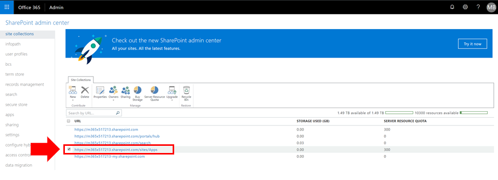
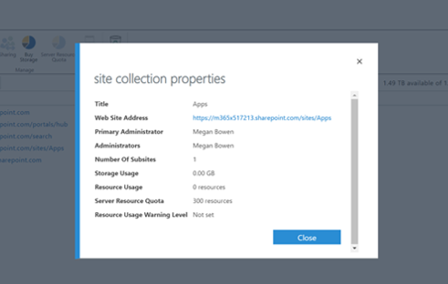
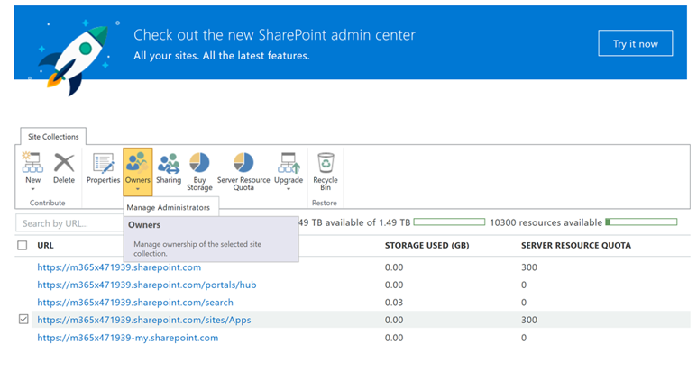

# Anzeigen oder Hinzufügen eines Administrators zur Ihrer SharePoint Online-App-Katalog

Um CLO365 erfolgreich installieren zu können, muss die Person, die wie folgt die Bereitstellung der Lösung als Administrator des Mandanten app-Katalogs aufgeführt werden.

1. Die Office 365 Administration Portal wechseln Sie zu der SharePoint Online-Verwaltungskonsole
1. **Wählen Sie** die App-Katalog-URL aus der websitesammlungsliste 
1. Vergewissern Sie sich, dass das Installationsprogramm CLO365 als eines der app-Katalogadministratoren aufgeführt ist. 

Wenn Ihr Benutzername aufgeführt ist, können Sie zu Bereitstellen der benutzerdefinierten Learning-Website zurückkehren.  Wenn dies nicht die nächsten Schritte aus. 

## Hinzufügen eines Administrators

1. Aktivieren Sie das Kontrollkästchen neben der app-Katalog-URL der SharePoint-Verwaltungskonsole und aktivieren Sie das Dropdown-Besitzer. 
1. Wählen Sie Administratoren verwalten aus dem Dropdown-Menü 
1. Fügen Sie die richtige Person als Websitesammlungsadministrator hinzu, und klicken Sie auf OK, um die Änderungen zu speichern.

### Nächste Schritte - [Website bereitstellen.](installsitepackage.md)
