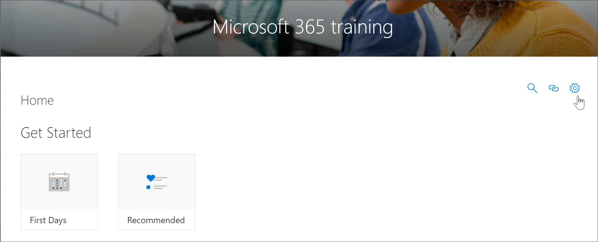

# Zugreifen auf die benutzerdefinierte Lern Verwaltungsseite

Die benutzerdefinierte Lern Verwaltungsseite ist der zentrale Kontrollpunkt für die Verwaltung des benutzerdefinierten Lern Webparts. Die benutzerdefinierte Lern Verwaltungsseite steht nur SharePoint-Administratoren zur Verfügung. Benutzer mit Mitglieds rechten, die die Website besuchen, sehen die Option " **Wiedergabeliste verwalten** " nicht. Darüber hinaus haben nur Administratoren die Möglichkeit, die benutzerdefinierte Lern Verwaltungsseite über das Menüelement "SharePoint- **Start** Seite" zu öffnen.  

> [!IMPORTANT]
> Änderungen auf der benutzerdefinierten Lern Verwaltungsseite, wie das Ausblenden einer Produktunterkategorie oder Wiedergabeliste, werden in allen Instanzen des Webparts widergespiegelt. Darüber hinaus wird empfohlen, dass nur ein Administrator zur Zeit Änderungen auf der benutzerdefinierten Learning Administrator-Seite vornimmt, da benutzerdefiniertes lernen keine Kollisionserkennung bietet, wenn mehrere Personen gleichzeitig die benutzerdefinierte Lern Verwaltung verwenden.  

## Zugriff über die benutzerdefinierte Lern Webpart-bevorzugte Methode
Wie Sie in diesem Beispiel zeigen, ist das Öffnen der benutzerdefinierten Learning Administration-Seite aus dem Webpart die bevorzugte Methode, da Sie die Seite "admin" in einem neuen Browserfenster öffnet. Mit dieser Methode können Sie problemlos zwischen den Seiten im Registerkartenformat wechseln, um Ihre Arbeit zu überprüfen oder zu ändern.  

1. Klicken Sie auf der benutzerdefinierten Lern Startseite auf die **Office 365 Training** -Kachel.
2. Klicken Sie auf das Menü **benutzerdefiniertes Lernsystem** , und klicken Sie dann auf **Wiedergabeliste verwalten**. 

## Zugriff über das Menüelement "benutzerdefiniertes lernen"
Anstatt zu einer Seite mit einem Webpart zu navigieren, können Administratoren über das Menüelement SharePoint **Home** auf die Seite benutzerdefinierte Lern Verwaltung zugreifen. 

- Klicken Sie auf der benutzerdefinierten Learning-Startseite auf das Menü **Start** und dann auf **benutzerdefinierte Lern Verwaltung**.

