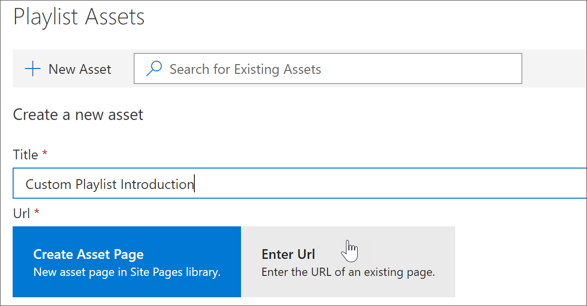
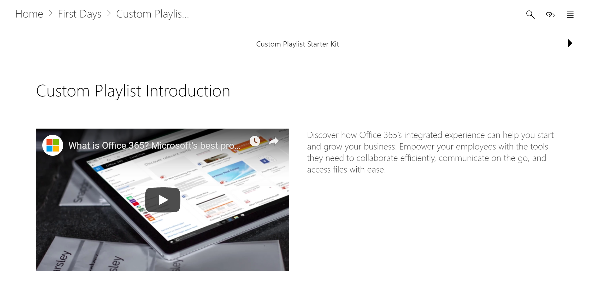

# Hinzufügen von Objekten zu einer benutzerdefinierten WiedergabelisteAdd Assets to a Custom Playlist

Mit benutzerdefiniertem lernen können Sie die folgenden Objekte einer Wiedergabeliste hinzufügen:With Custom Learning, you can add the following assets to a playlist:

- **Vorhandene benutzerdefinierte Lernressourcen** -Dies sind Objekte, die Teil des Microsoft Online-Katalogs sind, oder Objekte, die Ihre Organisation bereits zu benutzerdefiniertem lernen hinzugefügt hat.**Existing Custom Learning assets** - these are assets that are part of the Microsoft online catalog or assets that your organization has already added to Custom Learning.
- **Neue Objekte** -Dies sind Ressourcen, die Sie benutzerdefiniertem lernen hinzufügen, die aus SharePoint-Seiten erstellt werden, die Sie erstellen, oder SharePoint-Ressourcen, die bereits auf einer SharePoint-Website in Ihrer Organisation verfügbar sind.**New assets** - these are assets that you add to Custom Learning that are built from SharePoint pages that you create or SharePoint assets that are already available on a SharePoint site in your organization. 

> [!TIP]
> Wenn ein Microsoft-Wiedergabelisten Objekt Ihre Anforderungen nicht erfüllt, erstellen Sie eine neue Wiedergabeliste, und fügen Sie dann die Microsoft-Ressourcen und alle neu erstellten Objekte zur Wiedergabeliste hinzu, um die gewünschte Benutzeroberfläche zu erstellen.If a Microsoft playlist asset doesn't meet your needs, create a new playlist and then add the Microsoft assets and any newly created assets to the playlist to build the experience you want. Sie können benutzerdefinierte lernlisten, die von Microsoft bereitgestellt werden, nicht ändern, aber einer benutzerdefinierten Wiedergabeliste hinzufügen.You can't modify Custom Learning playlists supplied by Microsoft, but you can add Custom Learning-supplied assets to a custom playlist.   

## Erstellen eines neuen Objekts für eine WiedergabelisteCreate a new asset for a playlist

Es gibt zwei Optionen zum Hinzufügen eines neuen Objekts zu einer Wiedergabeliste.There are two options for adding a new asset to a playlist.

- **Seite "Objekt erstellen"** – mit dieser Option generiert benutzerdefiniertes lernen eine neue, leere SharePoint-Seite für Sie und fügt Sie der Wiedergabeliste hinzu.**Create Asset Page** - with this option, Custom Learning will generate a new,  blank SharePoint page for you and add it to the playlist. Anschließend können Sie der Seite Inhalte hinzufügen und speichern.You can then add content to the page and save it.  
- **Geben Sie die URL ein** – mit dieser Option erstellen Sie die Seite im voraus, oder Sie haben die Seite bereits verfügbar, und Sie geben die URL an, um die Seite der Wiedergabeliste hinzuzufügen.**Enter the URL** - with this option, you build the page in advance or you already have the page available and you specify the URL to add the page to the playlist.

### Seite "Objekt erstellen"Create Asset Page 
Mit der Option **Asset Page erstellen** geben Sie einen Titel für das Objekt an und klicken dann auf Objekt Seite erstellen, um eine neue SharePoint-Seite zur Bearbeitung zu erstellen und zu öffnen.With the **Create Asset Page** option, you provide a title for the Asset, then click Create Asset page to create and open a new SharePoint page for editing. 

1.  Wenn die Wiedergabeliste noch nicht zur Bearbeitung geöffnet ist, klicken Sie auf der Seite **benutzerdefinierte Lern Verwaltung** auf die Wiedergabeliste, die Sie bearbeiten möchten.If the playlist isn't already open for editing, from the **Custom Learning Administration** page, click the playlist you wish to edit. 
2. Wenn Sie einer Wiedergabeliste ein neues Objekt hinzufügen möchten, klicken Sie auf **Neues Objekt**.To add a new asset to a playlist, click **New Asset**. 
3. Geben Sie einen Titel ein.Enter a title. Geben Sie in diesem Beispiel "Objekte zu einer Wiedergabeliste hinzufügen" ein, und klicken Sie dann auf **Objekt Seite erstellen**.In this example enter “Add Assets to a Playlist”, and then click **Create Asset Page**.

4. Klicken Sie auf **Seite öffnen**.Click **Open Page**.
5. Klicken Sie auf das Symbol **Bearbeiten** , und klicken Sie dann im Titelbereich auf **Webpart bearbeiten** .Click the **Edit** icon, and then click **Edit Web part** in the Title area.
6. Klicken Sie unter **Layout**auf **Plain**.Under **Layout**, click **Plain**. 
7. Fügen Sie einen neuen Abschnitt mit einer Spalte hinzu, und fügen Sie der Seite dann einen Beispieltext hinzu, damit Sie wie im folgenden Beispiel aussieht.Add a new one-column section, and then add some sample text to the page so it looks like the following example. 

7. Klicken Sie auf **Veröffentlichen**.Click **Publish**.
8. Kehren Sie zur **benutzerdefinierten Learning Administration** -Seite zurück.Return to the **Custom Learning Administration** page. 
9. Füllen Sie die restlichen Eigenschaften für das Objekt aus, und klicken Sie dann auf **Ressource speichern.**Fill out the remainder of the properties for the asset, and then click **Save Asset.**

### Geben Sie die URL ein.Enter the URL
Geben Sie mit der Option **URL eingeben** einen Titel für das Objekt ein, und klicken Sie dann auf **Geben Sie die URL** ein, um die SharePoint-Seite anzugeben, die Sie der Wiedergabeliste hinzufügen möchten.With the **Enter the URL** option, you provide a title for the Asset, then click **Enter the URL** to specify the SharePoint page you want to add to the playlist. 

1.  Wenn die Wiedergabeliste nicht zur Bearbeitung geöffnet ist, klicken Sie auf der Seite **benutzerdefinierte Lern Verwaltung** auf die Wiedergabeliste, die Sie bearbeiten möchten.If the playlist isn't open for editing, from the **Custom Learning Administration** page, click the playlist you wish to edit. 
2. Wenn Sie einer Wiedergabeliste ein neues Objekt hinzufügen möchten, klicken Sie auf **Neues Objekt**.To add a new asset to a playlist, click **New Asset**. 
3. Geben Sie einen Titel ein.Enter a title. Geben Sie in diesem Beispiel "benutzerdefinierte Playlist-Einführung" ein, und klicken Sie dann auf **URL eingeben**.In this example, enter “Custom Playlist Introduction”, and then click **Enter URL**. 

4. Geben Sie die URL der SharePoint-Seite ein, die Sie in einem vorherigen Abschnitt [Erstellen von SharePoint-Seiten für benutzerdefinierte Wiedergabelisten](custom_createnewpage.md) erstellt haben, und füllen Sie dann die restlichen Felder aus, wie in der folgenden Abbildung dargestellt.Enter the URL of the SharePoint page you created in a previous [Create SharePoint pages for custom playlists ](custom_createnewpage.md) section, and then fill out the remainder of the fields, as shown in the following illustration.

5. Klicken Sie auf **Ressource speichern**.Click **Save Asset**. 

## Hinzufügen eines vorhandenen Objekts zu einer WiedergabelisteAdd an existing asset to a playlist

Vorhandene Objekte bestehen aus von Microsoft bereitgestellten benutzerdefinierten Lernressourcen oder Ressourcen, die bereits zum benutzerdefinierten lernen durch Ihre Organisation hinzugefügt wurden.Existing assets consist of Microsoft-provided Custom Learning assets or assets that have already been added to Custom Learning by your organization. 

- Geben Sie \*\*\*\* in das Suchfeld einen Suchbegriff ein, und wählen Sie dann ein Objekt aus den Suchergebnissen aus.In the **Search** box, enter a Search phrase, and then select an asset from the Search results. Geben Sie in diesem Beispiel "Was ist Excel?" ein.In this example, enter “What is Excel?” , um der Wiedergabeliste ein Excel-Einführungsthema hinzuzufügen.to add an Excel intro topic to the playlist.

## Bearbeiten, verschieben und Löschen von ObjektenEdit, move, and delete assets
Sie können benutzerdefinierte Objekte bearbeiten, die Sie erstellen, jedoch keine Objekte von Microsoft.You can edit custom assets that you create, but not assets from Microsoft. Sie können jedoch alle Objekte aus einer Wiedergabeliste entfernen und die Auftragsobjekte ändern.However, you can remove all assets from a playlist and change the order assets. 

### Bearbeiten eines ObjektsEdit an asset
- Klicken Sie auf die Schaltfläche Bearbeiten für eine Ressource, ändern Sie die Ressource, und klicken Sie dann auf Ressource speichern.Click the Edit button for an asset, modify the asset, and then click Save Asset. 

### Verschieben eines Objekts in eine WiedergabelisteMove an asset in a playlist
- Klicken Sie auf den Pfeil nach oben oder nach unten rechts neben dem Objekt, um die Objektreihenfolge in der Wiedergabeliste zu verschieben.Click the up or down arrow to the right of the asset to move the asset order in the playlist

### Entfernen eines Objekts aus einer WiedergabelisteRemove an asset from a playlist
- Klicken Sie auf das Symbol aus Playlist X entfernen für das Objekt.Click the Remove from Playlist X icon for the asset. 

## Anzeigen der Wiedergabeliste in AktionView the playlist in Action
Nachdem Sie nun Objekte zu einer Wiedergabeliste hinzugefügt haben, können wir die Wiedergabeliste beenden und Sie in Aktion sehen.Now that you've added assets to a playlist, let's close the playlist and see it in action. 

1. Klicken Sie auf **Wiedergabeliste beenden**.Click **Close Playlist**.
2. Klicken Sie auf die Registerkarte mit der **Office 365-Schulungs** Seite.Click the tab with the **Office 365 training** page.
3. Aktualisieren Sie die Seite, und klicken Sie dann auf **erste Tage** unter **Get Started**.Refresh the page, and then click **First Days** under **Get Started**.
4. Klicken Sie auf **BenutzerdefiniertEs Lern-Starter Kit** , um Ihre erste Wiedergabeliste in Aktion anzuzeigen.Click **Custom Learning Starter Kit** to view your first playlist in action. 

