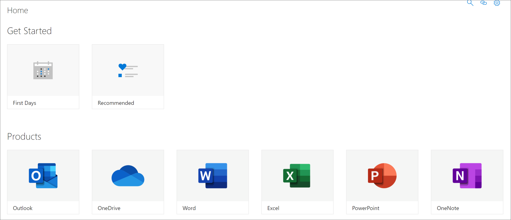

# Grundlegendes zu den SharePoint-AnwendungsseitenGet to know the SharePoint Application pages

Lernpfade bieten zwei SharePoint-Anwendungsseiten, die Sie als Administrator kennen sollten.Learning pathways provides two SharePoint Application pages that you should know about as an administrator. Diese beiden Seiten können nicht bearbeitet werden und sollten nicht gelöscht werden.These two pages are non-editable and should not be deleted. 

- CustomLearningAdmin.aspxCustomLearningAdmin.aspx
- CustomLearningViewer.aspxCustomLearningViewer.aspx

## CustomLearningAdmin.aspxCustomLearningAdmin.aspx

Die Seite CustomLearningAdmin.aspx bietet Administrative Features für Lernpfade, einschließlich ausblenden und Anzeigen von Inhalten sowie Erstellen und Bearbeiten von Unterkategorien und Wiedergabelisten.The CustomLearningAdmin.aspx page provides Administrative features for learning pathways, including hiding and showing content and creating and editing subcategories and playlists. Diese Seite und ihre Funktionalität werden in späteren Abschnitten ausführlicher behandelt.We’ll cover this page and its functionality in more detail in later sections.

### Anzeigen von CustomLearningAdmin.aspxView CustomLearningAdmin.aspx

1. Klicken Sie auf das Symbol **SharePoint-Einstellungen,** und klicken Sie dann auf   >  **Websiteinhalte-Websiteseiten**.Click the SharePoint **Settings** icon, and then click **Site Contents** > **Site Pages**. 
2. Klicken **Sie auf CustomLearningAdmin.aspx**.Click **CustomLearningAdmin.aspx**. 

## CustomLearningViewer.aspxCustomLearningViewer.aspx
Die Seite CustomLearningViewer.aspx bietet einen Viewer zum Anzeigen von Inhalten von Lernpfaden im Webteil.The CustomLearningViewer.aspx page provides a viewer for displaying learning pathways contents in the web part. Wenn Sie z. B. einen Wiedergabelistenlink kopieren und ihn für einen Kollegen freigeben, führt der Link, wenn er geklickt wird, den Benutzer zur Viewer-Seite und zeigt den verknüpften Inhalt an.For example, if you copy a Playlist link and share it with a co-worker, the link, when clicked, takes the user to the Viewer page and displays the linked content. 

### CustomLearningViewer.aspx anzeigenView CustomLearningViewer.aspx

1. Klicken Sie auf das Symbol **SharePoint-Einstellungen,** und klicken Sie dann auf   >  **Websiteinhalte-Websiteseiten**.Click the SharePoint **Settings** icon, and then click **Site Contents** > **Site Pages**. 
2. Klicken **Sie auf CustomLearningViewer.aspx**.Click **CustomLearningViewer.aspx**. 

