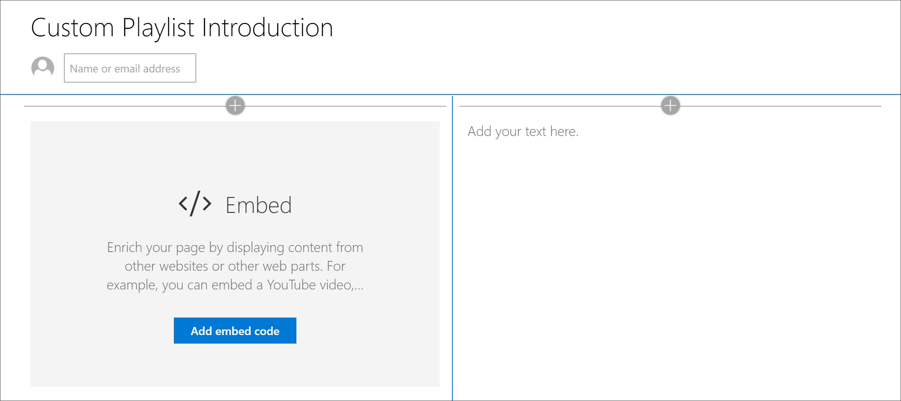

# Erstellen von SharePoint-Seiten für benutzerdefinierte Wiedergabelisten

Eines der einzigartigen Features von Lernpfaden ist die Möglichkeit, Wiedergabelisten zu erstellen, die aus Objekten aus Microsoft und aus von Ihnen erstellten SharePoint-Objekten zusammengesetzt werden. In diesem Beispiel erstellen wir eine SharePoint-Seite, bevor Sie eine Wiedergabeliste erstellen. Die Möglichkeit zum Erstellen von Wiedergabelisten von SharePoint-Seiten bietet eine Vielzahl von Möglichkeiten zum Erstellen von Seiten mit den von Microsoft oder Ihrer Organisation verfügbaren Webparts. Beispielsweise kann eine Wiedergabeliste eine SharePoint-Seite mit eingebetteten Videos von YouTube oder ein aus Office 365 Formularen erstelltes Formular oder einen eingebetteten Power BI-Bericht enthalten. In diesem Beispiel wird gezeigt, wie Sie eine Seite mit dem embed-Webpart und dem Text-Webpart erstellen.  

## Erstellen einer SharePoint-Seite für eine benutzerdefinierte Wiedergabeliste

1. Klicken Sie auf das Symbol SharePoint **Gear** , und klicken Sie dann auf **Seite hinzufügen**.
2. Klicken Sie auf der linken Seite auf **einen neuen Abschnitt hinzufügen (+)** , und klicken Sie dann auf **zwei Spalten** für das Abschnittslayout.
3. Klicken Sie in der linken Spalte auf +, und klicken Sie dann auf das Webpart **einbetten** . 
4. Klicken Sie in der rechten Spalte auf +, und klicken Sie dann auf das Webpart **Text** . Ihre Seite sollte wie folgt aussehen.

### Hinzufügen eines Videos und Texts aus YouTube

1. Wechseln Sie in Ihrem Browser zu YouTube. Suchen Sie in diesem Beispiel nach "Was ist Office 365 – die besten Produktivitäts-apps von Microsoft".
2. Klicken Sie auf das Video, um es wiederzugeben, halten Sie es dann an, und klicken Sie dann mit der rechten Maustaste darauf. 
3. Klicken Sie auf **embed-Code kopieren**und dann zur SharePoint-Seite zurückkehren. 
4. Klicken Sie im **embed** -Webpart auf **eingebetteten Code hinzufügen** , und fügen Sie dann den Code aus dem YouTube-Video hinzu.
5. Kehren Sie zur Seite YouTube zurück, und kopieren Sie den **Beschreibungs** Text für das Video. 
6. Kehren Sie zur SharePoint-Seite zurück, wählen Sie das Webpart **Text** aus, und kopieren Sie dann den Text aus dem YouTube-Video.
7. Wählen Sie das Symbol " **Webpart bearbeiten** " im Titelbereich der SharePoint-Seite aus, und nennen Sie die Seite "benutzerdefinierte Wiedergabeliste". 
8. Wählen Sie für **Layout**die Option **Plain**aus, und schließen Sie den Bereich Eigenschaften des **Titelbereichs** . Die Seite sollte nun etwa wie folgt aussehen. 

### Veröffentlichen der Seite

- Klicken Sie auf die Schaltfläche **veröffentlichen** . Jetzt können Sie diese SharePoint-Seite zu Ihrer benutzerdefinierten Wiedergabeliste hinzufügen. 