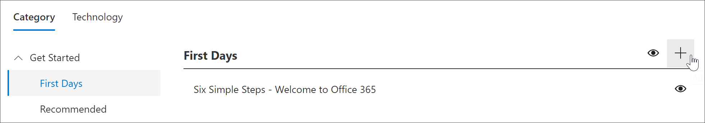

# Erstellen einer benutzerdefinierten WiedergabelisteCreate a Custom Playlist

Mit den Lernpfaden von Microsoft 365 können Sie benutzerdefinierte Wiedergabelisten erstellen, die auf die spezifischen Anforderungen Ihrer Organisation zugeschnitten sind.With Microsoft 365 learning pathways, you can create custom playlists from scratch that are tailored to the unique needs of your organization. Erstellen Sie beispielsweise eine Wiedergabeliste für das Onboarding neuer Mitarbeiter bei Microsoft Teams.For example, create a playlist for onboarding new hires to Microsoft Teams. Sie können auch Wiedergabelisten für Führungskräfte mit Informationen erstellen, die für Ihre eindeutige Rolle geeignet sind.Or create playlists for executive administrators with information suited to their unique role. Oder erstellen Sie einen ersten Tag für die Microsoft 365-Wiedergabeliste mit drei einfachen Schritten anstelle von sechs.Or create a First Day for Microsoft 365 playlist that has three simple steps instead of six. Sie können eine benutzerdefinierte Wiedergabeliste zu jeder Unterkategorie hinzufügen.You can add a custom playlist to any subcategory. Beispielsweise die **ersten Tage**, eine **Produkt** Unterkategorie wie **Excel**oder sogar eine Unterkategorie, die Sie erstellen.For example, **First Days**, a **Product** subcategory like **Excel**, or even a subcategory that you create. In diesem Abschnitt wird erläutert, wie Sie eine Wiedergabeliste erstellen und dann das Hinzufügen von Objekten zu einer Wiedergabeliste im folgenden Abschnitt [Hinzufügen von Objekten zu einer benutzerdefinierten Wiedergabe](custom_addassets.md)Liste abdecken.In this section, we’ll cover how to create a playlist, and then cover adding assets to a playlist in the following section, [Add assets to a custom playlist](custom_addassets.md).

## Erstellen einer WiedergabelisteCreate a playlist 

1. Klicken Sie auf der **Start** Seite von Microsoft 365 Learning Pfads auf **Office 365 Schulung**, und wählen Sie dann das Symbol **Verwalten** aus dem Webpart aus.From the Microsoft 365 learning pathways **Home** page, click **Office 365 training**, and then select the **Administer** icon from the Web part. 
2. Wählen Sie die Unterkategorie Symbol **Verwalten**aus.Select the **Administer**" icon  subcategory. Wählen Sie in diesem Beispiel die Option **erste Tage**aus.In this example, select **First Days**.  
3. Klicken Sie auf das Symbol +.Click the + icon.  

4.  Füllen Sie die Felder in der Wiedergabeliste aus, wie im folgenden Beispiel gezeigt.Fill out the fields in the playlist as shown in the following example. Sie können das Standardsymbol für dieses Beispiel belassen.You can leave the default icon for this example. 

5.  Wenn Sie fertig sind, wählen Sie **Details speichern**aus.When you are done, select **Save Detail**. 

## Bearbeiten einer WiedergabelisteEdit a playlist

- Klicken Sie auf der Seite **benutzerdefinierte Lern Verwaltung** auf die Wiedergabeliste, und klicken Sie dann auf **Detail bearbeiten**.From the **Custom Learning Administration** page, click the playlist, and then click **Edit Detail**.  

### Löschen einer WiedergabelisteDelete a playlist

- Klicken Sie auf der Seite benutzerdefinierte Lern Verwaltung auf das **Lösch** Symbol für die Wiedergabeliste.From the Custom Learning Administration page, click the **Delete** icon for the playlist.  

