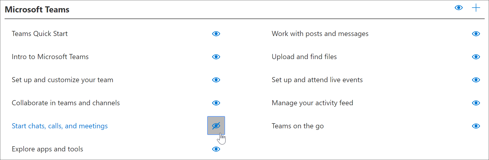

# Ausblenden und Anzeigen von Wiedergabelisten

Um benutzerdefiniertes lernen für Ihre Umgebung anzupassen, müssen Sie möglicherweise die von Microsoft bereitgestellten Wiedergabelisten ausblenden und diese durch Wiedergabelisten ersetzen, die Sie für Ihre Organisation erstellen. Ein gängiger Kunden Anwendungsfall besteht beispielsweise darin, die sechs einfachen Steps-Wiedergabeliste von Microsoft auszublenden und durch eine Wiedergabeliste zu ersetzen, die Sie für Ihre Organisation oder Benutzergruppe erstellen. 

## Ausblenden einer Wiedergabeliste

1. Klicken Sie auf der benutzerdefinierten Lern **Startseite** auf die **Office 365 Training** -Kachel.
2. Wählen Sie im benutzerdefinierten Lern Webpart das Menü **System** aus, und wählen Sie dann **Wiedergabeliste verwalten**aus. Sie sollten nun zwei Registerkarten öffnen: eine mit der **benutzerdefinierten Lern Verwaltungs** Seite; und eine mit der **Office 365 Training** -Seite. 
3. Wählen Sie auf der Seite **benutzerdefinierte Lern Verwaltung** unter **Kategorie**eine SubCategory aus, und wählen Sie dann den Augapfel für eine Wiedergabeliste aus, um ihn auszublenden. Klicken Sie in diesem Beispiel auf die Unterkategorie **erste Tage** , und blenden Sie dann die **sechs einfache Steps** -Wiedergabeliste aus.  

### Überprüfen, ob die Wiedergabeliste ausgeblendet ist
- Um zu überprüfen, ob die Wiedergabeliste ausgeblendet ist, wählen Sie die Registerkarte Browser mit der Seite **Erste Schritte mit Office 365** aus, und aktualisieren Sie dann die Seite. Die Unterkategorie **erste Tage** und **sechs einfache Schritte** sind ausgeblendet. In diesem Fall gibt es nur eine Wiedergabeliste in der Unterkategorie, die ausgeblendet ist, daher blendet benutzerdefiniertes lernen auch die Unterkategorie aus, statt eine leere Unterkategorie anzuzeigen. 

## EinBlenden einer Wiedergabeliste

- Wählen Sie auf der Seite **benutzerdefinierte Lern Verwaltung** unter **Kategorie**eine SubCategory aus, wählen Sie eine Wiedergabeliste aus, und wählen Sie dann den Augapfel für die verborgene Wiedergabeliste aus, um Sie einzublenden. In diesem Beispiel blenden Sie die **sechs einfachen Steps** -Wiedergabeliste unter der **ersten Tag** -Kategorie ein.  

