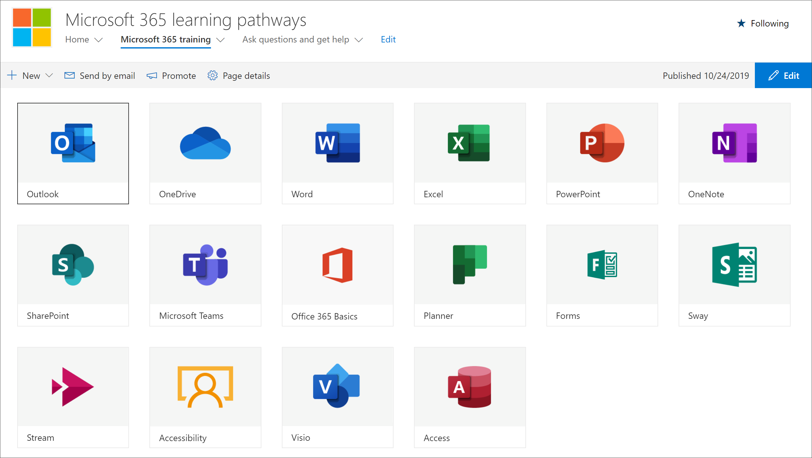

# Ausblenden und Anzeigen von Unterkategorien

Auf der Seite Verwaltungstools für Lern Pfade können Sie Unterkategorien von Inhalten ausblenden und anzeigen. Beispielsweise können Unternehmen, die kein jammern ausführen, die Kategorie jammern ausblenden, sodass jammern von Inhalten für Benutzer nicht sichtbar ist. Dadurch werden unerwünschte Supportanrufe von Benutzern verhindert, die andernfalls möglicherweise Informationen im Zusammenhang mit Diensten sehen, die in Ihrer Organisation nicht verfügbar sind.

## Ausblenden einer Unterkategorie 

1. Klicken Sie auf der Startseite von Microsoft 365 Learning Pfads auf die Microsoft 365-Schulungs Kachel.
2. Klicken Sie im Microsoft 365 Learning Pfads-Webpart auf das Symbol Verwaltung. 
3. Wählen Sie im linken Bereich der Seite eine Unterkategorie aus, und wählen Sie dann den Augapfel für die Unterkategorie aus, um sie auszublenden. In diesem Beispiel blenden Sie die Unterkategorie **jammern** aus.  

### Überprüfen, ob die Unterkategorie ausgeblendet ist
- Um zu überprüfen, ob die Unterkategorie ausgeblendet ist, wählen Sie die Registerkarte Browser mit der Seite **Erste Schritte mit Microsoft 365** aus, und aktualisieren Sie dann die Seite. Die Unterkategorie jammern sollte jetzt in der Kategorie Produkte ausgeblendet werden. 

## Unterkategorie einblenden 

- Wählen Sie auf der Seite **Verwaltung** eine Unterkategorie aus, und wählen Sie dann den Augapfel für die verborgene Unterkategorie aus, um Sie einzublenden. In diesem Beispiel blenden Sie die Unterkategorie jammern ein.