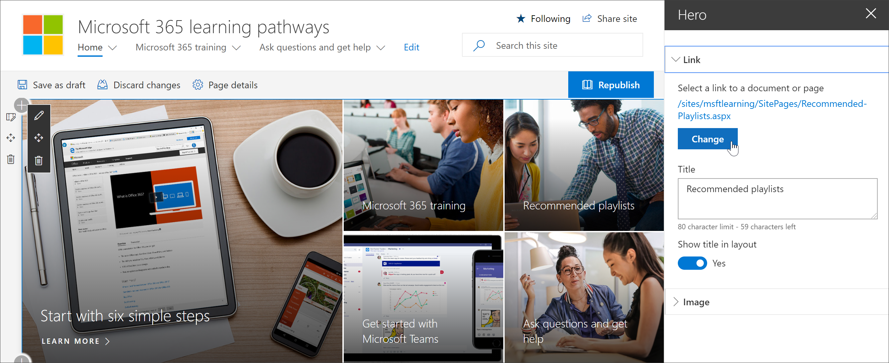
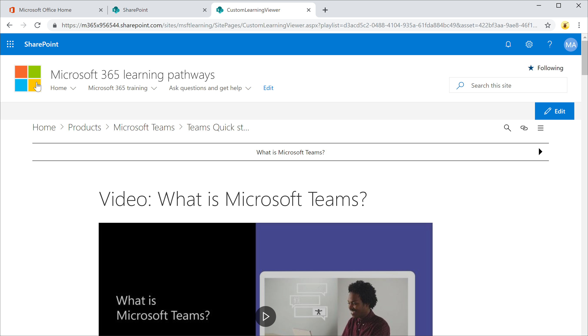

# Link zu Lernpfaden Inhalt

Bei Lernpfaden gibt es zwei Möglichkeiten zum Verknüpfen von Inhalten:

- Link zu der Seite, auf der das Webpart gehostet wird, das für den anzuzeigenden Inhalt gefiltert ist 
- Direkte Verknüpfung mit einer Instanz des Webparts

## Link zu einer Seite

Wenn Sie neue Seiten und Lernerfahrungen mit dem Webpart Microsoft 365 Learning-Pfade erstellt haben, können Sie eine Verknüpfung mit der Seite mit dem Webpart herstellen, das zum Anzeigen des anzuzeigenden Inhalts konfiguriert ist. Im vorherigen Abschnitt wurde beschrieben, wie Excel-Wiedergabelisten auf einer Seite angezeigt werden. Sie können nun die Startseite bearbeiten, um eine Verknüpfung mit der Seite zu erstellen. 

1. Klicken Sie auf der Startseite auf **Bearbeiten**.
2. Klicken Sie in einer der Startseiten Kacheln auf **Details bearbeiten** . In diesem Beispiel bearbeiten wir die **empfohlenen Wiedergabelisten** Kacheln.
3. Klicken Sie unter **Link**auf **ändern**.

4. Klicken Sie auf **Website**, dann auf **Website Seiten**, klicken Sie auf die Seite, mit der Sie eine Verknüpfung herstellen möchten, und klicken Sie dann auf **Öffnen**. In diesem Beispiel wird eine Verknüpfung mit der **Create-your-own-Experience. aspx** -Seite hergestellt, die im vorherigen Abschnitt behandelt wurde.
5. Schließen Sie den Bereich Hero-Eigenschaften, klicken Sie auf **veröffentlichen**, und testen Sie dann den Link. 

## Link zum Microsoft 365 Learning Pfads-Webpart
Lern Pfade bieten Ihnen, dem Administrator oder einem Endbenutzer die Möglichkeit, eine Verknüpfung zu einer Instanz des Webparts unabhängig von der Seite, die das Webpart enthält, zu erstellen. Sie können den kopierten Link oder den Link von anderen Seiten freigeben. Wenn auf den Link kopiert geklickt wird, wird die Instanz des Microsoft 365 Learning-Pfads auf der Seite CustomLLearningViewer. aspx angezeigt. Hier ist ein Beispiel. 

1. Klicken Sie auf der Startseite auf **Microsoft365 Training**.
2. Klicken Sie auf **Microsoft Teams**, und klicken Sie dann auf **Einführung in Microsoft Teams**.
3. Klicken Sie auf das Symbol **Kopieren** .

4. Klicken Sie im Menü Website von Microsoft 365 Learning Pfads auf Startseite.
5. Fügen Sie die kopierte URL in die Adressleiste des Browsers ein, und drücken Sie die EINGABETASTE. 

Wie in der folgenden Abbildung dargestellt, wechselt der Link zur Seite CustomLearningViewer. aspx und zeigt den Inhalt basierend auf den Parametern in der kopierten Verknüpfung an. 

