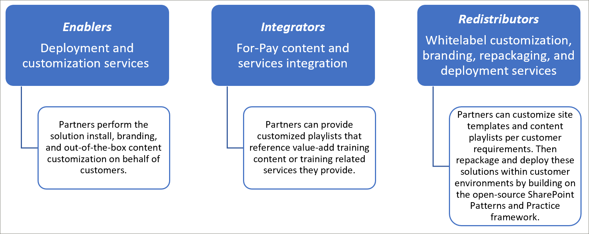
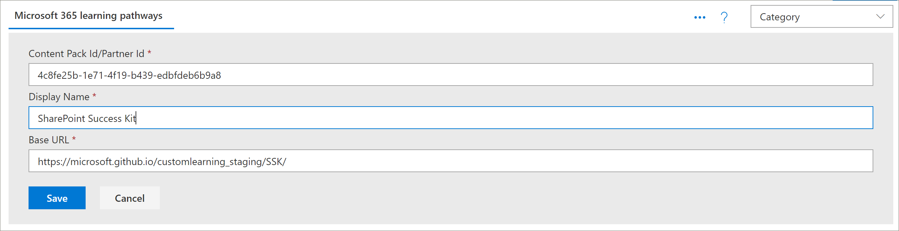

# Partner-Integrationsmodelle
Es ist zwar nicht möglich, den Inhalt von Microsoft 365 Learning-Pfaden direkt aus dem SharePoint Online Bereitstellung-Dienst zu ergänzen, aber es gibt verschiedene Integrationsmodelle, die Partner für die Erstellung ausgerichteter Mehrwertdienst Angebote nutzen können. Die oben aufgeführten Partner Integrationsmodelle werden in der Reihenfolge der aufsteigenden Komplexität und der Höhe der Investitionen vorgestellt. Daher ist es unser Leitfaden, ihr Fachwissen zu erweitern und erweiterte Stufen basierend auf ihren Geschäftsmodellen zu absolvieren.

 

## Wie sollte ich beginnen? 
Um zu beginnen, finden Sie hier einige bewährte Methoden.     

### 1. beginnen Sie mit der Erstellung von Know-how als Enabler. 
Sie können einen Prozentsatz ihrer Kundenbasis sofort unterstützen, indem Sie das Schulungsportal für Lern Pfade aktivieren und gezielte Microsoft-Inhalts-Kuration durchführen. Anweisungen zum Vorbereiten von Lernpfaden finden Sie unter https://docs.microsoft.com/office365/customlearning/custom_provision .  

### 2. erweitern Sie dann ihre Dienste als Integrator
Durchführen einer Automatisierung Return on Investment Analysis-abhängig von der Menge ihrer Inhalte und/oder Dienstleistungen Integration benötigt. Beispielsweise kann es nicht sinnvoll sein, die Entwicklungs-und Betriebskosten in Bezug auf unsere Richtlinien zur Inhalts Integration zu übernehmen, wenn Sie schnell manuell eine zielgerichtete benutzerdefinierte Wiedergabeliste erstellen können, die auf Ihre for-Pay-Inhalte verweist oder auf ihre Dienste verweist.

### 3. wenn der Return on Investment sinnvoll ist – berücksichtigen Sie die Umverteilung 
Wenn die Rentabilität sinnvoll ist, sollten Sie die Umverteilung (oder die Zusammenarbeit mit verwandten Lernpfaden) in die Lage versetzen, umgepackte Lösungen zu erstellen. Diese basieren auf dem SharePoint Patterns and Practice Framework, das Lösungen zum Extrahieren benutzerdefinierter Websites und zum anschließende Bereitstellen in Kundenumgebungen bereitstellt. 

## Von Partnern bereitgestellte Richtlinien zur Inhalts Integration
Inhalte für Lern Pfade von Microsoft 365 werden von einer Reihe von JSON-Dateien gesteuert, die als Inhalts Manifeste für Ihr Lern Paket fungieren. Es gibt drei Dateien: metadata.jsein, playlists.jsund assets.jsein. Diese Dateien müssen so strukturiert sein, dass Sie den Modellen entsprechen, die das Webpart erkennt und dann von einem Content Delivery Network (CDN) gehostet wird, damit das Webpart Sie laden kann. Microsoft stellt Start Vorlagen dieser Dateien bereit, damit Sie den Einstieg erhalten.  

**Haftungsausschluss:** die JSON-Dateistruktur kann aufgrund der bevorstehenden Lösungs Arbeit geändert werden. Der Microsoft 365 Learning Pfads-Partner Early Adopter Program (EAP) wird über bevorstehende Änderungen dieser Art informiert. Zusammen mit allen Kunden Abwärtskompatibilität und/oder Übergangs Anleitungen. 

### Herunterladen der Microsoft 365-Lern Pfad Lösung
Sie können die Microsoft 365-Lern Pfad Lösung zusammen mit den JSON-Dateien aus dem GitHub-Repository herunterladen: https://github.com/pnp/custom-learning-office-365 . Beachten Sie, dass Microsoft zu diesem Zeitpunkt keine GitHub Pull-Anforderung für die Lösung übernimmt. Sie können die GitHub-Dateien jedoch als Ausgangspunkt für die Erstellung eines eigenen benutzerdefinierten Inhaltspakets verwenden. 

### Struktur Metadata.js
Sie können sich diese Datei als das Gehirn der Menüs und der Struktur vorstellen. Sie enthält alle Navigationsstrukturen sowie Auswahllisten für Daten in den beiden anderen Dateien. 

|              Name        |                     Beschreibung                                                               | 
|:-----------------------------|-------------------------------------------------------------------------------------------|
|**Technologien**              |Inhalte werden markiert und können basierend auf der zugewiesenen Technologie ausgeblendet werden.                 |  
|&nbsp;&nbsp;ID                |GUID, die die Technologie darstellt                                                           |  
|&nbsp;&nbsp;Name              |Anzeigename der Technologie                                                             |
|&nbsp;&nbsp;*Subjects []*     |Ein Array von Themen, die eine Teilmenge der Technologie sind                                   | 
|&nbsp;&nbsp;&nbsp;&nbsp;ID    |GUID, die den Betreff darstellt                                                              |
|&nbsp;&nbsp;&nbsp;&nbsp;Name  |Anzeigename des Betreffs                                                                |
|**Categories []**             |Kategorien informieren die Navigation des WebPart-Steuerelemente. Jede Kategorie stellt eine oberste Ebene der Navigation dar.                                                                                                                 |
|&nbsp;&nbsp;ID                |GUID, die die Kategorie/Unterkategorie darstellt                                                 |
|&nbsp;&nbsp;Name              |Anzeigename für die Kategorie/Unterkategorie                                                  |
|&nbsp;&nbsp;Bild             |URL für das Bild, das im UX angezeigt werden soll (relativ zur CDN-Basis)            |
|&nbsp;&nbsp;Technologie-Nr      |Die GUID der Technologie, mit der dieser Inhalt verwandt ist (optional – leere Zeichenfolge)            |
|&nbsp;&nbsp;SubjectId         |Die GUID des Betreffs, mit dem dieser Inhalt verknüpft ist (optional – leere Zeichenfolge)               |
|&nbsp;&nbsp;Quelle            |Aus dem Quell-Array wird nicht speziell in UX verwendet, außer benutzerdefinierte Daten, die vom Benutzer hinzugefügt wurden, wird als "Mandant" gekennzeichnet, und der UX-Verwaltungsbereich lässt keine Bearbeitung von irgendetwas zu, das nicht als "Mandant" markiert ist.                           |
|&nbsp;&nbsp;*Unterkategorien []*|Unterkategorien sind im Wesentlichen die NAV-Ebene ab Ebene 2 nach unten. Die Struktur ist identisch mit einer nur geschachtelten Kategorie.          |
|**Benutzergruppen []**             |Wenn einer Kategorie/Unterkategorie zugeordnete Wiedergabelisten verschiedene Benutzergruppen haben, ist eine Auswahl verfügbar, um die verfügbaren Benutzergruppen anzuzeigen. |         
|&nbsp;&nbsp;ID                |GUID der Benutzergruppe                                                                       |  
|&nbsp;&nbsp;Name              |Anzeigename der Benutzergruppe                                                               |       
|**Sources []**               |Array von Zeichenfolgen, die Inhalte mit der Quelle bezeichnen, nicht speziell in anderen UX-Dateien als benutzerdefinierte Daten, die vom Benutzer hinzugefügt wurden, wird als "Mandant" gekennzeichnet, und im UX-Verwaltungsbereich kann nichts bearbeitet werden, das nicht als "Mandant" gekennzeichnet ist.                                                   |  
|**Ebenen []**               |Wenn einer Kategorie/Unterkategorie zugeordnete Wiedergabelisten verschiedene Ebenen haben, ist eine Auswahl verfügbar, um die verfügbaren Ebenen anzuzeigen.             |  
|&nbsp;&nbsp;ID                |GUID der Ebene                                                                          |  
|&nbsp;&nbsp;Name              |Anzeigename der Ebene                                                                  | 
|**StatusTag [ ]**           |Status-Tag besteht darin, Inhalte mit verschiedenen Status zu identifizieren, die in der UX verfügbar gemacht werden. Einige dieser Flags werden dem Consumer und einigen nur dem Administrator angezeigt.                                                   |  
|&nbsp;&nbsp;ID                |GUID des StatugTag                                                                      |  
|&nbsp;&nbsp;Name              |Anzeigename des StatusTag                                                              | 
|**Telemetrie []**            |                                                                                           |  
|&nbsp;&nbsp;AppInsightsKey    |GUID des Schlüssels App Insights, den Sie eingerichtet haben, um das Laden des Viewer-Webparts nachzuverfolgen. Die Nachverfolgung kann von einem Administrator für den gesamten Mandanten deaktiviert werden, die gesendeten Informationen werden jedoch anonymer Benutzer mit der Mandanten-ID. Weitere Informationen finden Sie in diesem Abschnitt. https://github.com/pnp/custom-learning-office-365#disabling-telemetry-collection               |  
|**Version**                   |Versionsinformationen werden von der Lösung verwendet, um Administratoren anzuzeigen, dass das Webpart aktualisiert wurde, und es dem Webpart auch gestatten, benutzerdefinierten Inhalt auf die neueste Version des Manifests selbst zu aktualisieren, wenn wesentliche Änderungen vorgenommen wurden.         | 
|&nbsp;&nbsp;Manifest          |Die Version des Manifests                                               |
|&nbsp;&nbsp;ManifestMinWebPart|Die minimale Version des WebPart, das mit der Version des Manifests verwendet wird.             |
|&nbsp;&nbsp;CurrentWebPart    |URL für das Bild, das im UX angezeigt werden soll (relativ zur CDN-Basis)            |
|&nbsp;&nbsp;Repourl           |Die URL des Repositorys, in dem die Update-Webpart-Anweisungen enthalten sind.                    |
|**Inhaltspakete**             |Zu diesem Zeitpunkt werden Inhaltspakete für zusätzliche CDN-Daten nicht unterstützt. Inhaltspakete ermöglichen Microsoft, andere von Microsoft erstellte Lösungen vorzuschlagen, die über den Bereitstellung Dienst bereitgestellt werden können, der M365LP nutzt, um Inhalte zu übertragen und sich selbst benutzerdefinierte CDNs.       | 
|&nbsp;&nbsp;ID                |GUID des Inhaltspakets/CDN                                                              |
|&nbsp;&nbsp;Name              |Anzeigename des CDN                                                                   |
|&nbsp;&nbsp;Beschreibung       |Beschreibung, die in der Benutzeroberfläche zum Hinzufügen eines Inhaltspakets angezeigt werden soll                               |
|&nbsp;&nbsp;Bild             |Bild, das in der Benutzeroberfläche zum Hinzufügen eines Inhaltspakets angezeigt werden soll                                     |
|&nbsp;&nbsp;ProvisionURL      |Die URL des Dienstpakets für die Paketerstellung zum Erstellen der Websitesammlung des Inhaltspakets  |
|&nbsp;&nbsp;CDNbase           |Die Basis-URL für die Manifeste für das Inhaltspaket                                       |
|AssetOrigins                  |Ein Array von URL-Ursprung, das im assets.jsder Datei verwendet wird, die später beschrieben wird. Wenn die Ursprungs-URL diese unterstützt, wird eine Post-Nachricht an help_getClientHeight gesendet. Eine Antwort in der Data-Eigenschaft von: "help_getClientHeight = {height of Content}" (beispielsweise "help_getClientHeight = 5769") ermöglicht, dass die Größe des iframes auf die entsprechende Höhe des Frame-Inhalts geändert wird.         |

### Struktur Playlists.js
playlists.json – das Wiedergabelisten Manifest ist ein Array von Objekten, die die Metadaten zu einer Wiedergabeliste und die Objekte beschreiben, die in der Wiedergabeliste enthalten sind.

|              Name        |                     Beschreibung                                                               | 
|:-----------------------------|-------------------------------------------------------------------------------------------|
|Id                            |GUID, die die Wiedergabeliste darstellt                                                             |  
|Titel                         |Anzeigename der Wiedergabeliste                                                               |
|Bild                         |Relative URL (von CDN) zu einem Bild, um die Wiedergabeliste zu visualisieren                              |                      
|Level-Nr                       |Zugeordnete Ebene                                                                           |
|Publikums-Nr                   |Zugeordnete Benutzergruppe                                                                        |
|Technologie-Nr                 |Zugehörige Technologie                                                                      |
|SubjectId                    |Anzeigename für die Kategorie/Unterkategorie                                                  |
|Source                        |Aus dem Quell-Array, nicht speziell in UX andere als benutzerdefinierte Daten, die vom Benutzer hinzugefügt werden, wird als "Mandant" und der UX-Admin-Bereich nicht erlaubt die Bearbeitung von nichts, das nicht als "Mandant" gekennzeichnet.                                              |
|CatId                         |Die Kategorie-oder Unterkategorie-ID, die den Container darstellt, in dem die Wiedergabeliste angezeigt werden soll. Im Moment unterstützt das Manifest das Auswählen einer Kategorie oder Unterkategorie als Container nicht, wenn es auch untergeordnete Unterkategorien enthält.        |
|Beschreibung                   |Für jede Wiedergabeliste im UX wurde eine Beschreibung angezeigt.                                           |
|StatusTagId                   |Zugeordnetes Status-Tag                                                                      |
|Eingestellte Abwesenheitsstatus                    |Hinweise zu Inhalten, die Administratoren angezeigt werden                                            |
|*Objekte []*                        |Ein Array von GUIDs für die Objekte, die Teil dieser Wiedergabeliste sind, in der Anzeigereihenfolge.        |         

### Struktur Asset.js
playlists.json – das Wiedergabelisten Manifest ist ein Array von Objekten, die die Metadaten zu einer Wiedergabeliste und die Objekte beschreiben, die in der Wiedergabeliste enthalten sind.

|              Name        |                     Beschreibung                                                               | 
|:-----------------------------|-------------------------------------------------------------------------------------------|
|Id                            |GUID, die die Wiedergabeliste darstellt                                                             |  
|Titel                         |Anzeigename der Wiedergabeliste                                                               |
|Beschreibung                   |---                                                                                           |                      
|URL                           |Die Quell-URL für das Objekt, das auf den IFRAME angewendet werden soll.                                  |
|Technologie-Nr                  |Zugehörige Technologie                                                                      |
|SubjectId                     |Zugeordneter Betreff                                                                         |
|Source                        |Anzeigename für die Kategorie/Unterkategorie                                                  |
|StatusTagId                   |Zugeordnetes Status-Tag                                                                      |
|Eingestellte Abwesenheitsstatus                    |Hinweise zu Inhalten, die Administratoren angezeigt werden.                                           |

### Zwischenspeicherung
Die aktuelle Version des Viewer-Webparts verwendet eine zwischengespeicherte Version der Manifestdateien für 24 Stunden. Nach 24 Stunden wird der erste Benutzer, der das Webpart für "Hit" verwendet, den Leistungs Treffer, um den Cache zu aktualisieren, indem er die Manifeste aus dem Quell-CDN herunterlädt und diese Informationen mit ausgeblendeten Technologien und Wiedergabelisten zusammenführt sowie in benutzerdefinierten Unterkategorien, Wiedergabelisten und Objekten zusammenführt. Alternativ wird das Webpart "admin" immer den Inhalt aus den Manifesten herunterladen und in zusammenführen und den Cache aktualisieren.  Das heißt, der Administrator kann ein Cache Update jederzeit erzwingen, indem Sie das Admin-Webpart laden, auch zur Verwaltungsseite wechseln.

## Inhaltspaket-Richtlinien
Das Inhaltspaket Feature entsperrt die folgenden Szenarien:
- Die Möglichkeit für Partner, Mehrwert basierte benutzerdefinierte Lerninhalte, die auf die Kundenumgebung zugeschnitten sind, neu zu verteilen
- Organisationen mit einem starken Schulungsteam und dem IT-Support können benutzerdefinierte Lerninhalte erstellen, die sich an Ihre eigenen internen Systeme und die Steuerung richten.
- Die Möglichkeit für Microsoft, in Zukunft zusätzliche Lernpfade bereitzustellen, die von Kunden in die Option integriert werden können

Dieser aktuelle Dokumentationssatz ist aufgrund der Komplexität des Features absichtlich für Partner vorgesehen. Das Service Team arbeitet in Zukunft aktiv an einer besseren Unterstützung und Aktivierung von Szenario #2. 

### Funktionsweise von Inhaltspaketen
Microsoft verwendet GitHub-Seiten als CDN-Quelle (Content Delivery Network) für Ihre Manifestdateien und-Bilder. Wir haben einen docs-Ordner im Stamm unseres GitHub-Repositorys, der Unterordner für jede Version der Manifestdateien enthält. In jedem Ordner gibt es drei Manifestdateien sowie einen Bilder Ordner, in dem alle Kategorien, Unterkategorien und Wiedergabelisten Bilder gespeichert werden. 

Es ist wichtig, dass Sie die gleiche Versions Verwaltungsstruktur wie bei Microsoft beibehalten, wenn Sie sich für die Erweiterung der Lern Pfad Lösung mit Ihrem eigenen Inhaltspaket entscheiden. Der CDN-Endpunkt sollte nicht den Ordner "Version" enthalten, da die manifestVersion, die das Webpart unterstützt, in dieses Element eingebrannt wird und automatisch an die CDN-URL angehängt wird. Wir werden Ihnen natürlich Zeit geben, neue Instanzen Ihrer Manifestdateien zu erstellen, sobald wir Sie überarbeitet haben.

 

Weitere Informationen zum Verwenden von GitHub-Seiten als CDN-Quelle finden Sie in der folgenden Hilfedokumentation: [https://help.github.com/en/articles/configuring-a-publishing-source-for-github-pages](https://help.github.com/en/articles/configuring-a-publishing-source-for-github-pages) .

Die Lösung von Microsoft macht die Informationen zu den Objekten für die Öffentlichkeit zugänglich, da es keine Sicherheit gibt, wer Zugriff auf diese Dateien hat. Wir glauben, dass es eine freie Inhalts Schicht für einen Verbraucher geben sollte, die besagt, dass Sie für einige oder alle Ihre Inhalte, die Sie benötigen, um diese unterschiedlich innerhalb der technischen Einschränkungen der Lösung umzusetzen und die Verwendung von GitHub-Seiten benötigen, keineswegs erforderlich sind. Jeder CDN-Anbieter, den Sie verwenden möchten, ist in Ordnung, wenn Sie die Struktur der Versionsnummerierung beibehalten, die wir skizziert haben. Wie bereits erwähnt, wird die Version der Manifeststruktur, die das Webpart unterstützt, in den Code gebacken und automatisch an die CDN-URL angehängt. 

### Leitfaden zur Integration der Inhaltspakete 
Die Admin-und Viewer-Webparts wurden erweitert, um dem Verbraucher die Möglichkeit zu geben, zusätzliche CDN-Endpunkte in seinem Mandanten zu konfigurieren, sodass das Viewer-Webpart auswählen kann, welches CDN für die angezeigten Daten verwendet werden soll. 

Key Framing zu beachten, für dieses Feature: 
- Dies gilt primär für Partner umverteilungs Szenarien, bei denen die manuelle Wiedergabelisten Konfiguration zu umständlich ist. 
- Benutzerdefinierte Inhaltspakete sind ein erweitertes Feature und sollten nur von Partnern verwendet werden, die über Erfahrung beim Verwalten von Webinhalten verfügen. Nicht vertrauenswürdige Inhaltsquellen führen möglicherweise zu unsicheren Inhalten auf Ihrer Website. Sie sollten nur vertrauenswürdige Quellen hinzufügen.

> **Wichtiger Hinweis** Bevor Sie ein benutzerdefiniertes Inhaltspaket hinzufügen, müssen Sie Microsoft 365-Lern Pfade 3,0 oder höher installiert haben. Informationen zum informataion für Microsoft 365-Lern Pfade finden Sie unter [Provision Microsoft 365 Learning Pfads](https://docs.microsoft.com/office365/customlearning/custom_provision).

### Inhalts-Whitelisting
Als Partner ist es Ihre Aufgabe, ihren Verbrauchern dabei zu unterstützen, sicherzustellen, dass Ihre Inhalte in Ihrer Umgebung auf der weißen Liste liegen. Wir empfehlen Ihnen, ein Testszenario in Ihrer Umgebung zu erstellen, um zu überprüfen, ob Ihre Inhalte in einer SharePoint-Seite innerhalb Ihrer Firewall IFRAME 'd sein können. Befolgen Sie die Anweisungen zum [Erstellen von SharePoint-Seiten für benutzerdefinierte Wiedergabelisten](https://docs.microsoft.com/office365/customlearning/custom_createnewpage) , um zu bestätigen, dass dies der Fall ist.

### Hinzufügen eines Inhaltspakets zu Lernpfaden
Nachdem Sie das JSON-Formular geändert und Ihr CDN definiert haben, können Sie das Contact Pack zu Lernpfaden hinzufügen. 

1. Klicken Sie auf der **Start** Seite der Website für Lern Pfade auf **Start** , und klicken Sie dann auf **Lern Pfadverwaltung**. 
2. Klicken Sie auf der Seite **Verwaltung** auf die **... Inhaltspaket** in der oberen rechten Ecke der Seite hinzufügen.
3. Klicken Sie auf benutzerdefiniertes Inhaltspaket, und geben Sie einen Namen für das Inhaltspaket ein, und geben Sie dann das CDN an, in dem sich die JSON-Dateien befinden.

4. Klicken Sie auf **Speichern**. Die Inhalte aus Ihrem benutzerdefinierten Inhaltspaket sollten nun auf der Seite "Verwaltung" angezeigt werden. Hier ein Beispiel. 

### Filtern nach dem Inhaltspaket im Webpart
Mit Lernpfaden können Sie das Webpart Lernpfade zu einer Seite hinzufügen, das Webpart filtern, um auf die benutzerdefinierte Inhaltspaket Quelle zu zeigen, und dann das Webpart auf die gewünschte Kategorie, Unterkategorie, Wiedergabeliste und Objekt filtern. 

1. Klicken Sie auf der Website Lern Pfade auf **neu**und dann auf **Seite**.
2. Klicken Sie auf **leer**und dann auf **Seite erstellen**.
3. Geben Sie der Seite einen Namen. 
4. Klicken Sie auf **+ einen neuen Abschnitt** auf der linken Seite der Seite hinzufügen.
5. Klicken Sie **+** in die obere Mitte des neuen Abschnitts, und fügen Sie dann das **Microsoft 365 Learning Pfads** -Webpart hinzu.
6. Klicken Sie auf das Webpart, und klicken Sie dann auf das Symbol **Bearbeiten** .
7. Wählen Sie im Feld **Lernquelle auswählen** Ihr benutzerdefiniertes Inhaltspaket aus, und Filtern Sie das Webpart dann auf den gewünschten Inhalt. Im folgenden finden Sie ein Beispiel für das Webpart, das aus einem benutzerdefinierten Inhaltspaket in eine Wiedergabeliste gefiltert wurde.

  

