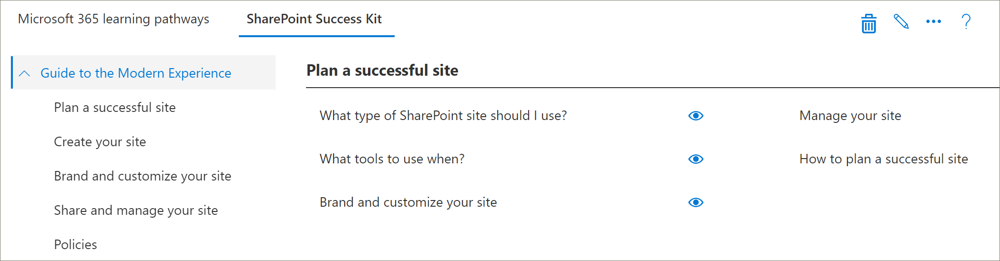

# Partner IntegrationsmodellePartner integration models
Es ist zwar nicht möglich, den Inhalt von Microsoft 365 Learning-Pfaden direkt aus dem SharePoint Online Bereitstellung-Dienst zu ergänzen, aber es gibt verschiedene Integrationsmodelle, die Partner zum Erstellen eines angepassten Mehrwert Diensts nutzen können. Angebote.While it’s not possible to supplement the Microsoft 365 learning pathways content directly ‘out of the box’ from the SharePoint Online Provisioning service, there are several integration models that partners can leverage to create aligned value-add service offerings. Die oben aufgeführten Partner Integrationsmodelle werden in der Reihenfolge der aufsteigenden Komplexität und der Höhe der Investitionen vorgestellt.The partner integration models above are presented in order of ascending complexity and levels of investment. Daher ist es unser Leitfaden, ihr Fachwissen zu erweitern und erweiterte Stufen basierend auf ihren Geschäftsmodellen zu absolvieren.Hence our guidance is to build your expertise and graduate to more advanced levels based on your business models.

 

## Wie sollte ich beginnen?How should I get started? 
Um zu beginnen, finden Sie hier einige bewährte Methoden.To get started, here are some best practices to follow.     

### 1. beginnen Sie mit der Erstellung von Know-how als Enabler.1. Begin with building expertise as an Enabler. 
Sie können einen Prozentsatz ihrer Kundenbasis sofort unterstützen, indem Sie das Schulungsportal für Lern Pfade aktivieren und gezielte Microsoft-Inhalts-Kuration durchführen.You can help a percentage of your customer base right away by enabling their learning pathways training portal and performing targeted Microsoft content curation. Anweisungen zum Vorbereiten von Lernpfaden finden Sie unter https://docs.microsoft.com/en-us/office365/customlearning/custom_provision.For instructions on provisioning learning pathways, see https://docs.microsoft.com/en-us/office365/customlearning/custom_provision.  

### 2. erweitern Sie dann ihre Dienste als Integrator2. Then extend your services as an Integrator
Durchführen einer Automatisierung Return on Investment Analysis-abhängig von der Menge ihrer Inhalte und/oder Dienstleistungen Integration benötigt.Perform an automation return on investment analysis - depending on the quantity of your content and/or services integration needs. Beispielsweise kann es nicht sinnvoll sein, die Entwicklungs-und Betriebskosten in Bezug auf unsere Richtlinien zur Inhalts Integration zu übernehmen, wenn Sie schnell manuell eine zielgerichtete benutzerdefinierte Wiedergabeliste erstellen können, die auf Ihre for-Pay-Inhalte verweist oder auf ihre Dienste verweist.For example, it may not make sense to take on the development and operational costs with respect to our content integration guidelines if you can quickly manually create a targeted custom playlist(s) pointing to your for-pay content or reference your services.

### 3. wenn der Return on Investment sinnvoll ist – berücksichtigen Sie die Umverteilung3. When the return on investment makes sense – consider Redistribution 
Wenn die Rentabilität sinnvoll ist, sollten Sie die Umverteilung (oder die Zusammenarbeit mit verwandten Lernpfaden) in die Lage versetzen, umgepackte Lösungen zu erstellen.When the return on investment makes sense – consider Redistribution (or working with related learning pathways partners) to build repackaged solutions. Diese basieren auf dem SharePoint Patterns and Practice Framework, das Lösungen zum Extrahieren benutzerdefinierter Websites und zum anschließende Bereitstellen in Kundenumgebungen bereitstellt.These are based on the SharePoint Patterns and Practice framework which provides solutions to extract customized sites and then deploy into customer environments 

## Von Partnern bereitgestellte Richtlinien zur Inhalts IntegrationPartner-provided content integration guidelines
Inhalte für Lern Pfade von Microsoft 365 werden von einer Reihe von JSON-Dateien gesteuert, die als Inhalts Manifeste für Ihr Lern Paket fungieren.Content for Microsoft 365 learning pathways is driven by a set of JSON files that act as content manifests for your learning package. Es gibt drei Dateien: Metadata. JSON, Playlisten. JSON und Assets. JSON.There are three files: metadata.json, playlists.json, and assets.json. Diese Dateien müssen so strukturiert sein, dass Sie den Modellen entsprechen, die das Webpart erkennt und dann von einem Content Delivery Network (CDN) gehostet wird, damit das Webpart Sie laden kann.These files need to be structured to match the models the web part recognizes and then hosted from a content delivery network (CDN) to allow the web part to load them. Microsoft stellt Start Vorlagen dieser Dateien bereit, damit Sie den Einstieg erhalten.Microsoft will provide starter templates of these files to get you started.  

**Haftungsausschluss:** die JSON-Dateistruktur kann aufgrund der bevorstehenden Lösungs Arbeit geändert werden.**Disclaimer:** the JSON file structure is subject to change based on upcoming solution work. Der Microsoft 365 Learning Pfads-Partner Early Adopter Program (EAP) wird über bevorstehende Änderungen dieser Art informiert.The Microsoft 365 learning pathways partner Early Adopter Program (EAP) will be informed of any impending changes of this nature. Zusammen mit allen Kunden Abwärtskompatibilität und/oder Übergangs Anleitungen.Along with any customer backwards compatibility and/or transition guidance. 

### Herunterladen der Microsoft 365-Lern Pfad LösungDownload the Microsoft 365 learning pathways solution
Sie können die Microsoft 365-Lern Pfad Lösung zusammen mit den JSON-Dateien aus dem GitHub-Repository herunterladen https://github.com/pnp/custom-learning-office-365:.You can download the Microsoft 365 learning pathways solution, along with the JSON files, from the GitHub repository: https://github.com/pnp/custom-learning-office-365. Beachten Sie, dass Microsoft zu diesem Zeitpunkt keine GitHub Pull-Anforderung für die Lösung übernimmt.Note that at this time, Microsoft is not taking GitHub pull request on the solution. Sie können die GitHub-Dateien jedoch als Ausgangspunkt für die Erstellung eines eigenen benutzerdefinierten Inhaltspakets verwenden.But you can use the GitHub files as a starting point for creating your own custom content pack. 

## Metadata. JSON-StrukturMetadata.json Structure
Sie können sich diese Datei als das Gehirn der Menüs und der Struktur vorstellen.You can think of this file as the brains of the menus and structure. Sie enthält alle Navigationsstrukturen sowie Auswahllisten für Daten in den beiden anderen Dateien.It contains all the navigation structure as well as pick lists for data in the other two files. 

|              NameName        |                     BeschreibungDescription                                                               | 
|:-----------------------------|-------------------------------------------------------------------------------------------|
|**Technologien****Technologies**              |Inhalte werden markiert und können basierend auf der zugewiesenen Technologie ausgeblendet werden.Content is tagged and can be hidden based on the Technology it’s assigned.                 |  
|&nbsp;&nbsp;ID&nbsp;&nbsp;Id                |GUID, die die Technologie darstelltGUID representing the technology                                                           |  
|&nbsp;&nbsp;Name&nbsp;&nbsp;Name              |Anzeigename der TechnologieDisplay name of the technology                                                             |
|&nbsp;&nbsp;*Subjects []*&nbsp;&nbsp;*Subjects[ ]*     |Ein Array von Themen, die eine Teilmenge der Technologie sindAn array of subjects that are a subset of the technology                                   | 
|&nbsp;&nbsp;&nbsp;&nbsp;ID&nbsp;&nbsp;&nbsp;&nbsp;Id    |GUID, die den Betreff darstelltGUID representing the subject                                                              |
|&nbsp;&nbsp;&nbsp;&nbsp;Name&nbsp;&nbsp;&nbsp;&nbsp;Name  |Anzeigename des BetreffsDisplay name of the subject                                                                |
|**Categories []****Categories [ ]**             |Kategorien informieren die Navigation des WebPart-Steuerelemente.Categories inform the navigation of the webpart. Jede Kategorie stellt eine oberste Ebene der Navigation dar.Each category represents a top level of the navigation                                                                                                                 |
|&nbsp;&nbsp;ID&nbsp;&nbsp;Id                |GUID, die die Kategorie/Unterkategorie darstelltGUID representing the category/subcategory                                                 |
|&nbsp;&nbsp;Name&nbsp;&nbsp;Name              |Anzeigename für die Kategorie/UnterkategorieDisplay name for the category/subcategory                                                  |
|&nbsp;&nbsp;Bild&nbsp;&nbsp;Image             |URL für das Bild, das im UX angezeigt werden soll (relativ zur CDN-Basis)URL for the image that should be displayed in the UX (relative to the CDN base)            |
|&nbsp;&nbsp;Technologie-Nr&nbsp;&nbsp;TechnologyId      |Die GUID der Technologie, mit der dieser Inhalt verwandt ist (optional – leere Zeichenfolge)The GUID of the Technology this content is related to (optional – empty string)            |
|&nbsp;&nbsp;SubjectId&nbsp;&nbsp;SubjectId         |Die GUID des Betreffs, mit dem dieser Inhalt verknüpft ist (optional – leere Zeichenfolge)The GUID of the Subject this content is related to (optional – empty string)               |
|&nbsp;&nbsp;Quelle&nbsp;&nbsp;Source            |Aus dem Quell-Array wird nicht speziell in UX verwendet, außer benutzerdefinierte Daten, die vom Benutzer hinzugefügt wurden, wird als "Mandant" gekennzeichnet, und der UX-Verwaltungsbereich lässt keine Bearbeitung von irgendetwas zu, das nicht als "Mandant" markiert ist.From Source array, not specifically used in UX other than custom data added by the user is marked as “Tenant” and the UX admin area does not allow editing of anything not marked “Tenant”.                           |
|&nbsp;&nbsp;*Unterkategorien []*&nbsp;&nbsp;*Subcategories[ ]*|Unterkategorien sind im Wesentlichen die NAV-Ebene ab Ebene 2 nach unten.Sub-Categories are basically the nav level from level 2 down. Die Struktur ist identisch mit einer nur geschachtelten Kategorie.The structure is the same as a Category just nested.          |
|**Benutzergruppen []****Audiences [ ]**             |Wenn einer Kategorie/Unterkategorie zugeordnete Wiedergabelisten verschiedene Benutzergruppen haben, ist eine Auswahl verfügbar, um die verfügbaren Benutzergruppen anzuzeigen.When playlists associated with a category/subcategory are various audiences tagged, a selector will be available to show the available audiences. |         
|&nbsp;&nbsp;ID&nbsp;&nbsp;Id                |GUID der BenutzergruppeGUID of the audience                                                                       |  
|&nbsp;&nbsp;Name&nbsp;&nbsp;Name              |Anzeigename der BenutzergruppeDisplay name of the audience                                                               |       
|**Sources []****Sources [ ]**               |Array von Zeichenfolgen, die Inhalte mit der Quelle bezeichnen, nicht speziell in anderen UX-Dateien als benutzerdefinierte Daten, die vom Benutzer hinzugefügt wurden, wird als "Mandant" gekennzeichnet, und im UX-Verwaltungsbereich kann nichts bearbeitet werden, das nicht als "Mandant" gekennzeichnet ist.Array of strings that tag content with its source, not specifically used in UX other than custom data added by the user is marked as “Tenant” and the UX admin area does not allow editing of anything not marked “Tenant”.                                                   |  
|**Ebenen []****Levels  [ ]**               |Wenn einer Kategorie/Unterkategorie zugeordnete Wiedergabelisten verschiedene Ebenen haben, ist eine Auswahl verfügbar, um die verfügbaren Ebenen anzuzeigen.When playlists associated with a category/subcategory are various levels tagged, a selector will be available to show the available levels.             |  
|&nbsp;&nbsp;ID&nbsp;&nbsp;Id                |GUID der EbeneGUID of the Level                                                                          |  
|&nbsp;&nbsp;Name&nbsp;&nbsp;Name              |Anzeigename der EbeneDisplay name of the Level                                                                  | 
|**StatusTag [ ]****StatusTag  [ ]**           |Status-Tag besteht darin, Inhalte mit verschiedenen Status zu identifizieren, die in der UX verfügbar gemacht werden.Status tag is to identify content with various status that will be exposed in the UX. Einige dieser Flags werden dem Consumer und einigen nur dem Administrator angezeigt.Some of these flags will be show to the consumer and some only to the admin.                                                   |  
|&nbsp;&nbsp;ID&nbsp;&nbsp;Id                |GUID des StatugTagGUID of the StatugTag                                                                      |  
|&nbsp;&nbsp;Name&nbsp;&nbsp;Name              |Anzeigename des StatusTagDisplay name of the StatusTag                                                              | 
|**Telemetrie []****Telemetry  [ ]**            |                                                                                           |  
|&nbsp;&nbsp;AppInsightsKey&nbsp;&nbsp;AppInsightsKey    |GUID des Schlüssels App Insights, den Sie eingerichtet haben, um das Laden des Viewer-Webparts nachzuverfolgen.GUID of the app insights key that you have set up to track the loading of the viewer web part. Die Nachverfolgung kann von einem Administrator für den gesamten Mandanten deaktiviert werden, die gesendeten Informationen werden jedoch anonymer Benutzer mit der Mandanten-ID. Weitere Informationen finden Sie in diesem Abschnitt.https://github.com/pnp/custom-learning-office-365#disabling-telemetry-collectionTracking can be turned off by an administrator for the entire tenant, but the information sent is anonymized user with the tenant id. Please see this section for more information https://github.com/pnp/custom-learning-office-365#disabling-telemetry-collection               |  
|**Version****Version**                   |Versionsinformationen werden von der Lösung verwendet, um Administratoren anzuzeigen, dass das Webpart aktualisiert wurde, und es dem Webpart auch gestatten, benutzerdefinierten Inhalt auf die neueste Version des Manifests selbst zu aktualisieren, wenn wesentliche Änderungen vorgenommen wurden.Version information is used by the solution to indicate to administrators that the webpart has updated and also allow the webpart to self-update custom content to the latest version of the manifest if significant changes have been made.         | 
|&nbsp;&nbsp;Manifest&nbsp;&nbsp;Manifest          |Die Version des ManifestsThe version of the manifest                                               |
|&nbsp;&nbsp;ManifestMinWebPart&nbsp;&nbsp;ManifestMinWebPart|Die minimale Version des WebPart, das mit der Version des Manifests verwendet wird.The minimum version of the webpart that works with the version of the manifest             |
|&nbsp;&nbsp;CurrentWebPart&nbsp;&nbsp;CurrentWebPart    |URL für das Bild, das im UX angezeigt werden soll (relativ zur CDN-Basis)URL for the image that should be displayed in the UX (relative to the CDN base)            |
|&nbsp;&nbsp;Repourl&nbsp;&nbsp;RepoURL           |Die URL des Repositorys, in dem die Update-Webpart-Anweisungen enthalten sind.The url of the repository where the updating web part instructions are.                    |
|**Inhaltspakete****Content Packs**             |Zu diesem Zeitpunkt werden Inhaltspakete für zusätzliche CDN-Daten nicht unterstützt.At this time content packs for additional CDN’s is not supported. Inhaltspakete ermöglichen Microsoft, andere von Microsoft erstellte Lösungen vorzuschlagen, die über den Bereitstellung Dienst bereitgestellt werden können, der M365LP nutzt, um Inhalte zu übertragen und sich selbst benutzerdefinierte CDNs.Content packs allow Microsoft to suggest other Microsoft created solutions that can be provisioned via the Provisioning service that leverage M365LP to deliver content and are in and of themselves custom CDNs.       | 
|&nbsp;&nbsp;ID&nbsp;&nbsp;Id                |GUID des Inhaltspakets/CDNGUID of the content pack/CDN                                                              |
|&nbsp;&nbsp;Name&nbsp;&nbsp;Name              |Anzeigename des CDNDisplay name of the CDN                                                                   |
|&nbsp;&nbsp;Beschreibung&nbsp;&nbsp;Description       |Beschreibung, die in der Benutzeroberfläche zum Hinzufügen eines Inhaltspakets angezeigt werden sollDescription to be displayed in UI for adding a content pack                               |
|&nbsp;&nbsp;Bild&nbsp;&nbsp;Image             |Bild, das in der Benutzeroberfläche zum Hinzufügen eines Inhaltspakets angezeigt werden sollImage to be displayed in UI for adding a content pack                                     |
|&nbsp;&nbsp;ProvisionURL&nbsp;&nbsp;ProvisionURL      |Die URL des Dienstpakets für die Paketerstellung zum Erstellen der Websitesammlung des InhaltspaketsThe URL to the provisioning service package to create the content pack’s site collection  |
|&nbsp;&nbsp;CDNbase&nbsp;&nbsp;CDNbase           |Die Basis-URL für die Manifeste für das InhaltspaketThe Base URL for the manifests for the content pack                                       |
|AssetOriginsAssetOrigins                  |Ein Array von URL-Ursprung, das in der später beschriebenen Datei "Assets. JSON" verwendet wird.An array of URL origin’s utilized in the assets.json file described later. Wenn die Ursprungs-URL diese unterstützt, wird eine Post-Nachricht an help_getClientHeight gesendet.If the origin URL supports it, a post message will be sent to help_getClientHeight. Eine Antwort in der Data-Eigenschaft von: "help_getClientHeight = {height of Content}" (beispielsweise "help_getClientHeight = 5769") ermöglicht, dass die Größe des iframes auf die entsprechende Höhe des Frame-Inhalts geändert wird.A response in the data property of: "help_getClientHeight={height of content}" (for example "help_getClientHeight=5769") will allow the iFrame to be resized to the appropriate height of the framed content.         |

## Playlists. JSON-StrukturPlaylists.json Structure
Playlists. JSON – das Wiedergabelisten Manifest ist ein Array von Objekten, die die Metadaten zu einer Wiedergabeliste und die Objekte beschreiben, die in der Wiedergabeliste enthalten sind.playlists.json – The playlists manifest is an array of objects that describe the metadata about a playlist and the assets that are included in the playlist.

|              NameName        |                     BeschreibungDescription                                                               | 
|:-----------------------------|-------------------------------------------------------------------------------------------|
|IdId                            |GUID, die die Wiedergabeliste darstelltGUID representing the playlist                                                             |  
|TitelTitle                         |Anzeigename der WiedergabelisteDisplay name of the playlist                                                               |
|ImageImage                         |Relative URL (von CDN) zu einem Bild, um die Wiedergabeliste zu visualisierenRelative URL (from CDN) to an image to visualize the playlist                              |                      
|Level-NrLevelId                       |Zugeordnete EbeneAssociated level                                                                           |
|Publikums-NrAudienceId                   |Zugeordnete BenutzergruppeAssociated audience                                                                        |
|Technologie-NrTechnologyId                 |Zugehörige TechnologieAssociated technology                                                                      |
|SubjectIdSubjectId                    |Anzeigename für die Kategorie/UnterkategorieDisplay name for the category/subcategory                                                  |
|QuelleSource                        |Aus dem Quell-Array, nicht speziell in UX andere als benutzerdefinierte Daten, die vom Benutzer hinzugefügt werden, wird als "Mandant" und der UX-Admin-Bereich nicht erlaubt die Bearbeitung von nichts, das nicht als "Mandant" gekennzeichnet.From the source array, not specifically used in UX other than custom data added by the user is marked as “Tenant” and the UX admin area does not allow editing of anything not marked “Tenant”.                                              |
|CatIdCatId                         |Die Kategorie-oder Unterkategorie-ID, die den Container darstellt, in dem die Wiedergabeliste angezeigt werden soll.The Category or SubCategory ID that represents the container the playlist should be shown in. Im Moment unterstützt das Manifest das Auswählen einer Kategorie oder Unterkategorie als Container nicht, wenn es auch untergeordnete Unterkategorien enthält.Currently the manifest does not support selecting a Category or SubCategory as the container if it also has SubCategory children.        |
|BeschreibungDescription                   |Für jede Wiedergabeliste im UX wurde eine Beschreibung angezeigt.A description showed for each playlist in the UX                                           |
|StatusTagIdStatusTagId                   |Zugeordnetes Status-TagAssociated status tag                                                                      |
|Eingestellte AbwesenheitsstatusStatusNote                    |Hinweise zu Inhalten, die Administratoren angezeigt werdenNotes about content displayed to administrators                                            |
|*Objekte []**Assets[]*                        |Ein Array von GUIDs für die Objekte, die Teil dieser Wiedergabeliste sind, in der Anzeigereihenfolge.An array of GUID’s for the assets that are part of this playlist, in display order.        |         

## Asset. JSON-StrukturAsset.json Structure
Playlists. JSON – das Wiedergabelisten Manifest ist ein Array von Objekten, die die Metadaten zu einer Wiedergabeliste und die Objekte beschreiben, die in der Wiedergabeliste enthalten sind.playlists.json – The playlists manifest is an array of objects that describe the metadata about a playlist and the assets that are included in the playlist.

|              NameName        |                     BeschreibungDescription                                                               | 
|:-----------------------------|-------------------------------------------------------------------------------------------|
|IdId                            |GUID, die die Wiedergabeliste darstelltGUID representing the playlist                                                             |  
|TitelTitle                         |Anzeigename der WiedergabelisteDisplay name of the playlist                                                               |
|BeschreibungDescription                   |---                                                                                           |                      
|URLURL                           |Die Quell-URL für das Objekt, das auf den IFRAME angewendet werden soll.The source url for the asset, to be applied to the iFrame                                  |
|Technologie-NrTechnologyId                  |Zugehörige TechnologieAssociated technology                                                                      |
|SubjectIdSubjectId                     |Zugeordneter BetreffAssociated subject                                                                         |
|QuelleSource                        |Anzeigename für die Kategorie/UnterkategorieDisplay name for the category/subcategory                                                  |
|StatusTagIdStatusTagId                   |Zugeordnetes Status-TagAssociated status tag                                                                      |
|Eingestellte AbwesenheitsstatusStatusNote                    |Hinweise zu Inhalten, die Administratoren angezeigt werden.Notes about content displayed to administrators.                                           |

## ZwischenspeicherungCaching
Die aktuelle Version des Viewer-Webparts verwendet eine zwischengespeicherte Version der Manifestdateien für 24 Stunden.The current version of the viewer web part utilizes a cached version of the manifest files for 24 hours. Nach 24 Stunden wird der erste Benutzer, der das Webpart für "Hit" verwendet, den Leistungs Treffer, um den Cache zu aktualisieren, indem er die Manifeste aus dem Quell-CDN herunterlädt und diese Informationen mit ausgeblendeten Technologien und Wiedergabelisten zusammenführt sowie in benutzerdefinierten Unterkategorien zusammenführt. Wiedergabelisten und Objekte.After 24 hours, the first user that hit’s the webpart takes the performance hit to refresh the cache by downloading the manifests from the source CDN and merge that information with hidden technologies and playlists as well as merging in custom sub-categories, playlists, and assets. Alternativ wird das Webpart "admin" immer den Inhalt aus den Manifesten herunterladen und in zusammenführen und den Cache aktualisieren.Alternately the admin web part always downloads the content from the manifests and merges them in and updates the cache.  Das heißt, der Administrator kann ein Cache Update jederzeit erzwingen, indem Sie das Admin-Webpart laden, auch zur Verwaltungsseite wechseln.So, in other words, the administrator can force a cache update at any time by loading the admin web part, aka going to the Administration page.

## Inhaltspaket-RichtlinienContent Pack Guidelines
Das Inhaltspaket Feature entsperrt die folgenden Szenarien:The Content Pack feature unlocks the following scenarios:
- Die Möglichkeit für Partner, Mehrwert basierte benutzerdefinierte Lerninhalte, die auf die Kundenumgebung zugeschnitten sind, neu zu verteilenThe ability for partners to redistribute value-added custom learning content custom tailored to customers’ environment
- Organisationen mit einem starken Schulungsteam und dem IT-Support können benutzerdefinierte Lerninhalte erstellen, die sich an Ihre eigenen internen Systeme und die Steuerung richten.The ability for organizations with a strong training team and IT support to build custom learning content directed at their own internal systems and governance
- Die Möglichkeit für Microsoft, in Zukunft zusätzliche Lernpfade bereitzustellen, die von Kunden in die Option integriert werden könnenThe ability for Microsoft to deliver additional learning pathways in the future that customers can opt into

Dieser aktuelle Dokumentationssatz ist aufgrund der Komplexität des Features absichtlich für Partner vorgesehen.This current documentation set is intentionally targeted for Partners due to the feature’s complexity. Das Service Team arbeitet in Zukunft aktiv an einer besseren Unterstützung und Aktivierung von Szenario #2.The service team is actively working to better support and enable scenario #2, in the future. 

## Funktionsweise von InhaltspaketenHow Content Packs work
Microsoft verwendet GitHub-Seiten als CDN-Quelle (Content Delivery Network) für Ihre Manifestdateien und-Bilder.Microsoft utilizes GitHub pages as a Content Delivery Network (CDN) source for its manifest files and images. Wir haben einen docs-Ordner im Stamm unseres GitHub-Repositorys, der Unterordner für jede Version der Manifestdateien enthält.We have a docs folder at the root of our GitHub repository that includes sub folders for each version of the manifest files. In jedem Ordner gibt es drei Manifestdateien sowie einen Bilder Ordner, in dem alle Kategorien, Unterkategorien und Wiedergabelisten Bilder gespeichert werden.Inside each folder there are three manifest files, plus an images folder to store all the category, subcategory, and playlist images. 

Es ist wichtig, dass Sie die gleiche Versions Verwaltungsstruktur wie bei Microsoft beibehalten, wenn Sie sich für die Erweiterung der Lern Pfad Lösung mit Ihrem eigenen Inhaltspaket entscheiden.It is important that you maintain the same versioning structure that Microsoft does should you choose to extend the learning pathways solution with your own content pack. Der CDN-Endpunkt sollte nicht den Ordner "Version" enthalten, da die manifestVersion, die das Webpart unterstützt, in dieses Element eingebrannt wird und automatisch an die CDN-URL angehängt wird.Your CDN endpoint should not include the version folder, as the manifest version the web part supports is baked into it and is automatically appended to the CDN url. Wir werden Ihnen natürlich Zeit geben, neue Instanzen Ihrer Manifestdateien zu erstellen, sobald wir Sie überarbeitet haben.We will obviously give you time to create new instances of your manifest files any time we revision it.

 

Weitere Informationen zum Verwenden von GitHub-Seiten als CDN-Quelle finden Sie in der folgenden Hilfedokumentation [https://help.github.com/en/articles/configuring-a-publishing-source-for-github-pages](https://help.github.com/en/articles/configuring-a-publishing-source-for-github-pages):.For more information about utilizing GitHub pages as your CDN source please see the following help documentation: [https://help.github.com/en/articles/configuring-a-publishing-source-for-github-pages](https://help.github.com/en/articles/configuring-a-publishing-source-for-github-pages).

Die Lösung von Microsoft macht die Informationen zu den Objekten für die Öffentlichkeit zugänglich, da es keine Sicherheit gibt, wer Zugriff auf diese Dateien hat.Microsoft’s solution makes the information about the assets open to the public as there is no security around who has access to these files. Wir glauben, dass es eine freie Inhalts Schicht für einen Verbraucher geben sollte, die besagt, dass Sie für einige oder alle Ihre Inhalte, die Sie benötigen, um diese unterschiedlich in den technischen Einschränkungen der Lösung umzusetzen und die Verwendung von GitHub-Seiten zu leisten, keineswegs bedeuten. s eine Anforderung.We believe that there should be a free layer of content for a consumer, that said if you have a need for pay wall for some or all of your content you will need to implement this differently within the technical limitations of the solution and using GitHub pages is by no means a requirement. Jeder CDN-Anbieter, den Sie verwenden möchten, ist in Ordnung, wenn Sie die Struktur der Versionsnummerierung beibehalten, die wir skizziert haben.Any CDN provider you would like to use is fine if you maintain the version numbering structure we’ve outlined. Wie bereits erwähnt, wird die Version der Manifeststruktur, die das Webpart unterstützt, in den Code gebacken und automatisch an die CDN-URL angehängt.As stated previously, the version of the manifest structure the web part supports is baked into the code and is automatically appended to the CDN URL. 

## Leitfaden zur Integration der InhaltspaketeContent Pack Integration Guidance 
Die Admin-und Viewer-Webparts wurden erweitert, um dem Verbraucher die Möglichkeit zu geben, zusätzliche CDN-Endpunkte in seinem Mandanten zu konfigurieren, sodass das Viewer-Webpart auswählen kann, welches CDN für die angezeigten Daten verwendet werden soll.The admin and viewer web parts have been extended to allow the consumer to configure additional CDN endpoints in their tenant which will then allow the viewer web part to select which CDN they should source the data they display. 

Key Framing zu beachten, für dieses Feature:Key framing to keep in mind for this feature: 
- Dies gilt primär für Partner umverteilungs Szenarien, bei denen die manuelle Wiedergabelisten Konfiguration zu umständlich ist.This is primary applicable for partner redistribution scenarios – where manual playlist configuration is too cumbersome 
- Benutzerdefinierte Inhaltspakete sind ein erweitertes Feature und sollten nur von Partnern verwendet werden, die über Erfahrung beim Verwalten von Webinhalten verfügen.Custom Content Packs are an advanced feature and should only be used by Partners with experience administrating web content. Nicht vertrauenswürdige Inhaltsquellen führen möglicherweise zu unsicheren Inhalten auf Ihrer Website.Untrustworthy content sources may introduce unsafe content into your site. Sie sollten nur vertrauenswürdige Quellen hinzufügen.You should only add sources that you trust.

> **Wichtiger Hinweis** Bevor Sie ein benutzerdefiniertes Inhaltspaket hinzufügen, müssen Sie Microsoft 365-Lern Pfade 3,0 oder höher installiert haben.**IMPORTANT** Before adding a Custom Content Pack, you must have provisioned Microsoft 365 learning pathways 3.0 or later. Informationen zum informataion für Microsoft 365-Lern Pfade finden Sie unter [Provision Microsoft 365 Learning Pfads](https://docs.microsoft.com/en-us/office365/customlearning/custom_provision).For informataion about provisioning Microsoft 365 learning pathways, see [Provision Microsoft 365 learning pathways](https://docs.microsoft.com/en-us/office365/customlearning/custom_provision).

## Inhalts-WhitelistingContent Whitelisting
Als Partner ist es Ihre Aufgabe, ihren Verbrauchern dabei zu unterstützen, sicherzustellen, dass Ihre Inhalte in Ihrer Umgebung auf der weißen Liste liegen.As a partner it’s your responsibility to assist your consumers in making sure your content is whitelisted in their environment. Wir empfehlen Ihnen, ein Testszenario in Ihrer Umgebung zu erstellen, um zu überprüfen, ob Ihre Inhalte in einer SharePoint-Seite innerhalb Ihrer Firewall IFRAME 'd sein können.We suggest you create a test scenario in their environment to validate that your content can be iFrame’d into a SharePoint page inside of their firewall. Befolgen Sie die Anweisungen zum [Erstellen von SharePoint-Seiten für benutzerdefinierte Wiedergabelisten](https://docs.microsoft.com/en-us/office365/customlearning/custom_createnewpage) , um zu bestätigen, dass dies der Fall ist.Follow the [Create SharePoint pages for Custom Playlists](https://docs.microsoft.com/en-us/office365/customlearning/custom_createnewpage) instructions to confirm this is the case.

## Hinzufügen eines Inhaltspakets zu LernpfadenAdd a Content Pack to Learning Pathways
Nachdem Sie das JSON-Formular geändert und Ihr CDN definiert haben, können Sie das Contact Pack zu Lernpfaden hinzufügen.Once you've created modified the JSON and defined your CDN, you can add the Contact Pack to learning pathways. 

1. Klicken Sie auf der **Start** Seite der Website für Lern Pfade auf **Start** , und klicken Sie dann auf **Lern Pfadverwaltung**.From the learning pathways site **Home** page, point to **Home** and then click **Learning pathways administration**. 
2. Klicken Sie auf der Seite **Verwaltung** auf die **... Inhaltspaket** in der oberen rechten Ecke der Seite hinzufügen.From the **Administration** page, click the **... Add Content Pack** in the upper-right corner of the page.
3. Klicken Sie auf benutzerdefiniertes Inhaltspaket, und geben Sie einen Namen für das Inhaltspaket ein, und geben Sie dann das CDN an, in dem sich die JSON-Dateien befinden.Click Custom Content Pack, and then enter a name of the Content Pack and then specify the CDN where the JSON files are located.

4. Klicken Sie auf **Speichern**.Click **Save**. Die Inhalte aus Ihrem benutzerdefinierten Inhaltspaket sollten nun auf der Seite "Verwaltung" angezeigt werden.The content from your Custom Content Pack should now appear in the Administration page. Hier ein Beispiel:Here is an example. 

## Filtern nach dem Inhaltspaket im WebpartFilter to the Content Pack in the web part
Mit Lernpfaden können Sie das Webpart Lernpfade zu einer Seite hinzufügen, das Webpart filtern, um auf die benutzerdefinierte Inhaltspaket Quelle zu zeigen, und dann das Webpart auf die gewünschte Kategorie, Unterkategorie, Wiedergabeliste und Objekt filtern.With learning pathways, you can add the learning pathways web part to a page, filter the web part to point to the Custom Content Pack source, and then filter the web part to the category, subcategory, playlist, and asset that you want. 

1. Klicken Sie auf der Website Lern Pfade auf **neu**und dann auf **Seite**.From the learning pathways site, click **New**, and then **Page**.
2. Klicken Sie auf **leer**und dann auf **Seite erstellen**.Click **Blank**, and then **Create Page**.
3. Geben Sie der Seite einen Namen.Give the page a name. 
4. Klicken Sie auf **+ einen neuen Abschnitt** auf der linken Seite der Seite hinzufügen.Click **+ Add a new section** on the left side of the page.
5. Klicken **+** Sie in die obere Mitte des neuen Abschnitts, und fügen Sie dann das **Microsoft 365 Learning Pfads** -Webpart hinzu.Click **+** in the top-middle of the new section, and then add the **Microsoft 365 learning pathways** web part.
6. Klicken Sie auf das Webpart, und klicken Sie dann auf das Symbol **Bearbeiten** .Click the Web part, and then click the **Edit** icon.
7. Wählen Sie im Feld **Lernquelle auswählen** Ihr benutzerdefiniertes Inhaltspaket aus, und Filtern Sie das Webpart dann auf den gewünschten Inhalt.In the **Select the Learning Source** box, select your Custom Content Pack, and and then filter the web part to the content you want. Im folgenden finden Sie ein Beispiel für das Webpart, das aus einem benutzerdefinierten Inhaltspaket in eine Wiedergabeliste gefiltert wurde.The following provides an example of the Web part filtered to a playlist from a Custom Content Pack.

  

