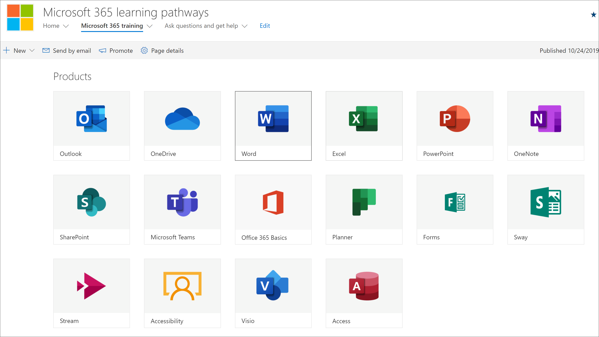
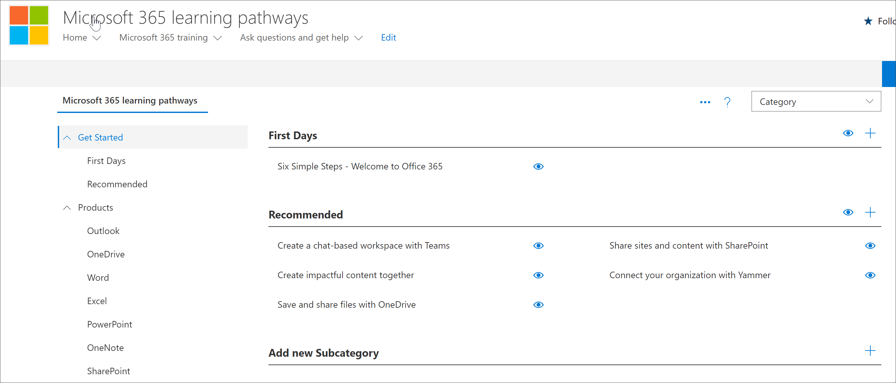

# Planen der Inhalte für Lern Pfade
Bevor Sie sich mit der Einführung von Microsoft 365-Lernpfaden vertraut machen, sollten Sie sich einige Zeit nehmen, um die Lerninhalte, Tools und Funktionen, die Ihnen zur Verfügung stehen, zu vermessen. Unser Ziel ist es, Ihnen dabei zu helfen, die Benutzer Ihrer Organisation so schnell und effizient wie möglich auf dem neuesten Stand zu halten und produktiv zu nutzen. Wenn es um die Planung von Lern wegen geht, empfehlen wir einen dreistufigen Prozess:

1. **Überprüfen Sie die verfügbaren Ressourcen** – sowohl die Ressourcen, die über Lern Pfade bereitgestellt werden, als auch die in Ihrer Organisation verfügbaren Ressourcen. Die besten Lernpläne kombinieren sowohl Microsoft-Ressourcen als auch Ressourcen aus Ihrer Organisation.
2. Lernen Sie **die Funktionen des Tools für Lern Pfade kennen** – wir geben Ihnen eine kurze Einführung. 
3. **Erstellen eines Inhalts Plans** – überprüfen Sie die verfügbaren Einführungsleitfäden, um Sie beim Erstellen eines Gesamtplans zu unterstützen.

## Überprüfen der verfügbaren Ressourcen
Bevor Sie einen Inhaltsplan für Microsoft 365-Lern Pfade erstellen, sollten Sie sich Zeit nehmen, um alle verfügbaren Ressourcen zu entdecken.  

### Überprüfen der SharePoint-Website für Lern Pfade
Die Microsoft 365-Lern Pfad Lösung stellt eine SharePoint-Kommunikationswebsite mit einem Webpart bereit, das mit einem Online Katalog verbunden ist. Die SharePoint-Website ist vollständig anpassbar, einschließlich des Website namens, des Logos, der Seiten, Menüelemente, Designs und Kacheln. Nehmen Sie sich eine Weile Zeit, um auf die Kacheln und Menüelemente zu klicken, um zu ermitteln, was auf der Website für Lern Pfade verfügbar ist.

### Überprüfen der Inhalte aus dem Online Katalog mit dem Webpart
Das Webpart wird standardmäßig einer Reihe von Seiten auf der SharePoint-Kommunikationswebsite hinzugefügt. Der vollständige Inhaltskatalog wird auf der Microsoft 365-Schulungsseite bereitgestellt. Auf der Microsoft 365-Schulungsseite wird das Webpart für Lern Pfade gehostet, das für die Anzeige aller für Lern Pfade verfügbaren Schulungen konfiguriert ist. 

**So zeigen Sie die Microsoft 365-Schulungsseite an**
1. Klicken Sie auf das Menüelement Microsoft 365 Training. 
1. Scrollen Sie auf der Seite nach unten, um alle Kategorien und Unterkategorien anzuzeigen.
2. Kick die Reifen ein wenig. Klicken Sie auf einige Unterkategorien, und klicken Sie dann auf einige Wiedergabelisten, um ein Gefühl dafür zu erhalten, wie Lern Pfade Inhalte organisiert werden. 

### Anzeigen der Verwaltungsseite
Die Verwaltungsseite enthält eine Liste der verfügbaren Inhalte. Hier können Sie Inhalte ausblenden, neue Wiedergabelisten erstellen und Wiedergabelisten hinzufügen, bearbeiten und entfernen. Klicken Sie durch die verschiedenen Kategorien und Wiedergabelisten, um den vollständigen Atem der verfügbaren Inhalte anzuzeigen. 

**, Um die Verwaltungsseite anzuzeigen.**
1. Zeigen Sie auf der Website Lernpfade auf den Dropdownpfeil Start Menü, und klicken Sie dann auf Lern Pfadverwaltung.  
2. Klicken Sie dann durch die verschiedenen Kategorien, Unterkategorien und Wiedergabelisten, um ein Gefühl für den Hauch von Inhalten zu erhalten, die Ihnen zur Verfügung stehen. 

### Kennenlernen der Funktionen von Microsoft 365-Lernpfaden
Mit den Lernpfaden von Microsoft 365 können Inhalte, die von Microsoft mit Inhalten erstellt wurden, die Sie erstellen, für bestimmte Richtlinien und Verfahren zur Verfügung gestellt werden, die für Ihre Organisation eindeutig sind. Als bewährte Methode sollten Sie die von Microsoft bereitgestellten Inhalte so weit wie möglich nutzen. Microsoft aktualisiert einzelne Ressourcen regelmäßig und aktualisiert den vollständigen Bestand an Inhalten auf vierteljährlicher Basis. In der Regel erstellt eine Organisation 10-20% eindeutige Inhalte und lässt dann die restlichen 80% an Microsoft weiter, um auf dem neuesten Stand zu sein. In der folgenden Liste wird beschrieben, wie Lern Pfade Inhalte organisiert werden, zusammen mit Richtlinien für den Inhalt, der geändert oder erstellt werden kann. Anleitungen zum Anpassen von Inhalten finden Sie im Abschnitt Anpassen von Lernpfaden im Admin Success Center.

- **Categories** -sind Container für Unterkategorien. Kategorien werden von Microsoft bereitgestellt und können nicht erstellt oder geändert werden.
- Unter **Kategorien** -sind Container für Wiedergabelisten. Microsoft stellt Unterkategorien zur Verfügung, die Sie nicht ändern können, aber Sie können eigene Unterkategorien erstellen. 
- **Playlist** -sind Container für Objekte. Microsoft stellt Wiedergabelisten zur Verfügung, die Sie nicht ändern können, aber Sie können Ihre eigenen Wiedergabelisten erstellen.  
- **Objekte** – sind die Lernseiten innerhalb der Wiedergabeliste. Microsoft stellt Objekte in Wiedergabelisten bereit, die Sie nicht ändern können, aber Sie können eigene Objekte erstellen und Sie zu Wiedergabelisten hinzufügen. EST

### Überprüfen zusätzlicher Ressourcen von Microsoft
Microsoft stellt Hilfe-und Schulungsressourcen bereit, die Sie bei der Planung von Inhalten für Lern Pfade nutzen können.  

-  [Office-Hilfe und-Schulung](https://support.office.com)
-  [Office 365-Schulungscenter](https://support.office.com/office-training-center)

### Überprüfen der Lernressourcen in Ihrer Organisation
Bestandsaufnahme der Lerninhalte, die Ihnen in Ihrer Organisation bereits zur Verfügung stehen.
Beispielsweise haben in Ihrer Organisation möglicherweise bereits benutzerdefinierte schnell Start Handbücher, Cheat Sheets oder SharePoint-Seiten bereitgestellt, die Microsoft 365-Bereitschaft, Helpdesk, Onboarding oder Schulungen gewidmet sind. Vorhandene SharePoint-Objekte können in die Microsoft 365-Portal-Wiedergabelisten integriert werden und mit Microsoft-Inhalten in einer Wiedergabeliste gemischt werden, um eine gezielte Wiedergabeliste für Ihre Organisation zu erstellen. Weitere Informationen zum Mischen der Inhalte Ihrer Organisation mit den Inhalten von Microsoft finden Sie unter [Anpassen von Lernpfaden](custom_overview.md). Abschnitt Anpassen von Lernpfaden im Admin Success Center.

### Nutzen der Adoptions Ressourcen
Beachten Sie, dass Sie mit der Verwendung von Lernpfaden innerhalb von Tagen beginnen können, es empfiehlt sich jedoch, vor der Ausführung einer Strategie für die Lernkampagne eine neue Technologie oder eine Reihe von Diensten zu planen. Das Entwickeln eines Inhalts Plans und das Verwenden von Lernpfaden ist wirklich Teil eines umfassenderen Bemühens bei der Planung einer allgemeinen Change Management-Strategie, daher bieten wir Einführungsmaterialien an, die Sie für die Planung Ihrer Gesamtstrategie nutzen können. Im Rahmen Ihres Planungsaufwands sollten Sie sich [Adoptions Ressourcen](https://resources.techcommunity.microsoft.com/adoption/)ansehen.

### Erstellen eines Lernplans und durchlaufen des Lern Plans 
Viele Unternehmen, die Lern Pfade erfolgreich eingeführt haben, haben Lern Kampagnen mit Schwerpunkt auf bestimmten Szenarien oder Technologien angenommen. Beispiel: "mehr Collaborative-using Teams" oder "mobil mit Outlook Mobile". Beispiele für potenzielle Lern Kampagnen finden Sie unter Verwendung des [downloadbaren Adoptions Kits](https://teamworktools.azurewebsites.net/m365lp/m365lpadoptionkit.zip).

 
