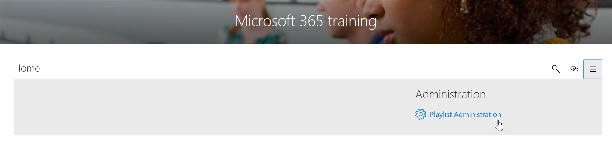

# Bereitstellungslösung für neue Lern Pfade 
Organisationen, die keine Lernpfade in Ihrem Mandanten bereitgestellt haben, können den SharePoint-Such Buch Dienst verwenden, um die Lösung für mehrsprachige Lern Pfade hinzuzufügen. Mit dieser Option wird die SharePoint-Vorlage für Lern Pfade in neun Sprachen übersetzt und kann mit mindestens einer Änderung verwendet werden.

> [!IMPORTANT]
> Wenn Sie bereits Lern Pfade in Ihrem Mandanten bereitgestellt haben, wird empfohlen, dass Sie Lern Pfade [Aktualisieren](custom_update.md) . Wenn Sie eine neue Instanz von Lernpfaden installieren, müssen Sie alle Anpassungen von der vorhandenen Website manuell auf die neue Website übertragen. 

## Voraussetzungen für mehrsprachige Unterstützung
 
Um Microsoft 365-Lernpfade mit dem "Look Book Service" erfolgreich einzurichten, muss die Person, die die Einrichtung ausführt, die folgenden Voraussetzungen erfüllen: 
 
- Die Person, die Lernpfade ausstellt, muss ein Mandanten Administrator des Mandanten sein, in dem Lern Pfade eingerichtet werden.  
- Ein Mandanten-App-Katalog muss in der apps-Option des SharePoint Admin Center verfügbar sein. Wenn Ihre Organisation nicht über einen SharePoint-Mandanten-App-Katalog verfügt, lesen Sie in der [SharePoint Online Dokumentation](https://docs.microsoft.com/sharepoint/use-app-catalog) nach, um eine zu erstellen. Sie müssen mindestens zwei Stunden nach dem Erstellen des App-Katalogs warten, bevor Sie Lern Pfade einrichten.  
- Die Person, die Lern Pfade anstellt, muss ein Websitesammlungsbesitzer des Mandanten-App-Katalogs sein. Wenn die Person, die Lern Pfade anbietet, kein Websitesammlungsbesitzer des App-Katalogs ist, führen Sie die [folgenden Schritte](addappadmin.md) aus, und fahren Sie fort. 

## Sicherstellen, dass für das mandantenadministrator Konto keine Sprache ausgewählt ist
Vergewissern Sie sich vor dem Bereitstellen von Lernpfaden, dass für das Administratorkonto für den Mandanten keine Sprache ausgewählt ist. Hier erfahren Sie, wie Sie überprüfen können, ob für das Administratorkonto keine Sprache ausgewählt ist. 
1.  Wechseln Sie mit Ihrem Edge-Administratorprofil zu Office.com.
2.  Geben Sie die Benutzeranmeldeinformationen (falls erforderlich) ein.
3.  Klicken Sie in Microsoft 365 auf **alle apps** > vertiefen. 
4.  Klicken Sie auf **Me**  >  -**Update Profil**.
5.  Scrollen Sie auf der Seite nach unten, und klicken Sie auf **wie kann ich die Sprach-und Ländereinstellungen ändern**.
6.  Klicken Sie **hier**, und klicken Sie dann auf die Ellipsen **...**.
7.  Unter **meine Anzeigesprachen**sollten **keine Sprachen ausgewählt**angezeigt werden. Wenn eine Sprache ausgewählt ist, heben Sie die Auswahl auf.

### So stellen Sie Lern Pfade zur Verfügung

1. Wechseln Sie zur [Seite Microsoft 365 Learning Pfads Solution](https://lookbook.microsoft.com/details/3df8bd55-b872-4c9d-88e3-6b2f05344239).
2. Klicken Sie auf **zu Ihrem Mandanten hinzufügen**. Wenn Sie nicht bei Ihrem Mandanten angemeldet sind, werden Sie vom Dienst für die Verwaltung aufgefordert, Ihre Mandanten-Administratoranmeldeinformationen einzugeben. 
3. Wählen Sie im Dialogfeld angeforderte Berechtigungen die Option **Zustimmung im Namen Ihrer Organisation** aus, und wählen Sie dann **annehmen**aus.

Der Such Buch Dienst benötigt diese Berechtigungen, um den Mandanten-App-Katalog zu erstellen, die Anwendung im Mandanten-App-Katalog zu installieren und die Websitevorlage zur Verfügung zu stellen. Es gibt keine Gesamtauswirkung auf ihren Mandanten. Diese Berechtigungen werden explizit für den Zweck der Lösungsinstallation verwendet. Sie müssen diese Berechtigungen akzeptieren, um mit der Installation fortzufahren.

4. Füllen Sie die Felder auf der Seite Informationen zur Datenverarbeitung entsprechend für Ihre Installation aus. Geben Sie mindestens die e-Mail-Adresse ein, unter der Sie Benachrichtigungen über den Bereitstellung-Prozess und die Ziel-URL für die Bereitstellung Ihrer Website erhalten möchten.  
> [!NOTE]
> Stellen Sie die Ziel-URL für Ihre Website so freundlich wie "/Sites/MyTraining" oder "/Teams/LearnMicrosoft365" für Ihre Mitarbeiter dar.

6. Klicken Sie auf bereit **Stellung** , wenn Sie Lern Pfade in Ihrer Mandanten Umgebung installieren möchten.  Der Bereitstellung-Prozess kann bis zu 15 Minuten dauern. Sie werden per e-Mail benachrichtigt, wenn die Website verfügbar ist. 

> [!IMPORTANT]
> Der mandantenadministrator, der die Website für Lern Pfade bereitstellt, muss zur Website wechseln und dann **CustomLearningAdmin. aspx** öffnen, um die Administrator Eigenschaften für Lern Pfade zu initialisieren. Zu diesem Zeitpunkt sollte der mandantenadministrator dem Standort auch Besitzer zuweisen. 

## Überprüfen des Erfolgs der Vorstellung und Initialisieren der CustomConfig-Liste

Wenn die Einrichtung abgeschlossen ist, erhält der mandantenadministrator, der die Website vorsieht, eine e-Mail vom Look Book Service. Die e-Mail enthält einen Link zu der Website. An dieser Stelle sollte der mandantenadministrator die Website über den in der e-Mail angegebenen Link aufrufen und die Website für die erste Verwendung einrichten:

- Navigieren Sie in das Verzeichnis `<YOUR-SITE-COLLECTION-URL>sites/<YOUR-SITE-NAME>/SitePages/CustomLearningAdmin.aspx`. Beim Öffnen von **CustomLearningAdmin. aspx** wird das **CustomConfig** -Listenelement initialisiert, das Lern Pfade für die erste Verwendung einrichtet. Sie sollten eine Seite sehen, die wie folgt aussieht:

## Hinzufügen von Besitzern zur Website
Als mandantenadministrator ist es unwahrscheinlich, dass Sie die Person anpassen, die die Website anpasst, sodass Sie der Website einige Besitzer zuweisen müssen. Besitzer verfügen über Administratorrechte für die Website, damit Sie Website Seiten ändern und die Website neu Branding können. Sie haben auch die Möglichkeit, Inhalte auszublenden und anzuzeigen sowie benutzerdefinierte Wiedergabelisten und Unterkategorien zu erstellen.  

1. Klicken Sie im Menü SharePoint- **Einstellungen** auf **Websiteberechtigungen**.
2. Klicken Sie auf **Erweiterte Berechtigungseinstellungen**.
3. Klicken Sie auf **Microsoft 365 Lern Pfad Besitzer**.
4. Klicken Sie auf **neu**  >  **Hinzufügen von Benutzern zu dieser Gruppe**, und fügen Sie dann die Personen hinzu, die Besitzer sein sollen. 
5. Fügen Sie einen Link zum [Durchsuchen der Website](custom_exploresite.md) in der Freigabenachricht hinzu, und klicken Sie dann auf **Freigeben**.

## Hinzufügen von Übersetzern zur Website
Wenn Sie Übersetzer für die Website verwenden, können Sie ihnen Berechtigungen zuweisen. Übersetzer benötigen Mitgliedsberechtigungen oder höher. 

## Auswählen von Optionen für die Verwendung von mehreren Sprachen auf der Website
Der SharePoint-Such Buch Dienst erstellt die Website für Lern Pfade in neun Sprachen. Es gelten die folgenden Empfehlungen:
- Deaktivieren der Sprachen, die nicht unterstützt werden sollen
- Wenn Sie keine mehrsprachige Website unterstützen, deaktivieren Sie die mehrsprachige Funktion. Weitere Informationen finden Sie im Abschnitt "Deaktivieren der mehrsprachigen Unterstützung" weiter unten in diesem Thema.

### Entfernen von Sprachen, die nicht unterstützt werden sollen
Für Organisationen, die nur eine Sprache unterstützen möchten, wird neben der Standardsprache Englisch empfohlen, nicht unterstützte Sprachen zu entfernen. 
1. Wählen Sie auf der Website Lern Pfade die Option **Einstellungen** von oben rechts auf der Seite aus, und wählen Sie dann **Website Informationen**aus.
2. Wählen Sie unten im Bereich Website Informationen die Option **Alle Websiteeinstellungen anzeigen**aus.
3. Wählen Sie unter **Websiteverwaltung**die Option **Spracheinstellungen**aus.
4. Schieben Sie unter **Aktivieren von Seiten und Nachrichten in mehrere Sprachen**die Umschaltfläche **auf ein**. Es sollte standardmäßig aktiviert sein.
5. Klicken Sie Unterwebsite Sprachen hinzufügen oder entfernen auf **Entfernen** , um die Sprachen zu entfernen, die für die Website nicht erforderlich sind. Im folgenden finden Sie ein Beispiel für die Seite "Spracheinstellungen", mit der Italienisch für die Website zusätzlich zur Standardsprache Englisch unterstützt wird.

> [!NOTE]
> Beim Entfernen von Sprachen können Sie die Standardsprache Deutsch nicht entfernen. 

### Zuweisen von Übersetzern
Wenn Sie Seiten übersetzen möchten, weisen Sie optional einen oder mehrere Übersetzer für jede Sprache zu (mit Ausnahme der Standardsprache der Website). 
- Geben Sie in der Spalte **Translator** den Namen der Person ein, die Sie Übersetzer sein möchten, und wählen Sie dann den Namen aus der Liste aus. 

> [!NOTE]
> Jeder Benutzer in der Active Directory Ihrer Organisation kann als Übersetzer zugewiesen werden. Personen, die als Übersetzer zugewiesen sind, werden nicht automatisch entsprechende Berechtigungen erteilt. Wenn ein Benutzer ohne Bearbeitungsberechtigungen für eine Website versucht, auf die Website zuzugreifen, wird er an eine Webseite weitergeleitet, auf der er Zugriff anfordern kann.

## Deaktivieren der mehrsprachigen Unterstützung
Wenn Sie keine mehrsprachige Website benötigen, beispielsweise eine nur-Englisch-Website, empfiehlt es sich, das mehrsprachige Feature zu deaktivieren. 

1. Wählen Sie auf der Website Lern Pfade die Option **Einstellungen** von oben rechts auf der Seite aus, und wählen Sie dann **Website Informationen**aus.
2. Wählen Sie unten im Bereich Website Informationen die Option **Alle Websiteeinstellungen anzeigen**aus.
3. Wählen Sie unter **Websiteverwaltung**die Option **Spracheinstellungen**aus.
4. Schieben Sie unter **Aktivieren von Seiten und Nachrichten in mehrere Sprachen**die Umschaltfläche **auf ein**. Es sollte standardmäßig aktiviert sein.
- Wählen Sie unter **Aktivieren von Seiten und Nachrichten für die Übersetzung** **aus aus**. 

### Hinzufügen von Sprachen
Lern Pfade unterstützen 9 Sprachen, es wird jedoch empfohlen, nur die Sprachen hinzuzufügen, die Sie für die Website für Lern Pfade benötigen. Sie können Sprachen jederzeit hinzufügen. 
- Geben Sie unter **Sprachen hinzufügen oder entfernen**die Eingabe eines sprach namens in **"auswählen" oder**"Sprache eingeben" ein, oder wählen Sie eine Sprache aus der Dropdownliste aus. Sie können diesen Schritt wiederholen, um mehrere Sprachen hinzuzufügen. Sie können jederzeit Sprachen von Ihrer Website hinzufügen oder entfernen, indem Sie zurück zu dieser Seite wechseln.