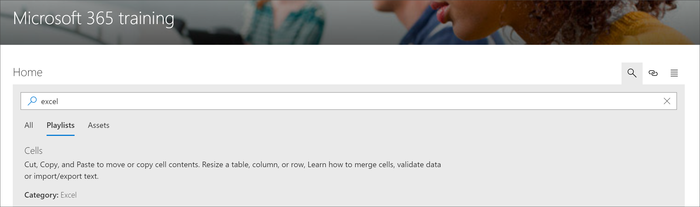

# Suchen nach Microsoft 365 Lernpfaden Inhalt

Microsoft 365 Lern Pfade bieten die Möglichkeit, nach Inhalten nach Unterkategorie, Wiedergabeliste oder Objekt zu suchen. 

> [!TIP]
> Die Microsoft 365-Lern Pfad Suche umfasst Inhalte für Lern Pfade, einschließlich der von Microsoft bereitgestellten Inhalte und der Inhalte, die benutzerdefinierten Wiedergabelisten oder Unterkategorien hinzugefügt werden. SharePoint-Seiten, die sich nicht in einer Playlist für Lernpfade befinden, sind nicht in den Suchergebnissen enthalten.     

- Klicken Sie auf das **Such** Symbol, und geben Sie einen Suchbegriff ein. 

