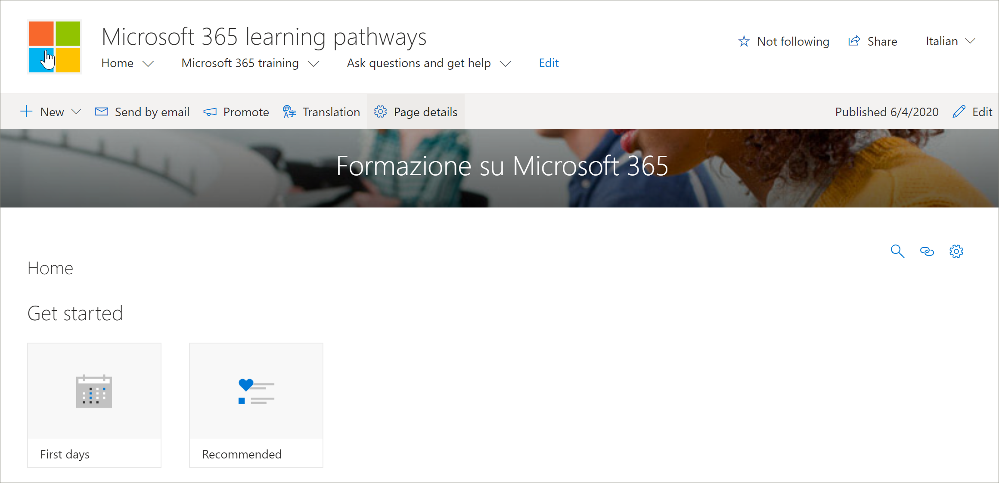

# Übersetzen von Website SeitenTranslate site pages
Bevor Sie mit der Übersetzung der Website für Lern Pfade beginnen, müssen Sie einige wichtige Konzepte verstehen, wie das mehrsprachige Feature mit Lernpfaden funktioniert.Before you start translating the learning pathways site, it’s important to understand a few key concepts of how the multilingual feature works with learning pathways. 
- Website Informationen – Übersetzungen für Navigation, Logo und Websitenamen erfordern, dass die Website im Sprachprofil des Benutzers angezeigt und übersetzt wird.Site information - Navigation, logo, and site name translations require that the site is viewed, and translated, in the user’s language profile.  
- Das Lern Pfad-Webpart muss mit dem Sprachprofil des Benutzers angezeigt werden, damit es in einer anderen Sprache als Englisch angezeigt wird.The learning pathways Web part must be viewed with user’s language profile for it to appear in a non-English language. Das Webpart und die von Microsoft bereitgestellten Inhalte werden bereits für Sie übersetzt.The Web part and the Microsoft-supplied content are already translated for you. Weitere Informationen zu den Sprachen Profilen finden Sie unter [Ändern Ihrer persönlichen Sprache und regionalen Einstellungen](https://support.microsoft.com/en-us/office/change-your-personal-language-and-region-settings-caa1fccc-bcdb-42f3-9e5b-45957647ffd7).For more information about languages profiles, see [Change your personal language and regional settings](https://support.microsoft.com/en-us/office/change-your-personal-language-and-region-settings-caa1fccc-bcdb-42f3-9e5b-45957647ffd7).
- Die Art und Weise, wie Sie Lern Pfade einrichten, bestimmt, ob Sie übersetzte Seiten verfügbar haben.The way you set up learning pathways determines whether you have translated pages available. Für neue Websites, die mit dem Microsoft 365-Such Buch Dienst bereitgestellt werden, sind übersetzte Seiten in neun Sprachen verfügbar.New sites provisioned with the Microsoft 365 look book service will have translated pages in nine languages available. Aktualisierte Websites oder Websites, die Sie erstellen, erfordern eine manuelle Übersetzung.Updated sites or sites you create will require manual translation. Weitere Informationen finden Sie unter [Setup Optionen für mehrsprachige Lern Pfade](custom_setupoptions_ml.md).See [Setup options for multilingual learning pathways](custom_setupoptions_ml.md).
- Die mehrsprachige Unterstützung für Lern Pfade wird durch SharePoint Online mehrsprachigen Features für Kommunikationswebsites aktiviert.Multilingual support for learning pathways is enabled by SharePoint Online multilingual features for communication sites. Informationen zu SharePoint Online mehrsprachigen Features finden Sie unter [Erstellen von mehrsprachigen Kommunikationswebsites, Seiten und Nachrichten](https://support.office.com/article/2bb7d610-5453-41c6-a0e8-6f40b3ed750c).To learn about SharePoint Online multilingual features, see [Create multilingual communication sites, pages, and news](https://support.office.com/article/2bb7d610-5453-41c6-a0e8-6f40b3ed750c). 

## Arbeiten mit einer neu eingerichteten WebsiteWorking with a newly provisioned site
Wenn Sie eine neue Website für Lern Pfade aus dem Microsoft 365-Such Buch Dienst bereitgestellt haben, stehen Ihnen die übersetzten Seiten bereits zur Verfügung.If you provisioned a new learning pathways site from the Microsoft 365 look book service, the translated pages are already available to you. Standardmäßig stellt die Website die folgenden Seiten bereit:By default, the site provides the following pages:

- Home. aspxHome.aspx
- Start-with-Six-Simple-Steps. aspxStart-with-Six-Simple-Steps.aspx
- Get-Started-with-Microsoft-365. aspxGet-started-with-Microsoft-365.aspx
- Get-Started-with-Microsoft-Teams. aspxGet-started-with-Microsoft-Teams.aspx
- Get-Started-with-SharePoint. aspxGet-started-with-SharePoint.aspx
- Get-Started-with-OneDriive. aspxGet-started-with-OneDriive.aspx
- Ask-questions-and-Get-Help. aspxAsk-questions-and-get-help.aspx
- Schulungs Ereignisse Calendar. aspxTraining events calendar.aspx
- Become-a-Champion. aspxBecome-a-Champion.aspx
- Recommended-Playlists. aspxRecommended-Playlists.aspx
- Lern Pfade Administrator Success CenterLearning pathways Admin Success Center

## Übersetzte Seiten aus der neu erstellten Website anzeigenView translated pages from the newly provisioned site
Um sich mit der übersetzten Lernpfade-Website vertraut zu machen, werfen wir einen Blick auf einige übersetzte Seiten.To get familiar with the translated learning pathways site, let's take a look at a few translated pages.

### Die übersetzte Startseite anzeigenView the translated Home page
Wählen Sie auf der Startseite für Lern Pfade eine Sprache aus der Dropdownliste Sprache aus, wie im folgenden Beispiel gezeigt.From the learning pathways Home page, select a language from the language dropdown as shown in the following example. In diesem Beispiel wird in der oberen rechten Ecke Italienisch ausgewählt, und alle Seitenelemente werden übersetzt.In the example, you see Italian selected in the upper right corner and all the page elements are translated.

### Anzeigen der übersetzten Microsoft 365-SchulungsseiteView the translated Microsoft 365 training page
Werfen wir nun einen Blick auf die Microsoft 365-Schulungsseite.Now let's take a look at the Microsoft 365 training page. 

1. Klicken Sie auf der **Start** Seite der Website für Lern Pfade auf **Microsoft 365 Training**.From the learning pathways site **Home** page, click **Microsoft 365 training**.
2. Wählen Sie in der oberen rechten Ecke der Seite eine Sprache aus.In the upper-right corner of the page, select a language. In diesem Beispiel wird Italienisch ausgewählt.In this example, Italian is selected.

Welche Übersetzungen werden angezeigt, wenn die Sprache ausgewählt wird?What translations are visible when the language is selected?
- Die SharePoint-Seite wird wie in der obigen Grafik dargestellt übersetzt.The SharePoint page is translated as shown in the graphic above. Beachten Sie, dass der Text für das Seitenbanner jetzt auf Italienisch angezeigt wird.Notice the text for the page banner is now in Italian.

Was sind Übersetzungen nicht sichtbar?What’s translations aren't visible?
- Der Websitename ist in Englisch.The site name is in English
- Die Websitenavigation ist in EnglischThe site navigation is in English
- Das Webpart für Lern Pfade ist in Englisch.The learning pathways web part is in English

## Anzeigen der vollständig übersetzten WebsiteView the fully translated site 
Um eine vollständig übersetzte Website in einer bestimmten Sprache anzuzeigen, einschließlich der Website Seiten, der Navigation und des Webparts, müssen die persönlichen sprach-und Ländereinstellungen des Benutzers für diese Sprache festgelegt werden.To view a fully translated site in a specific language, including the site pages, navigation, and web part, the user’s personal language and regional settings must be set for that language. Weitere Informationen zum Festlegen von Sprach-und Ländereinstellungen finden Sie unter [Ändern Ihrer persönlichen Sprache und regionalen Einstellungen](https://support.microsoft.com/en-us/office/change-your-personal-language-and-region-settings-caa1fccc-bcdb-42f3-9e5b-45957647ffd7).For more information on setting language and regional settings, see [Change your personal language and regional settings](https://support.microsoft.com/en-us/office/change-your-personal-language-and-region-settings-caa1fccc-bcdb-42f3-9e5b-45957647ffd7). Es wird empfohlen, dass Sie ein separates Konto verwenden oder einen anderen Benutzer haben, in dem die unterschiedlichen Spracheinstellungen die übersetzten Seiten anzeigen.It's recommended that you use a separate account or have another user with the different language settings view the translated pages.  

## Arbeiten mit einer aktualisierten oder manuell installierten Lern Pfad WebsiteWorking with an updated or manually installed learning pathways site
Wenn Sie eine vorhandene Lern Pfad Website aktualisiert oder das Webpart manuell auf einer vorhandenen Website installiert haben, müssen Sie die Website Seiten manuell übersetzen.If you updated an existing Learning Pathways site or manually installed the web part to an existing site, you'll need to manually translate the site pages. Das Webpart für Lern Pfade und der Inhalt sind bereits übersetzt und werden in der bevorzugten Sprache des Benutzers angezeigt.The learning pathways web part and content are already translated and will appear in the user's preferred language. Informationen zum Übersetzen von Seiten finden Sie in den folgenden Anweisungen unter "Erstellen von Seiten für die gewünschten Sprachen".To translate pages, see the following instructions "Create pages for the languages you want". 

## Erstellen von Seiten für die gewünschten SprachenCreate pages for the languages you want
Nachdem Sie Ihre Website für mehrsprachige Funktionen aktiviert haben und die Sprachen ausgewählt haben, die Sie zur Verfügung stellen möchten, können Sie die gewünschten Übersetzungsseiten erstellen.Once you've enabled your site for multilingual features and you've chosen the languages you want to make available, you can create the translation pages you want. 

1. Wechseln Sie zur Standardsprach Seite, die Sie in einer anderen Sprache verfügbar machen möchten.Go to the default language page you want to make available in another language.
2. Wählen Sie in der oberen Leiste **Übersetzung**aus.On the top bar, select **Translation**.
3. Wählen Sie **Erstellen** für die gewünschten Sprachen aus.Select **Create** for the languages you want.

> [!IMPORTANT]
> Nachdem Sie die Übersetzungsseiten erstellt haben, müssen Sie die Standardsprach Seite veröffentlichen (oder erneut veröffentlichen), um Folgendes sicherzustellen:After you create the translation pages, you must publish (or republish) the default language page to ensure that:
>- Übersetzungsseiten werden auf der entsprechenden sprach Website angezeigt.Translation pages are shown in the corresponding language site.
>- Übersetzungsseiten werden im News-Webpart und den markierten Inhalts-Webparts ordnungsgemäß angezeigt.Translation pages display correctly in the News web part and the Highlighted content web parts.
>- Das Sprachmenü oben auf der Website enthält alle Sprachen, die Sie aktiviert haben.The language dropdown at the top of the site includes all of the languages you enabled.
>- Übersetzer werden über die Übersetzungsanforderung benachrichtigt.Translators are notified of the translation request.

Nachdem Sie die Seite (n) erstellt haben, wird der Status der Seite (gespeicherter Entwurf, veröffentlicht usw.) im Übersetzungsbereich neben jeder Sprache angezeigt.After you create the page(s), the status of the page (draft saved, published, and so on) is shown in the translation pane next to each language. Außerdem werden die von Ihnen zugewiesenen Übersetzer per e-Mail benachrichtigt, dass eine Übersetzung angefordert wird.Also, the translator(s) you assigned will be notified in email that a translation is requested.

### Anzeigen der vollständig übersetzten Website in einer bestimmten SpracheView the fully translated site in a specific language
Um eine vollständig übersetzte Website in einer bestimmten Sprache anzuzeigen, einschließlich der Website Seiten, der Navigation und des Webparts, müssen die persönlichen sprach-und Ländereinstellungen des Benutzers für diese Sprache festgelegt werden.To view a fully translated site in a specific language, including the site pages, navigation, and web part, the user’s personal language and regional settings must be set for that language. Weitere Informationen zum Festlegen von Sprach-und Ländereinstellungen finden Sie unter [Ändern Ihrer persönlichen Sprache und regionalen Einstellungen](https://support.microsoft.com/en-us/office/change-your-personal-language-and-region-settings-caa1fccc-bcdb-42f3-9e5b-45957647ffd7).For more information on setting language and regional settings, see [Change your personal language and regional settings](https://support.microsoft.com/en-us/office/change-your-personal-language-and-region-settings-caa1fccc-bcdb-42f3-9e5b-45957647ffd7). Beachten Sie, dass es am besten ist, ein separates Konto zu verwenden oder einen anderen Benutzer zu haben, in dem die unterschiedlichen Spracheinstellungen die übersetzten Seiten anzeigen.Note that it’s best to use a separate account or have another user with the different language settings view the translated pages.

## Was macht ein Übersetzungstool?What does a translator do?
 Nachdem die Website in Englisch eingerichtet wurde, wird ein Benutzer mit Spanisch als bevorzugter persönlicher Sprache zum Beispiel manuell bearbeitet und übersetzt den Titel, die Navigation und die Fußzeile Inhalt in Spanisch.After the site is set up in English, a user with Spanish as their preferred personal language, for example, manually edits and translates the title, navigation, and footer content into Spanish. Ein Benutzer mit Deutsch als bevorzugter persönlicher Sprache macht dasselbe für Deutsch.A user with German as their preferred personal language does the same for German. Sobald der Inhalt übersetzt wurde, wird er für alle Benutzer dieser bevorzugten Sprachen angezeigt.Once the content is translated, it will display for all users of those preferred languages. Das Webpart nimmt die bevorzugte Sprache des Benutzers auf und zeigt den Inhalt an, der in dieser Sprache übersetzt wurde.The Web part picks up the user's preferred language and shows the content translated in that language. 

Übersetzer übersetzen die Kopien der Standardsprach Seite manuell in die angegebenen Sprache (n).Translators manually translate the copies of the default language page into the language(s) specified. Wenn die Kopien der Seite (n) erstellt werden, werden Übersetzer per e-Mail benachrichtigt, wenn ein Übersetzer angegeben wurde.When the copies of the page(s) are created, translators are notified in email if a translator has been specified. Die e-Mail enthält einen Link zur Standardsprach Seite und der neu erstellten Übersetzungsseite.The email includes a link to the default language page and the newly created translation page. Der Übersetzer wird:The translator will:
1. Wählen Sie die Schaltfläche über **Setzung starten** in der e-Mail aus.Select the **Start translating** button in the email.
2. Wählen Sie oben rechts auf der Seite **Bearbeiten** aus, und übersetzen Sie den Inhalt.Select **Edit** on the top right of the page, and translate the content.
3. Wenn Sie fertig sind, wählen Sie **als Entwurf speichern** (wenn Sie nicht bereit sind, es für Leser sichtbar zu machen) oder wenn die Seite für jeden sichtbar ist, der diese Sprache auf der Website verwendet, wählen Sie veröffentlichen oder nach **richten** **veröffentlichen** aus.When done, select **Save as draft** (if you're not ready to make it visible to readers) or if the page is ready to be visible to everyone who is using that language on the site, select **Publish** or **Post news**.

Weitere Informationen zum Übersetzungsprozess finden Sie unter [Erstellen von mehrsprachigen Kommunikationswebsites, Seiten und Nachrichten](https://support.office.com/en-us/article/2bb7d610-5453-41c6-a0e8-6f40b3ed750c).For more information about the translation process, see [Create multilingual communication sites, pages, and news](https://support.office.com/en-us/article/2bb7d610-5453-41c6-a0e8-6f40b3ed750c). 

## Aktualisieren der Standardsprach SeiteUpdating the default language page
Wenn die Seite Standardsprache aktualisiert wird, muss die Seite erneut veröffentlicht werden.When the default language page is updated, the page must be republished. Anschließend werden die Übersetzer für die Übersetzungsseiten per e-Mail benachrichtigt, dass eine Aktualisierung vorgenommen wurde, damit die einzelnen Übersetzungsseiten aktualisiert werden können.Then, the translator(s) for the translation pages are notified in email that an update has been made so updates can be made to the individual translation pages.

## Einrichten eines mehrsprachigen Website namens, einer Navigation und einer FußzeileSet up a multilingual site name, navigation and footer
Um den Websitenamen, die Navigation und die Fußzeile Ihrer Website in den verschiedenen Sprachen anzuzeigen, die Sie zur Verfügung gestellt haben, müssen Sie manuell übersetzt werden.To show the site name, navigation, and footer of your site in the different languages you've made available, each must be translated manually.

Angenommen, Sie haben eine Kommunikationswebsite mit einer englischen Standardsprache erstellt, und Sie haben die Website für die Sprachen Spanisch und Deutsch aktiviert.For example, let's say you've created a  communication site with an English default language, and you've enabled the site for Spanish and German languages. Wenn Sie eine Website erstellen, richten Sie den Websitenamen und die Beschreibung in der Standardsprache ein (in diesem Fall Englisch).When you create a site, you set up the site name and description in the default language (in this case, English). Sie können auch den Websitenamen und die Beschreibung nach der Erstellung der Website aktualisieren.You can also update the site name and description after site creation. Anschließend erstellen Sie die Navigationsknoten und Fußzeilen Inhalte in englischer Sprache.Then you create the navigation nodes and footer content in English.

Nachdem die Website in Englisch eingerichtet wurde, bearbeitet und übersetzt ein Benutzer mit Spanisch als bevorzugter persönlicher Sprache die Titel-, Beschreibungs-, Navigations-und Fußzeilen Inhalte manuell in Spanisch.After the site is set up in English, a user with Spanish as their preferred personal language manually edits and translates the title, description, navigation and footer content into Spanish. Ein Benutzer mit Deutsch als bevorzugter persönlicher Sprache macht dasselbe für Deutsch.A user with German as their preferred personal language does the same for German. Sobald der Inhalt übersetzt wurde, wird er für alle Benutzer dieser bevorzugten Sprachen angezeigt.Once the content is translated, it will display for all users of those preferred languages. 

> [! Notizen[!NOTES]
>- Benutzer, die den Websiteinhalt für Ihre bevorzugten Sprachen übersetzen, sollten Mitglieder der Gruppe Besitzer für die Website sein oder über entsprechende Websiteberechtigungen verfügen.Users who translate the site content for their preferred languages should be members of the Owners group for the site or have equivalent site permissions.
>- Wenn eine Änderung am Websitenamen, der Navigation oder der Fußzeile in der Standardsprache vorgenommen wird, wird das entsprechende übersetzte Element in einer anderen Sprache nicht automatisch aktualisiert, es sei denn, Sie haben die Möglichkeit, vorhandene Website Übersetzungen zu überschreiben.If a change is made to the site name, navigation, or footer in the default language, the corresponding translated item in another language is not automatically updated unless you choose to overwrite existing site translations. Wenn Sie dies tun, wird das übersetzte Element durch das Update in der Standardsprache ersetzt und müsste erneut manuell übersetzt werden.If you do that, the translated item is replaced by the update in the default language and would have to be manually translated again. Wechseln Sie zum Überschreiben von Übersetzungen zur Seite Website Sprachen für die Standardsprache, und wählen Sie erweiterte Einstellungen anzeigen aus.To overwrite translations, go to the Site languages page for the default language, and select Show advanced settings. Schieben Sie dann die Umschaltfläche für Übersetzungen Überschreiben in ein.Then, slide the toggle for Overwrite translations to On. Diese Option gilt nicht für Seiten-oder Nachrichteninhalte.This option does not apply to page or news content.

### So zeigen Sie die vollständig übersetzte Website in einer bestimmten Sprache anTo view the fully translated site in a specific language
Um eine vollständig übersetzte Website in einer bestimmten Sprache anzuzeigen, einschließlich der Website Seiten, der Navigation und des Webparts, müssen die persönlichen sprach-und Ländereinstellungen des Benutzers für diese Sprache festgelegt werden.To view a fully translated site in a specific language, including the site pages, navigation, and web part, the user’s personal language and regional settings must be set for that language. Weitere Informationen zum Festlegen von Sprach-und Ländereinstellungen finden Sie unter [Ändern Ihrer persönlichen Sprache und regionalen Einstellungen](https://support.microsoft.com/en-us/office/change-your-personal-language-and-region-settings-caa1fccc-bcdb-42f3-9e5b-45957647ffd7).For more information on setting language and regional settings, see [Change your personal language and regional settings](https://support.microsoft.com/en-us/office/change-your-personal-language-and-region-settings-caa1fccc-bcdb-42f3-9e5b-45957647ffd7). Es wird empfohlen, dass Sie ein separates Konto verwenden oder einen anderen Benutzer haben, in dem die unterschiedlichen Spracheinstellungen die übersetzten Seiten anzeigen.It’s recommended that you use a separate account or have another user with the different language settings view the translated pages.

## Weitere InformationenFor more information
- Weitere Informationen zum Übersetzen von SharePoint-Kommunikationswebsite Seiten finden Sie unter [Erstellen von mehrsprachigen Kommunikationswebsites, Seiten und Nachrichten](https://support.office.com/en-us/article/2bb7d610-5453-41c6-a0e8-6f40b3ed750c).For more information about translating SharePoint communication site pages, see [Create multilingual communication sites, pages, and news](https://support.office.com/en-us/article/2bb7d610-5453-41c6-a0e8-6f40b3ed750c).
- Weitere Informationen zum Anpassen von Lernpfaden finden Sie unter [Anpassen von Lern](custom_overview.md)Pfaden.For more information about customizing learning pathways, see [Customize Learning Pathways](custom_overview.md).  
