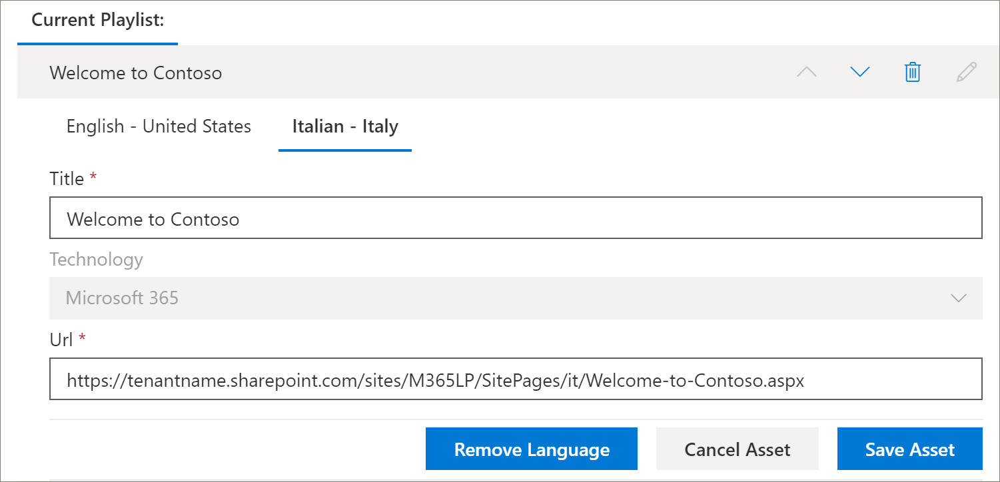

# Übersetzen einer benutzerdefinierten Wiedergabeliste für Lern Pfade
Wenn Sie benutzerdefinierte Playlists für Lern Pfade für Ihre Website erstellt haben, können Sie die Wiedergabelisten in die für diese Website aktivierten Sprachen übersetzen.

1.  Klicken Sie im Menü **Home** Lern Pfade auf **Lern Pfadverwaltung**. 
2.  Klicken Sie auf die benutzerdefinierte Wiedergabeliste. In diesem Beispiel werden **fünf einfache Schritte verwendet – Willkommen bei Contoso**. 
3.  Klicken Sie auf **Details bearbeiten**, und wählen Sie dann im Feld **Sprache hinzufügen** eine Sprache aus. In diesem Beispiel wird **Italienisch – Italien**verwendet. 
5.  Klicken Sie auf **Detail speichern**. 

> [!IMPORTANT]
> Translator-Benachrichtigungen sind nicht in benutzerdefinierte Wiedergabelisten integriert. Die Übersetzer müssen manuell benachrichtigt werden. 

## Was macht ein Übersetzungstool?
Übersetzer übersetzen die Kopien der Standardsprach Seite manuell in die angegebenen Sprache (n). Sie müssen den Übersetzer darüber informieren, welche Übersetzungen für Wiedergabelisten Details erforderlich sind. Es wird empfohlen, dass Sie alle Änderungen an der Wiedergabeliste abgeschlossen haben, einschließlich hinzufügen, bearbeiten oder Löschen von Wiedergabelisten Objekten, und den Übersetzer dann über die erforderlichen Übersetzungen informieren.

## Übersetzen der Objekte in der benutzerdefinierten Wiedergabeliste
Alle Objekte in einer Wiedergabeliste, die von Microsoft bereitgestellt werden, sind nicht bearbeitbar und erfordern keine Übersetzung. Wenn Sie benutzerdefinierte Objekte von der SharePoint-Website Ihres Mandanten hinzugefügt haben, ist für diese Ressourcen eine Übersetzung erforderlich. Sehen wir uns an, wie Sie ein benutzerdefiniertes Objekt in eine Wiedergabeliste übersetzen.

### Hinzufügen einer Sprache für ein vorhandenes Objekt
1. Wählen Sie unter **Objekte**das **Bearbeitungs** Symbol neben der benutzerdefinierten Ressource aus. 
2. Wählen Sie im Feld **Sprache hinzufügen** eine Sprache aus, und wählen Sie dann **Objekt speichern**aus.

### Hinzufügen einer Sprachseite für ein vorhandenes Objekt
1. Klicken Sie in der Liste Objekt auf das Objekt Englisch, und klicken Sie dann auf **Öffnen**.
2. Wählen Sie in der oberen Leiste **Übersetzung**aus.
3. Wählen Sie in der Dropdownliste Sprache die Sprache für das Objekt aus, wählen Sie **Erstellen**und dann **anzeigen**aus. Die Seite sollte nun etwa wie folgt aussehen. 

4. Klicken Sie auf **veröffentlichen**, und kopieren Sie dann die URL für die Seite. Es sollte in etwa wie folgt aussehen, wobei der Sprachcode in der URL enthalten ist.
https://tenantname.sharepoint.com/sites/M365LP/SitePages/it/Welcome-to-Contoso.aspx.
5. Kehren Sie zur Seite SharePoint-Verwaltung zurück, fügen Sie die URL für die Sprache für das Objekt hinzu, und klicken Sie dann auf **Speichern**. 

6.  Scrollen Sie die Seite nach oben, und klicken Sie auf **Wiedergabeliste schließen**.

## Was macht der Übersetzer?
Der Übersetzer wird:
- Details zur Wiedergabeliste übersetzen.
- Ressourcendetails übersetzen.
- Übersetzen von hinzugefügten Sprachseiten für Asset.
- Benachrichtigen des Anforderers über die Übersetzungen, die zur Überarbeitung bereit sind

### Details zur Wiedergabeliste übersetzen
Klicken Sie im Menü **Home** Lern Pfade auf **Lern Pfadverwaltung**. 
1. Klicken Sie auf die benutzerdefinierte Wiedergabeliste, die übersetzt werden muss, und klicken Sie dann auf die Sprachen. 
2. Klicken Sie auf **Details bearbeiten**, machen Sie die Übersetzungen für die Wiedergabeliste, und klicken Sie dann 
3. Klicken Sie auf **Detail speichern**. 
4. Benachrichtigen Sie den Übersetzungs anfordernden, dass die Übersetzung abgeschlossen ist. 

### Ressourcendetails übersetzen
Klicken Sie im Menü **Home** Lern Pfade auf **Lern Pfadverwaltung**. 
1. Klicken Sie auf die benutzerdefinierte Wiedergabeliste, die übersetzt werden muss. 
2. Scrollen Sie auf der Seite nach unten, und wählen Sie dann unter Objekte die Option Bearbeiten für das Objekt aus, das Sie bearbeiten möchten, und wählen Sie dann die Sprache aus. 
3. Übernehmen Sie die Übersetzungen für das Objekt, und klicken Sie dann auf **Objekt speichern**.  

## Übersetzen der Seite "hinzugefügte Sprache" für das Objekt
Klicken Sie im Menü **Home** Lern Pfade auf **Lern Pfadverwaltung**. 
1. Klicken Sie auf die benutzerdefinierte Wiedergabeliste, die übersetzt werden muss. 
2. Scrollen Sie auf der Seite nach unten, wählen Sie dann unter Objekte die Option Objekt aus, wählen Sie die Sprache aus, und klicken Sie dann auf Öffnen. 
3. Übernehmen Sie die Übersetzungen für die Seite, und klicken Sie dann auf **veröffentlichen**.  

## Erstellen einer neuen mehrsprachigen Wiedergabeliste
Anweisungen zum Erstellen einer neuen Wiedergabeliste für eine Website finden Sie unter [Erstellen einer benutzerdefinierten Wiedergabe](custom_createnewplaylist.md)Liste. Wenn Sie die Wiedergabeliste und die Objekte erstellt haben, lesen Sie in dieser Dokumentation nach, wie Sie die Wiedergabeliste und die Objekte übersetzen können. 