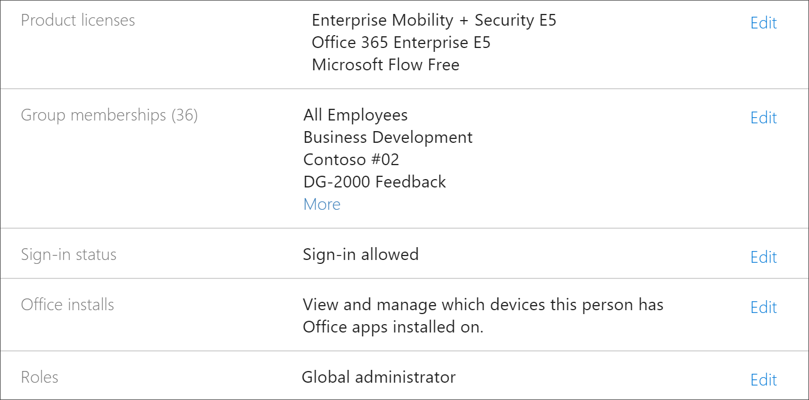

# Problembehandlung bei benutzerdefiniertem lernenTroubleshoot Custom Learning

Hier finden Sie Tipps zur Problembehandlung bei Problemen, die mit benutzerdefiniertem lernen für Office 365 oder dem SharePoint Online-bereitstellen Dienst auftreten können.Here are troubleshooting tips for problems that may occur with Custom Learning for Office 365 or the SharePoint Online Provisioning Service.

## So erfahren Sie, ob Sie über MandantenAdministrator Berechtigungen verfügenHow to know if you have Tenant Admin permissions

Melden Sie sich beim SharePoint Online-proarbeits Dienst und der benutzerdefinierten Schulung an.Sign in to the SharePoint Online Provisioning Service and provisioning Custom Learning requires Tenant Admin permissions. Wenn Sie Probleme mit der Anmeldung beim SharePoint Online-bereit stellungs Dienst haben, stellen Sie sicher, dass Ihnen die globale Administratorrolle zugewiesen wurde.If you are experiencing sign in issues with the SharePoint Online Provisioning Service, make sure that you have been assigned the Global administrator role. Die benutzerdefinierte Lernlösung erfordert MandantenAdministrator Berechtigungen, auch bekannt als globale Administrator Rolle von Office 365.The Custom Learning solution requires Tenant Admin permissions, otherwise known as Office 365 Global Administrator role. Hier erfahren Sie, wie Sie feststellen, ob Ihnen die globale Administrator Rolle zugewiesen wurde.Here’s how to determine if you have been assigned the Global Administrator role.

1.  Melden Sie sich bei Office.com an.Sign in to Office.com.
2.  Klicken Sie auf **Admin**Click **Admin**
3.  Wählen Sie unter **Benutzer**die Option **aktive Benutzer** aus.Under **Users**, select **Active Users**
4.  Suchen nach Ihrem NamenSearch for your name
5.  Klicken Sie in den Suchergebnissen auf Ihren Namen.Click your name in Search results. Sie sollten den globalen Administrator für ihre Rolle sehen.You should see Global administrator for your role.

### Wenn Sie nicht über die globale Administratorrolle verfügenIf you don’t have the Global administrator role
- Suchen Sie nach einem globalen Administrator in Ihrer Organisation, und lassen Sie diese Person sich beim Dienst anmelden, oder weisen Sie Ihnen die globale Administratorrolle zu.Find a Global Administrator in your organization and have that person sign into the service or have them assign the Global administrator role to you.

## Problembehandlung beim Mandanten-App-KatalogTenant App Catalog Troubleshooting
Für benutzerdefiniertes lernen muss ein App-Katalog im Zielmandanten eingerichtet werden.Custom Learning requires an App Catalog to be provisioned in the target tenant. Das Erstellen eines App-Katalogs erfordert globale Administrator Berechtigungen.Creating an app catalog requires Global Administrator permissions. Hier finden Sie die Schritte zur Problembehandlung für häufige Probleme mit dem App-Katalog:Here’s are troubleshooting steps for common App Catalog issues:

### So erfahren Sie, ob Sie einen Mandanten-App-Katalog habenHow to know if you have a Tenant app catalog 
Stellen Sie sicher, dass Sie über globale Administratorberechtigungen verfügen.For starters, ensure that you have Global administrator permissions. Lesen Sie die Schritte für MandantenAdministrator-Berechtigungen oben.See the steps for Tenant Admin permissions above.

1. klicken sie in Office 365 auf **administrator**, klicken sie auf den pfeil >, klicken sie auf **alle** > **admin center** > **sharepoint**anzeigen.From Office 365, click **Admin**, click the expand arrow >, click **Show all** > **Admin centers** > **SharePoint**.
2. Klicken Sie auf **klassische admin SharePoint Center** > **apps** > -**App-Katalog**.Click **Classic Admin SharePoint Center** > **apps** > **App Catalog**.
3. Unter **apps**sollte eine Kachel mit dem Titel Distribute **apps for SharePoint**angezeigt werden.Under **Apps**, you should see a tile titled **Distribute apps for SharePoint**. Wenn die Kachel angezeigt wird, haben Sie einen Mandanten-App-Katalog.If you see the tile, you have a Tenant App Catalog. Weitere Informationen finden Sie unter **How to sicher your are a Site colllection...** section below.See the **How to ensure your are a Site Colllection...** section below. Wenn die Kachel nicht angezeigt wird, müssen Sie einen Mandanten-App-Katalog für Ihren Mandanten erstellen.If you don’t see the tile you will need to create a tenant app catalog for your tenant. Weitere Informationen finden Sie im Abschnitt **So erstellen Sie einen Mandanten-App-Katalog** .See the **How to create a Tenant App Catalog** section below .

### So stellen Sie sicher, dass Sie ein WebsitesammlungsBesitzer im Mandanten-App-Katalog sindHow to ensure you are a Site Collection Owner on the Tenant App Catalog 
Um benutzerdefiniertes lernen für Office 365 zu stellen, müssen Sie ein WebsitesammlungsBesitzer im Mandanten-App-Katalog sein.To provision Custom Learning for Office 365, you will need to be a Site Collection Owner on the Tenant App Catalog. Hier erfahren Sie, wie Sie feststellen, ob Sie ein Besitzer sind.Here’s how to determin if you are an Owner.

1. klicken sie in Office 365 auf **administrator**, klicken sie auf den pfeil >, klicken sie auf **alle** > **admin center** > **sharepoint**anzeigen.From Office 365, click **Admin**, click the expand arrow >, click **Show all** > **Admin centers** > **SharePoint**.
2. Klicken Sie auf **klassische admin SharePoint Center**, und wählen Sie dann den **App-Katalog**aus.Click **Classic Admin SharePoint Center**, and then select the **app catalog**.
3. Wählen Sie **Besitzer**aus, und stellen Sie sicher, dass Sie ein Websitesammlungsbesitzer sind.Select **Owner**, and then ensure you are a Site Collection Owner. Es sollte ungefähr wie folgt aussehen.It should look something like this.
 

### Erstellen eines Mandanten-App-Katalogs, falls nicht vorhandenHow to create a Tenant App Catalog if one doesn’t exists 
1. Melden Sie sich bei Office 365 mit Ihrem SharePoint Online-Administratorkonto an.Sign in to Office 365 with your SharePoint Online admin account.
2. Klicken Sie auf **Administrator**.Click **Admin**.
3. Klicken Sie unter **Admin Centers**auf **SharePoint**.Under **Admin centers**, click **SharePoint**. 
4. Klicken Sie auf **apps** > -**App-Katalog**.Click **Apps** > **App Catalog**.
5. Klicken Sie auf **neue APP-katalogwebsite erstellen**, und klicken Sie dann auf **OK**.Click **Create a new app catalog site**, and then click **OK**. 
6.  Geben Sie die Informationen für den App-Katalog ein.Enter the information for the App Catalog. Möglicherweise möchten Sie mehrere Administratoren einbeziehen.You may want to include more than one Administrator. Nachfolgend sehen Sie ein Beispiel.The following shows an example.  

7.  Fertig!That’s it. Sie sind fertig.You’re done. Bevor Sie jedoch zur Bereitstellung von benutzerdefiniertem lernen wechseln, müssen Sie mindestens 30 Minuten warten, um sicherzustellen, dass die Erstellung des App-Katalogs abgeschlossen ist.But before you move to provisioning Custom Learning, you need to wait at least 30 minutes to make sure the App Catalog creation is complete. 

> [!IMPORTANT]
> Warten Sie nach dem Erstellen des Mandanten-App-Katalogs mindestens 30 Minuten, bevor Sie benutzerdefiniertes lernen einrichten.Wait at least 30 minutes after creating the Tenant App Catalog before provisioning Custom Learning. Dadurch wird sichergestellt, dass der APP-Katalog Bereitstellung in SharePoint abgeschlossen ist.This ensures that the App Catalog provisioning process is complete within SharePoint. 