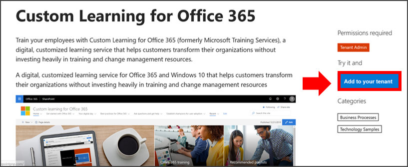
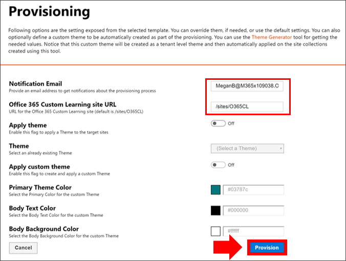

# Bereitstellen von benutzerdefiniertem Lernen

Mit dem SharePoint Online-Bereitstellungsdienst kann ein Office 365-Mandantenadministrator den Bereitstellungsprozess mit ein paar einfachen Klicks starten. Der Bereitstellungsdienst ist die empfohlene Methode zum Bereitstellen von Custom Learning. Es ist schnell, einfach und dauert nur wenige Minuten, um den Prozess zu starten. Bevor Sie mit dem Bereitstellungsdienst beginnen, stellen Sie jedoch sicher, dass Sie die Voraussetzungen für die Bereitstellung erfüllt haben.

## Voraussetzungen
 
Zum erfolgreichen Einrichten von Custom Learning mit dem Bereitstellungsdienst [SharePoint Online-Bereitstellungsdienst](https://provisioning.sharepointpnp.com)muss die Person, die die Bereitstellung vor sich hat, die folgenden Voraussetzungen erfüllen: 
 
- Die Person, die Benutzerdefiniertes Lernen bereitstellen, muss ein Mandantenadministrator des Mandanten sein, in dem custom Learning bereitgestellt wird.  
- Ein Mandanten-App-Katalog muss in der Option Apps des SharePoint Admin Center verfügbar sein. Wenn Ihre Organisation nicht über einen SharePoint-Mandanten-App-Katalog verfügt, lesen Sie die [SharePoint](/sharepoint/use-app-catalog) Online-Dokumentation, um einen zu erstellen.  
- Die Person, die Benutzerdefiniertes Lernen bereitstellen, muss ein Websitesammlungsbesitzer des Mandanten-App-Katalogs sein. Wenn die Person, die Benutzerdefiniertes Lernen bereitstellen, kein Websitesammlungsbesitzer des App-Katalogs [ist,](addappadmin.md) führen Sie diese Anweisungen aus, und fahren Sie fort. 

### So bereitstellen Sie benutzerdefiniertes Lernen

1. Wechseln Sie http://provisioning.sharepointpnp.com **zu, und melden** Sie sich von der oberen rechten Ecke der Startseite an.  Melden Sie sich mit den Anmeldeinformationen für den zielorientierten Mandanten an, in dem Sie die Websitevorlage installieren möchten.

2. Löschen Sie die **Zustimmung im Namen Ihrer Organisation,** und wählen Sie Akzeptieren **aus.**

3. Wählen Sie im Lösungskatalog Benutzerdefiniertes Lernen für **Office 365** aus.

4. Wählen Sie auf der Homepage der Lösung **die Option Zu Ihrem Mandanten hinzufügen aus.**

5. Füllen Sie die Felder auf der Seite mit den Bereitstellungsinformationen entsprechend Ihrer Installation aus. Geben Sie mindestens die E-Mail-Adresse ein, an der Sie Benachrichtigungen über den Bereitstellungsprozess und die Ziel-URL für Ihre Website erhalten möchten, für die sie bereitgestellt werden soll.  
> [!NOTE]
> Gestalten Sie die Ziel-URL für Ihre Website für Ihre Mitarbeiter wie "/sites/MyTraining" oder "/teams/LearnOffice365".

6. Wählen **Sie Bereitstellen** aus, wenn Sie benutzerdefiniertes Lernen in Ihrer Mandantenumgebung installieren möchten.  Der Bereitstellungsvorgang kann bis zu 15 Minuten dauern. Sie werden per E-Mail (an die Benachrichtigungs-E-Mail-Adresse, die Sie auf der Seite "Bereitstellung" eingegeben haben) benachrichtigt, wenn die Website für den Zugriff bereit ist.

> [!IMPORTANT]
> Der Mandantenadministrator, der die Benutzerdefinierte Lernwebsite verwendet, muss zur Website wechseln und dann CustomLearningAdmin.aspx öffnen, um die Eigenschaften des Benutzerdefinierten Lernadministrators zu initialisieren. Zu diesem Zeitpunkt sollte der Mandantenadministrator der Website auch Besitzer zuweisen. 

## Überprüfen des Erfolgs der Bereitstellung

Nach Abschluss der Bereitstellung empfängt der Mandantenadministrator eine E-Mail vom PnP-Bereitstellungsdienst. Der Administrator kann den Link zu der in der E-Mail bereitgestellten Website kopieren und dann die Anweisungen befolgen, um zur Website zu wechseln. Alternativ kann der Mandantenadministrator zu <YOUR-SITE-COLLECTION-URL>/SitePages/CustomLearningAdmin.aspx navigieren. Dadurch wird das Listenelement CustomConfig initialisiert, mit dem Custom Learning für die erste Verwendung eingerichtet wird. Die Person, die diese Seite zum ersten Mal öffnet, muss ein Mandantenadministrator, ein Websitesammlungsadministrator oder ein Besitzer der Website sein. Es sollte eine Seite angezeigt werden, die wie dies aussieht: 

## Hinzufügen von Besitzern zur Website
Als Mandantenadministrator ist es unwahrscheinlich, dass Sie die Person sind, die die Website anpasst, sodass Sie der Website Besitzer zuweisen müssen. Besitzer verfügen über Administratorrechte auf der Website, damit sie Websiteseiten ändern und die Website neubranden können. Sie haben auch die Möglichkeit, Inhalte auszublenden und anzuzeigen, die über das Custom Learning-Web part übermittelt werden. Außerdem können sie benutzerdefinierte Wiedergabelisten erstellen und benutzerdefinierten Unterkategorien zuweisen.  

1. Klicken Sie im Menü **SharePoint-Einstellungen** auf **Websiteberechtigungen**.
2. Klicken Sie **auf Erweiterte Berechtigungseinstellungen**.
3. Klicken **Sie auf Benutzerdefiniertes Lernen für Office 365-Besitzer**.
4. Klicken **Sie auf Neue** Benutzer zu dieser Gruppe hinzufügen, fügen Sie die Personen hinzu, die Besitzer sein sollen, und klicken Sie  >  dann auf **Freigeben.**

8. Klicken Sie **in** der oberen rechten Ecke der Seite auf die Option Folgen, um der Website zu folgen.  

### Nächste Schritte
- Sehen Sie sich [die Standardinhalte an,](sitecontent.md) die im Webpart enthalten sind.