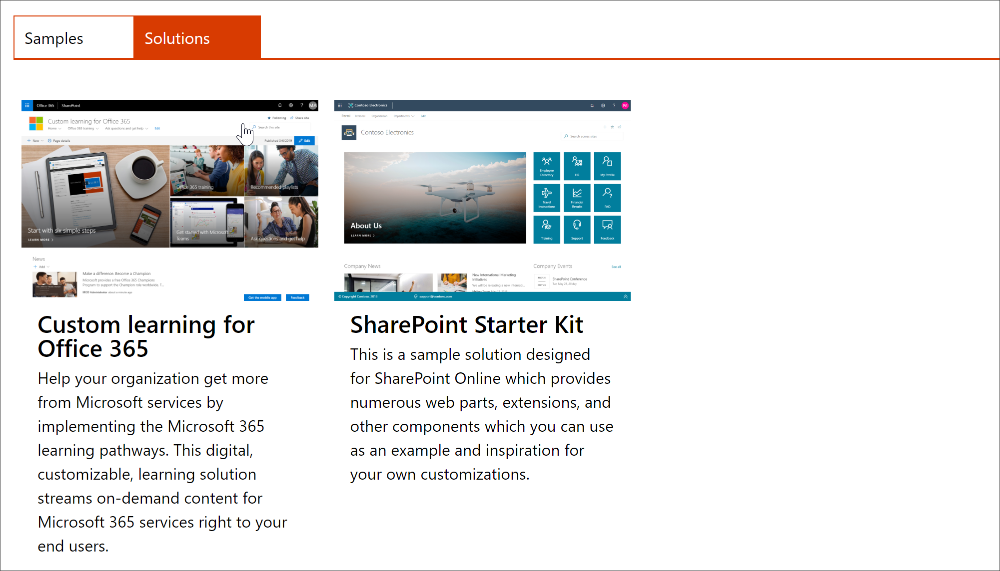

# Benutzerdefiniertes lernen einrichtenProvision Custom Learning

Mit dem SharePoint Online-proplanungs Dienst kann ein Office 365-Mandanten Administrator den proplanungs Prozess mit ein paar einfachen Klicks starten.With the SharePoint Online Provisioning Service, an Office 365 Tenant Administrator can start the provisioning process with a few simple clicks. Der bereitstellungsDienst ist die empfohlene Methode zum Einrichten von benutzerdefiniertem lernen.The Provisioning Service is the recommended way to provision Custom Learning. Es ist schnell, einfach und dauert nur ein paar Minuten, um den Prozess zu starten.It's fast, easy, and takes only a few minutes to start the process. Bevor Sie mit dem proSupporting-Dienst beginnen, sollten Sie sich jedoch vergewissern, dass Sie die Voraussetzungen für die bereit legung erfüllt haben.Before getting started with the Provisioning Service, however, make sure you've met the prerequisites for provisioning.

## VoraussetzungenPrerequisites
 
Um benutzerdefiniertes lernen erfolgreich mit dem [SharePoint Online-](https://provisioning.sharepointpnp.com)proArbeits Dienst für die Einrichtung einrichten zu können, muss die Person, die die proversionierung durchführen soll, die folgenden Voraussetzungen erfüllen:To successfully set up Custom Learning with the Provisioning Service [SharePoint Online Provisioning Service](https://provisioning.sharepointpnp.com), the person doing the provisioning must meet the following pre-requisites: 
 
- Die benutzerdefinierte Lernumgebung muss ein Mandant Administratorof dem Mandanten sein, in dem benutzerdefiniertes lernen eingerichtet wird.The person provisioning Custom Learning must be a Tenant Administratorof the tenant where Custom Learning will be provisioned.  
- Ein Mandanten-App-Katalog muss in der apps-Option im SharePoint Admin Center verfügbar sein.A tenant App Catalog must be available within the Apps option of the SharePoint Admin Center. Wenn Ihre Organisation keinen SharePoint-Mandanten-App-Katalog hat, lesen Sie die [SharePoint Online-Dokumentation](https://docs.microsoft.com/en-us/sharepoint/use-app-catalog) , um eine zu erstellen.If your organization does not have an SharePoint tenant App catalog, refer to the [SharePoint Online documentation](https://docs.microsoft.com/en-us/sharepoint/use-app-catalog) to create one.  
- Die benutzerdefinierte Schulung für Personen muss ein WebsitesammlungsBesitzer des Mandanten-App-Katalogs sein.The person provisioning Custom Learning must be a Site Collection Owner of the Tenant App Catalog. Wenn die Person, die benutzerdefiniertes lernen anbietet, kein WebsitesammlungsBesitzer des App-Katalogs ist, führen Sie die [folgenden Anweisungen](addappadmin.md) aus, und fahren Sie fort.If the person provisioning Custom Learning is not a Site Collection Owner of the App Catalog [complete these instructions](addappadmin.md) and continue. 

### So können Sie benutzerdefiniertes lernen einrichtenTo provision Custom Learning

1. Wechseln Sie http://provisioning.sharepointpnp.com zu und melden Sie sich **in** der oberen rechten Ecke der Startseite an.Go to http://provisioning.sharepointpnp.com and **sign in** from the upper right hand corner of the home page.  Melden Sie sich mit den Anmeldeinformationen für den Zielmandanten an, in dem Sie die Websitevorlage installieren möchten.Sign in with the  credentials for the targeted tenant where you plan to install the site template.

2. Löschen Sie die **Einwilligung im Namen Ihrer Organisation** , und wählen Sie **akzeptieren**aus.Clear the **Consent on behalf of your organization** and select **Accept**.

3. Wählen Sie **BenutzerdefiniertEs lernen für Office 365** aus dem Lösungskatalog aus.Select **Custom Learning for Office 365** from the solution gallery.

4. Wählen Sie auf der Startseite der Lösung **Ihrem mandantEn hinzufügen** aus.From the solution home page select **Add to your Tenant**

5. Füllen Sie die Felder auf der Seite proinformations Informationen entsprechend Ihrer Installation aus.Complete the fields on the provisioning information page as appropriate for your installation. Geben Sie mindestens die e-Mail-Adresse ein, unter der Sie Benachrichtigungen über den proplanungs Prozess und die Ziel-URL für Ihre Website erhalten möchten.At a minimum enter the email address where you wish to get notifications about the provisioning process and the destination URL for your site to be provisioned to.  
> [!NOTE]
> Stellen Sie die Ziel-URL Ihrer Website für Ihre Mitarbeiter wie "/sites/MyTraining" oder "/teams/LearnOffice365" bereit.Make the destination URL for your site something friendly to your employees such as "/sites/MyTraining" or "/teams/LearnOffice365".

6. Wählen Sie **bereit** stellen, wenn Sie bereit sind, benutzerdefiniertes lernen in Ihre Mandanten Umgebung zu installieren.Select **Provision** when ready to install Custom Learning into your tenant environment.  Das Bereitstellen dauert bis zu 15 Minuten.The provisioning process will take up to 15 minutes. Sie werden per e-Mail (an die Benachrichtigungs-e-Mail-Adresse, die Sie auf der Seite Bereitstellung eingegeben haben) benachrichtigt, wenn die Website auf den Zugriff zugreifen kann.You will be notified via email (to the notification email address you entered on the Provisioning page) when the site is ready for access.

> [!IMPORTANT]
> Der MandantenAdministrator, der die benutzerdefinierte Lernsite bereitstellt, muss zur Website wechseln und dann CustomLearningAdmin. aspx öffnen, um benutzerdefinierte Learning admin-Eigenschaften zu initialisieren.The Tenant Admin who provisions the Custom Learning site must go to the site, and then open CustomLearningAdmin.aspx to initialize Custom Learning Admin properties. Zu diesem Zeitpunkt sollte der MandantenAdministrator auch Besitzer der Website zuweisen.At this time, the Tenant Admin should also assign Owners to the site. 

## ÜberPrüfen des Erfolgs der überPrüfungValidate Provisioning Success

Wenn die Einrichtung abgeschlossen ist, erhält der MandantenAdministrator eine e-Mail vom PnP-proarbeits Dienst.When provisioning is complete, the Tenant Admin receives an email from the PnP Provisioning Service. Der Administrator kann den Link zu der in der e-Mail bereitgestellten Website kopieren und dann den Anweisungen folgen, um zur Website zu wechseln.The admin can copy the link to the site provided in the email, and then follow the instructions to go to the site. Alternativ kann der mandantenadministrator zu <YOUR-SITE-COLLECTION-URL>/SitePages/CustomLearningAdmin. aspx navigieren.Alternately, the tenant admin can navigate to <YOUR-SITE-COLLECTION-URL>/SitePages/CustomLearningAdmin.aspx. Dadurch wird das CustomConfig-Listenelement initialisiert, das benutzerdefiniertes lernen für die erste Verwendung festlegt.This initializes the CustomConfig list item that sets up Custom Learning for its first use. Die Person, die diese Seite zum ersten Mal öffnet, muss ein MandantenAdministrator, ein WebsitesammlungsAdministrator oder ein Besitzer der Website sein.The person who first opens this page must be a Tenant Admin,Site Collection Admin, or Owner of the site. Es sollte eine Seite angezeigt werden, die wie folgt aussieht:You should see a page that looks like this: 

## Hinzufügen von Besitzern zur WebsiteAdd Owners to Site
Als MandantenAdministrator ist es unwahrscheinlich, dass Sie die Website anpassen, daher müssen Sie der Websitebesitzer zuweisen.As the Tenant Admin, it's unlikely you'll be the person customizing the site, so you'll need to assign Owners to the site. Besitzer verfügen über Administratorrechte für die Website, damit Sie Website Seiten ändern und die Website neu bebranden können.Owners have administrative privileges on the site so they can modify site pages and rebrand the site. Außerdem können Sie Inhalte, die über das benutzerdefinierte Lern Webpart übermittelt werden, ausblenden und anzeigen.They also have the ability to hide and show content delivered through the Custom Learning Web part. Sie haben auch die Möglichkeit, benutzerdefinierte Wiedergabelisten zu erstellen und Sie benutzerdefinierten Unterkategorien zuzuweisen.They'll also have the ability to build custom playlist and assign them to custom subcategories.  

1. Klicken Sie im Menü SharePoint- **Einstellungen** auf **Websiteberechtigungen**.From the SharePoint **Settings** menu, click **Site Permissions**.
2. Klicken Sie auf **Erweiterte Berechtigungseinstellungen**.Click **Advanced Permission Settings**.
3. Klicken Sie auf **benutzerdefiniertes lernen für Office 365-Besitzer**.Click **Custom learning for Office 365 Owners**.
4. Klicken Sie auf **neue** > **Benutzer zu dieser Gruppe hinzufügen**, fügen Sie die Personen hinzu, die Besitzer sein sollen, und klicken Sie dann auf **Freigeben**.Click **New** > **Add Users to this group**, add the people you want to be Owners, and then click **Share**.

8. Klicken Sie in der oberen rechten Ecke der Seite auf die **folgende** Option, um der Website zu folgen.Click the **Following** option in the upper right hand corner of the page to follow the site.  

### Weitere SchritteNext Steps
- Erkunden Sie die im Webpart enthaltenen [Standardinhalte](sitecontent.md) .Explore the [default content](sitecontent.md) included in the webpart.
