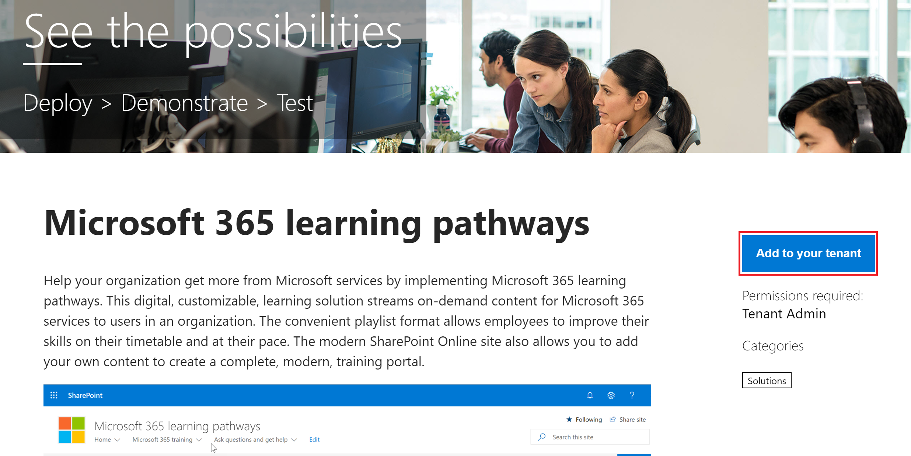

# Bereitstellen von benutzerdefiniertem LernenProvision Custom Learning

Mit dem SharePoint Online-Bereitstellungsdienst kann ein Office 365-Mandantenadministrator den Bereitstellungsprozess mit ein paar einfachen Klicks starten.With the SharePoint Online Provisioning Service, an Office 365 Tenant Administrator can start the provisioning process with a few simple clicks. Der Bereitstellungsdienst ist die empfohlene Methode zum Bereitstellen von Custom Learning.The Provisioning Service is the recommended way to provision Custom Learning. Es ist schnell, einfach und dauert nur wenige Minuten, um den Prozess zu starten.It's fast, easy, and takes only a few minutes to start the process. Bevor Sie mit dem Bereitstellungsdienst beginnen, stellen Sie jedoch sicher, dass Sie die Voraussetzungen für die Bereitstellung erfüllt haben.Before getting started with the Provisioning Service, however, make sure you've met the prerequisites for provisioning.

## VoraussetzungenPrerequisites
 
Zum erfolgreichen Einrichten von Custom Learning mit dem Bereitstellungsdienst [SharePoint Online-Bereitstellungsdienst](https://provisioning.sharepointpnp.com)muss die Person, die die Bereitstellung vor sich hat, die folgenden Voraussetzungen erfüllen:To successfully set up Custom Learning with the Provisioning Service [SharePoint Online Provisioning Service](https://provisioning.sharepointpnp.com), the person doing the provisioning must meet the following pre-requisites: 
 
- Die Person, die Benutzerdefiniertes Lernen bereitstellen, muss ein Mandantenadministrator des Mandanten sein, in dem custom Learning bereitgestellt wird.The person provisioning Custom Learning must be a Tenant Administratorof the tenant where Custom Learning will be provisioned.  
- Ein Mandanten-App-Katalog muss in der Option Apps des SharePoint Admin Center verfügbar sein.A tenant App Catalog must be available within the Apps option of the SharePoint Admin Center. Wenn Ihre Organisation nicht über einen SharePoint-Mandanten-App-Katalog verfügt, lesen Sie die [SharePoint](/sharepoint/use-app-catalog) Online-Dokumentation, um einen zu erstellen.If your organization does not have an SharePoint tenant App catalog, refer to the [SharePoint Online documentation](/sharepoint/use-app-catalog) to create one.  
- Die Person, die Benutzerdefiniertes Lernen bereitstellen, muss ein Websitesammlungsbesitzer des Mandanten-App-Katalogs sein.The person provisioning Custom Learning must be a Site Collection Owner of the Tenant App Catalog. Wenn die Person, die Benutzerdefiniertes Lernen bereitstellen, kein Websitesammlungsbesitzer des App-Katalogs [ist,](addappadmin.md) führen Sie diese Anweisungen aus, und fahren Sie fort.If the person provisioning Custom Learning is not a Site Collection Owner of the App Catalog [complete these instructions](addappadmin.md) and continue. 

### So bereitstellen Sie benutzerdefiniertes LernenTo provision Custom Learning

1. Wechseln Sie http://provisioning.sharepointpnp.com **zu, und melden** Sie sich von der oberen rechten Ecke der Startseite an.Go to http://provisioning.sharepointpnp.com and **sign in** from the upper right hand corner of the home page.  Melden Sie sich mit den Anmeldeinformationen für den zielorientierten Mandanten an, in dem Sie die Websitevorlage installieren möchten.Sign in with the  credentials for the targeted tenant where you plan to install the site template.

2. Löschen Sie die **Zustimmung im Namen Ihrer Organisation,** und wählen Sie Akzeptieren **aus.**Clear the **Consent on behalf of your organization** and select **Accept**.

3. Wählen Sie im Lösungskatalog Benutzerdefiniertes Lernen für **Office 365** aus.Select **Custom Learning for Office 365** from the solution gallery.

4. Wählen Sie auf der Homepage der Lösung die Option **Zum Mandantenbildschirm hinzufügen** aus, wo Sie 
 From the solution home page, select **Add to your Tenant**

5. Füllen Sie die Felder auf der Seite mit den Bereitstellungsinformationen entsprechend Ihrer Installation aus.Complete the fields on the provisioning information page as appropriate for your installation. Geben Sie mindestens die E-Mail-Adresse ein, an der Sie Benachrichtigungen über den Bereitstellungsprozess und die Ziel-URL für Ihre Website erhalten möchten, für die sie bereitgestellt werden soll.At a minimum enter the email address where you wish to get notifications about the provisioning process and the destination URL for your site to be provisioned to.  
   > [!NOTE]
   > Gestalten Sie die Ziel-URL für Ihre Website für Ihre Mitarbeiter wie "/sites/MyTraining" oder "/teams/LearnOffice365".Make the destination URL for your site something friendly to your employees such as "/sites/MyTraining" or "/teams/LearnOffice365".

   

6. Wählen **Sie Bereitstellen** aus, wenn Sie benutzerdefiniertes Lernen in Ihrer Mandantenumgebung installieren möchten.Select **Provision** when ready to install Custom Learning into your tenant environment.  Der Bereitstellungsvorgang kann bis zu 15 Minuten dauern.The provisioning process will take up to 15 minutes. Sie werden per E-Mail (an die Benachrichtigungs-E-Mail-Adresse, die Sie auf der Seite "Bereitstellung" eingegeben haben) benachrichtigt, wenn die Website für den Zugriff bereit ist.You will be notified via email (to the notification email address you entered on the Provisioning page) when the site is ready for access.

> [!IMPORTANT]
> Der Mandantenadministrator, der die Benutzerdefinierte Lernwebsite verwendet, muss zur Website wechseln und dann CustomLearningAdmin.aspx öffnen, um die Eigenschaften des Benutzerdefinierten Lernadministrators zu initialisieren.The Tenant Admin who provisions the Custom Learning site must go to the site, and then open CustomLearningAdmin.aspx to initialize Custom Learning Admin properties. Zu diesem Zeitpunkt sollte der Mandantenadministrator der Website auch Besitzer zuweisen.At this time, the Tenant Admin should also assign Owners to the site. 

## Überprüfen des Erfolgs der BereitstellungValidate Provisioning Success

Nach Abschluss der Bereitstellung empfängt der Mandantenadministrator eine E-Mail vom PnP-Bereitstellungsdienst.When provisioning is complete, the Tenant Admin receives an email from the PnP Provisioning Service. Der Administrator kann den Link zu der in der E-Mail bereitgestellten Website kopieren und dann die Anweisungen befolgen, um zur Website zu wechseln.The admin can copy the link to the site provided in the email, and then follow the instructions to go to the site. Alternativ kann der Mandantenadministrator zu <YOUR-SITE-COLLECTION-URL>/SitePages/CustomLearningAdmin.aspx navigieren.Alternately, the tenant admin can navigate to <YOUR-SITE-COLLECTION-URL>/SitePages/CustomLearningAdmin.aspx. Dadurch wird das Listenelement CustomConfig initialisiert, mit dem Custom Learning für die erste Verwendung eingerichtet wird.This initializes the CustomConfig list item that sets up Custom Learning for its first use. Die Person, die diese Seite zum ersten Mal öffnet, muss ein Mandantenadministrator, ein Websitesammlungsadministrator oder ein Besitzer der Website sein.The person who first opens this page must be a Tenant Admin,Site Collection Admin, or Owner of the site. Es sollte eine Seite angezeigt werden, die wie dies aussieht:You should see a page that looks like this: 

## Hinzufügen von Besitzern zur WebsiteAdd Owners to Site
Als Mandantenadministrator ist es unwahrscheinlich, dass Sie die Person sind, die die Website anpasst, sodass Sie der Website Besitzer zuweisen müssen.As the Tenant Admin, it's unlikely you'll be the person customizing the site, so you'll need to assign Owners to the site. Besitzer verfügen über Administratorrechte auf der Website, damit sie Websiteseiten ändern und die Website neubranden können.Owners have administrative privileges on the site so they can modify site pages and rebrand the site. Sie haben auch die Möglichkeit, Inhalte auszublenden und anzuzeigen, die über das Custom Learning-Web part übermittelt werden.They also have the ability to hide and show content delivered through the Custom Learning Web part. Außerdem können sie benutzerdefinierte Wiedergabelisten erstellen und benutzerdefinierten Unterkategorien zuweisen.They'll also have the ability to build custom playlist and assign them to custom subcategories.  

1. Klicken Sie im Menü **SharePoint-Einstellungen** auf **Websiteberechtigungen**.From the SharePoint **Settings** menu, click **Site Permissions**.
2. Klicken Sie **auf Erweiterte Berechtigungseinstellungen**.Click **Advanced Permission Settings**.
3. Klicken **Sie auf Benutzerdefiniertes Lernen für Office 365-Besitzer**.Click **Custom learning for Office 365 Owners**.
4. Klicken **Sie auf Neue** Benutzer zu dieser Gruppe hinzufügen, fügen Sie die Personen hinzu, die Besitzer sein sollen, und klicken Sie  >  dann auf **Freigeben.**Click **New** > **Add Users to this group**, add the people you want to be Owners, and then click **Share**.

8. Klicken Sie **in** der oberen rechten Ecke der Seite auf die Option Folgen, um der Website zu folgen.Click the **Following** option in the upper right hand corner of the page to follow the site.  
