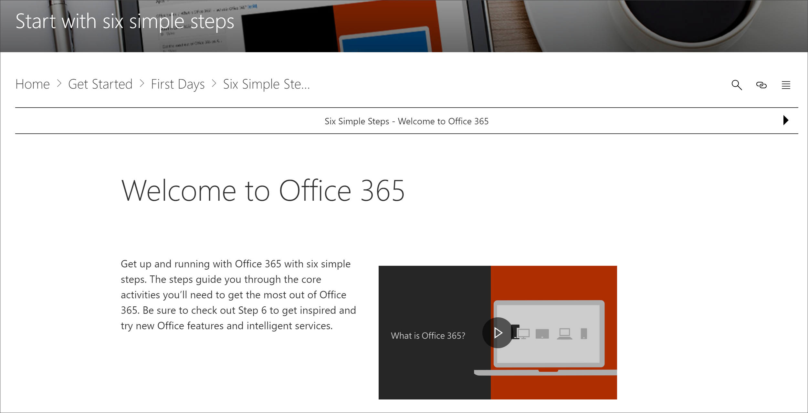
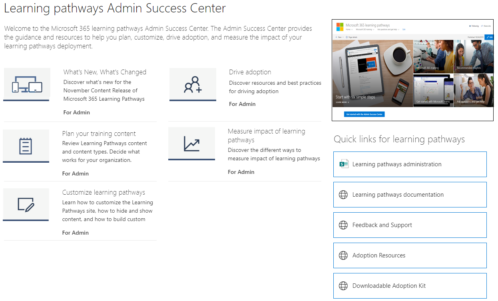

# Wo befindet sich das Webpart für Microsoft 365-Lernpfade? 

Wenn In Ihrer Organisation Lernpfade bereitgestellt werden, werden die Website und das Webteil der Lernpfade dem SharePoint-Mandanten Ihrer Organisation hinzugefügt. Im Rahmen der Bereitstellung wird das Microsoft 365-Lernwebteil den folgenden Seiten der Microsoft 365-Lernpfadwebsite hinzugefügt:

- Start-with-Six-Simple-Steps.aspx 
- Recommended-Playlists.aspx
- Erste Schritte mit Office 365.aspx
- Get-started-with-Microsoft-Teams.aspx
- Get-started-with-OneDrive.aspx
- Get-started-with-SharePoint.aspx
- Lernpfade Admin Success Center.aspx

Für jede Seite ist das Webteil anders konfiguriert, um die Kategorien, Unterkategorien, Wiedergabelisten oder Ressourcen zur Unterstützung der Absicht der Seite zu zeigen. Das Web part für Lernpfade, wie in späteren Abschnitten gezeigt wird, kann zu einer beliebigen SharePoint-Seite hinzugefügt und gefiltert werden, um bestimmte Kategorien, Unterkategorien, Wiedergabelisten oder nur Objekte anzeigen zu können. Lassen Sie uns einen Blick werfen. 

## Anzeigen von Microsoft Teams-Wiedergabelisten

Hier sehen Sie ein Beispiel für die Seite Erste Schritte **mit Microsoft Teams,** auf der das Webteil gefiltert wurde, um die Lernlisten für Teams zu zeigen. 

- Wählen Sie auf der Startseite der Lernpfade die Option **Erste Schritte mit Microsoft Teams aus.**

- Klicken Sie **im** Menü Lernpfade-Website auf das Menü Start, um zur Homepage der Website zurückzukehren.

## Anzeigen der Wiedergabeliste mit sechs einfachen Schritten

Das Webteil auf der **Seite Start-with-Six-Simple-Steps.aspx** ist so konfiguriert, dass das erste Objekt in der Wiedergabeliste mit sechs einfachen Schritten angezeigt wird. 

- Klicken Sie auf der Startseite der Lernpfade auf **Start mit sechs einfachen Schritten.** 

## Anzeigen aller Microsoft 365-Schulungen

Das Webteil auf der **Microsoft 365-Schulungsseite** ist so konfiguriert, dass alle Kategorien und Unterkategorien angezeigt werden, die im Katalog für Lernpfade verfügbar sind. Dies umfasst Unterkategorien von Microsoft sowie alle Unterkategorien, die Sie für Ihre Organisation erstellen.

- Klicken Sie auf der Startseite der Lernpfade auf **Microsoft 365-Schulungen.** Die Seite wird angezeigt, wenn das Webteil so konfiguriert ist, dass alle Kategorien und Unterkategorien angezeigt werden, die im Benutzerdefinierten Lernkatalog verfügbar sind.

- Klicken Sie **im** Menü Lernpfade-Website auf das Menü Start, um zur Homepage der Website zurückzukehren.

## Anzeigen des Webteils auf der Seite "Admin Success Center"

Das Webteil auf der **Seite Admin Success Center** ist so konfiguriert, dass alle wiedergabelisten gefiltert werden, die für das Admin Success Center verfügbar sind. Wie im folgenden Beispiel gezeigt, wird das Webteil einer Seite hinzugefügt, die auch Schnelllinks zu Administratorressourcen enthält. 

- Klicken Sie auf der Startseite der Lernpfade auf **Erste Schritte mit dem Admin Success Center**. . 

- Klicken Sie **im** Menü Lernpfade-Website auf das Menü Start, um zur Homepage der Website zurückzukehren.

