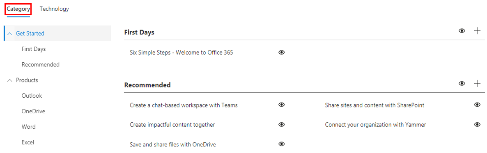

# Anpassen der Schulungsumgebung

Dies ist ein Test vier. Standardmäßig umfasst die Websiteumgebung und das Webpart Inhalte für alle Office 365-und Windows 10-Dienste.  Wenn in Ihrem Unternehmen nur alle oder einige dieser Dienste verfügbar sind, können Sie festlegen, welche Inhalte für Ihre Benutzer verfügbar sind.  

Es gibt verschiedene Arten von Anpassungen, die den Besitzern dieser Website zur Verfügung stehen. 

- [Anpassen von Webseiten](#customizing-web-pages)
- [Anpassen der verfügbaren Dienste](#customize-available-services)
- [Anpassen und Freigeben von Wiedergabelisten](customplaylist.md)

Einige oder alle dieser Anpassungen können abgeschlossen werden, bevor Sie die Website in Ihrer Benutzercommunity starten.  

> [!TIP]
> Sammeln Sie Feedback von ihren Mitarbeitern, und führen Sie in regelmäßigen Abständen zusätzliche Anpassungen aus.  Sie können Wiedergabelisten hinzufügen, Webseiten auf bestimmte Rollen ausrichten oder neue Schulungsinhalte aktivieren, wenn Sie neue Dienste starten. 

## Anpassen von Webseiten

Sie können die benutzerdefinierte Lernwebsite vollständig anpassen. Wenn Sie mit der Erstellung von Seiten in modernen SharePoint Online-Websites nicht vertraut sind, empfehlen wir Ihnen, [Ihren SharePoint-Website](https://support.office.com/en-us/article/customize-your-sharepoint-site-320b43e5-b047-4fda-8381-f61e8ac7f59b) artikel auf Support.Office.com anzupassen. 

### Anpassen der Seite Fragen **und Hilfe** anfordern

Wählen Sie als Ausgangspunkt für die Anpassung der Website die Option Fragen und Hilfe in der Menüleiste aus, klicken Sie dann auf die Schaltfläche SharePoint bearbeiten, und ändern Sie die Bilder und die Links. 

## Anpassen der verfügbaren Dienste

1.  Navigieren Sie zur benutzerdefinierten Learning Administration-Seite in 
1. Wählen Sie **Technologie** aus, um die vollständige Liste der in der Lösung enthaltenen Dienste anzuzeigen.
1. Wählen Sie eine Technologie aus, und **Klicken Sie auf das Augensymbol** , um diesen Inhalt auszublenden.  Klicken Sie erneut auf das Augensymbol, um den Inhalt in der Umgebung anzuzeigen. 

Derselbe Prozess kann für Kategorien von Wiedergabelisten innerhalb der Umgebung wiederholt werden.  Wählen Sie einfach die Option Kategorie aus, um Wiedergabelisten anzuzeigen/auszublenden. 

### Weitere Schritte

- [Anpassen und Freigeben von Wiedergabelisten](customplaylist.md)
- [Laufwerk Einführung](driveadoption.md) 