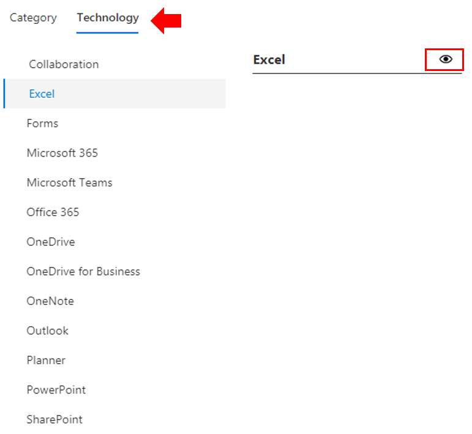

# Anpassen der SchulungserfahrungCustomize the training experience

Dies ist ein vierer Test.This is a test four. Standardmäßig enthalten sowohl die Websiteerfahrung als auch das Webpart Inhalte für alle Office 365- und Windows 10-Dienste.By default both the site experience and the webpart include content for all Office 365 and Windows 10 services.  Wenn nur alle oder einige dieser Dienste in Ihrem Unternehmen verfügbar sind, können Sie anpassen, welche Inhalte ihren Benutzern zur Verfügung stehen.If only all or some of these services are available in your company you can adjust what content is available to your users.  

Es gibt verschiedene Arten von Anpassungen, die den Besitzern dieser Website zur Verfügung stehen.There are several kinds of customizations that are available to the owners of this site. 

- [Anpassen von WebseitenCustomize web pages](#customizing-web-pages)
- [Anpassen der verfügbaren DiensteCustomize available services](#customize-available-services)
- [Anpassen und Freigeben von WiedergabelistenCustomize and share playlists](customplaylist.md)

Einige oder alle dieser Anpassungen können abgeschlossen werden, bevor Sie die Website für Ihre Benutzergemeinschaft starten.Some or all of these customizations can be completed before you launch the site to your user community.  

> [!TIP]
> Sammeln Sie Feedback von Ihren Mitarbeitern, und schließen Sie regelmäßig zusätzliche Anpassungen ab.Gather feedback from your employees and periodically complete additional customizations.  Fügen Sie Wiedergabelisten, Zielweb webseiten zu bestimmten Rollen hinzu oder aktivieren Sie neue Schulungsinhalte beim Starten neuer Dienste.Add playlists, target webpages to specific roles or turn on new training content when launching new services. 

## Anpassen von WebseitenCustomizing web pages

Sie können die Benutzerdefinierte Lernwebsite vollständig anpassen.You can fully customize the Custom Learning web site. Wenn Sie nicht mit dem Erstellen von Seiten in modernen SharePoint Online-Websites vertraut sind, empfehlen wir Ihnen, den Artikel [Anpassen Ihrer SharePoint-Website](https://support.office.com/article/customize-your-sharepoint-site-320b43e5-b047-4fda-8381-f61e8ac7f59b) auf support.office.com.If you are not familiar with creating pages within modern SharePoint Online sites we suggest you review [Customize your SharePoint site](https://support.office.com/article/customize-your-sharepoint-site-320b43e5-b047-4fda-8381-f61e8ac7f59b) article on support.office.com. 

### Anpassen der **Seite Fragen stellen und Hilfe erhalten**Customize the **Ask Questions and Get Help** page

Als Ausgangspunkt für die Anpassung der Website wählen Sie Fragen stellen und Hilfe in der Menüleiste erhalten aus, klicken Sie dann auf die Schaltfläche SharePoint Bearbeiten, und ändern Sie die Bilder und die Links.As a starting point for customizing the site, select Ask questions and get help from the menu bar, then click the SharePoint Edit button and change the images and the links. 

## Anpassen der verfügbaren DiensteCustomize available services

1.  Navigieren Sie zur Seite Verwaltung von benutzerdefiniertem Lernen auf der Website Navigate to the Custom Learning Administration page within the website 
1. Wählen **Sie Technologie** aus, um die vollständige Liste der Dienste zu sehen, die in der Lösung enthalten sind.Select **Technology** to see the full list of services that are included in the solution
1. Wählen Sie eine Technologie **aus, und klicken Sie auf das Augensymbol,** um diesen Inhalt auszublenden.Select a technology and **click the eye symbol** to hide this content.  Klicken Sie erneut auf das Augensymbol, um den Inhalt innerhalb der Erfahrung anzuzeigen.Click the eye symbol again to show the content within the experience. 

Der gleiche Vorgang kann für Kategorien von Wiedergabelisten innerhalb der Benutzererfahrung wiederholt werden.The same process can be repeated for categories of playlists within the experience.  Wählen Sie einfach die Option Kategorie aus, um Wiedergabelisten ein-/auszublenden.Simply select the Category option to show/hide playlists. 

### Nächste SchritteNext steps

- [Anpassen und Freigeben von WiedergabelistenCustomize and Share Playlists](customplaylist.md)
- [Fördern der EinführungDrive Adoption](driveadoption.md) 
