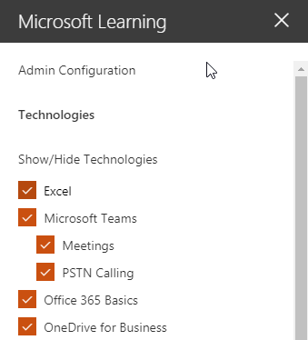

# Die Dienste und Wiedergabelisten anpassenCustomize the Services and Playlists

Standardmäßig enthalten die Erfahrung Site und das Webpart Inhalte für alle Office 365-Dienste.  Wenn aller oder einiger dieser Dienste sind nur verfügbar in Ihrem Unternehmen können Sie anpassen, welche Inhalte für die Benutzer verfügbar ist.  In diesem Artikel werden wir den Webpart-Inhalt anpassen.By default both the site experience and the webpart include content for all Office 365 services.  If only all or some of these services are available in your company you can adjust what content is available to your users.  In this article we will customize the webpart content.  

## Anpassen des Webpart-InhaltsCustomizing the webpart content

Das benutzerdefinierte Learning-Webpart bietet zwei wesentliche Features:The Custom Learning webpart provides two key features:
- Einblenden Sie Technologien/ausblendenHide/Show Technologies
- Erstellen einer WiedergabelisteCreate a Playlist

### Ausblenden oder anzeigen TechnologiekategorienHide or Show Technology Categories

Zum Ausblenden und Inhalt im Webpart anzeigen:To hide and show content in the Web part: 
1.  Klicken Sie auf das Dropdownmenü für das Webpart, und klicken Sie auf Technologien einblenden/ausblendenClick the dropdown menu on the webpart, then click Hide/Show Technologies

2. Wählen Sie eine Checkox ausblenden oder anzeigen eine Technologie und wählen Sie **anwenden**aus.Select a checkox to hide or show a technology and select **Apply**.

### Erstellen einer WiedergabelisteCreate a Playlist

Eine Wiedergabeliste ist eine Compliation "Anlagen". "Anlage" ist eine SharePoint-Seite oder von Microsoft Schulungsinhalte vorhandenes Element. Beim Erstellen einer Wiedergabeliste wählen Sie Objekte, die gemeinsam wechseln Sie zum Erstellen eines Learning Path für Ihre Benutzer.A playlist is a compliation of "assets". An "asset" is a SharePoint page or existing item of Microsoft training content. When you create a playlist you select assets that go together to create a learning path for your user.  

Hinzufügen von SharePoint-Seiten besteht darin, dass zum Erstellen von SharePoint-Seiten mit einem YouTube-Videos oder Videos in Ihrer Organisation gehostet. Sie können auch Seiten mit Formularen oder andere Office 365-Inhalte erstellen.The benefit of adding SharePoint pages is that you can create SharePoint pages with a YouTube videos or videos hosted in your organization. You can also create pages with Forms or other Office 365 content.  

#### Schritt 1: Erstellen einer SharePoint-Seite für die WiedergabelisteStep 1: Create a SharePoint page for your playlist
In diesem Beispiel erstellen wir zunächst eine SharePoint-Seite, um die Wiedergabeliste hinzuzufügen. Es wird eine Seite mit einem YouTube-video-Webpart und Text-Webpart erstellen.  Diese Anweisungen wird davon ausgegangen, dass Sie im SharePoint Online-Dienst verwenden.In this example, we’ll first create a SharePoint page to add to the playlist. We’ll create a page with a YouTube video web part and Text web part.  These instructions assume you are using the SharePoint Online service. 

#### Erstellen einer neuen SeiteCreate a new page
1.  Wählen Sie die Einstellungen im Menü > Websiteinhalte > Websiteseiten > neue > Websiteseite aus.Select the Settings menu > Site Contents > Site Pages > New > Site Page.
2.  Geben Sie im Titelbereich verwenden Sie das Befehlsfenster TeamsIn the title area, type Use the Teams command box
3.  Aktivieren Sie das Hinzufügen eines neuen Abschnitts, und wählen Sie zwei Spalten.Select the Add a new section, and then select Two Columns.

4.  Klicken Sie im linken wählen Sie neue Webpart hinzufügen aus, und wählen Sie dann einbetten.In the left-hand box, select Add a new web part, and then select Embed. 
5.  Wechseln Sie in einem Webbrowser zu dieser URL https://youtu.be/wYrRCRphrp0 , und erhalten Sie den Einbettungscode für das Video.In a Web browser, go to this URL https://youtu.be/wYrRCRphrp0 and get the embed code for the video. 
6.  In der SharePoint-Webpart hinzufügen einbetten Code und fügen Sie ihn in das einbetten.In the SharePoint Web part, select Add Embed code and then paste it into the Embed box. 
7.  Klicken Sie im rechten wählen Sie neue Webpart hinzufügen aus, und wählen Sie dann den Text.In the right-hand box, select Add a new web part, and then select Text. 
8.  Wechseln Sie in einem Webbrowser zu dieser URL: https://support.office.com/en-us/article/13c4e429-7324-4886-b377-5dbed539193b , und kopieren Sie die versuchen Sie es! Anweisungen auf der Seite, und fügen Sie sie in das Textfeld Webpart. Die Seite sollte wie folgt aussehen.In a Web browser, go to this URL: https://support.office.com/en-us/article/13c4e429-7324-4886-b377-5dbed539193b and copy the Try it! Instructions from the page and paste them into the Text Web part. Your page should look like the following. 

9.  Klicken Sie auf veröffentlichen, und kopieren Sie die URL der Seite, und fügen Sie ihn in NotepadClick Publish, and then copy the URL of the page and paste it in Notepad

#### Schritt 2: Erstellen der WiedergabelisteStep 2: Create the Playlist
1.  Navigieren Sie zu, in dem Sie das Webpart benutzerdefinierte Learning installiert haben. Vollständige Website Oberfläche wird es auf die Seite der Schulung für Office 365 gehostet.Navigate to where you have installed the Custom Learning webpart. In the full site experience it is hosted on the Office 365 training page. 
2.  Wählen Sie im Dropdownmenü neue Wiedergabeliste erstellen.From the dropdown menu select Create New Playlist. 

3.  Füllen Sie die Werte wie im folgenden Beispiel dargestellt, und wählen Sie **Erstellen**aus.Fill in the values as shown in the example below and select **Create**. 

#### Schritt 3: Hinzufügen von Ressourcen zur WiedergabelisteStep 3: Add assets to the playlist
In diesem Schritt fügen Sie vorhandene Ressourcen von Microsoft und der SharePoint-Seite, die Sie erstellt haben, die Wiedergabeliste.In this step, you’ll add existing assets from Microsoft and the SharePoint page you created to the playlist. 

1.  Klicken Sie auf die Menüschaltfläche, und klicken Sie auf vorhandenen Anlage hinzufügen.Click the menu button, then click Add Existing Asset.

2.  Filtern Sie nach Office 365 Apps > Microsoft-Teams-SchulungFilter on Office 365 Apps > Microsoft Teams Training
3.  Fügen Sie Willkommen zum Microsoft-Teams hinzu, erhalten Sie Ihr Team betriebsbereit, und starten Sie Chats und tätigen.Add Welcome to Microsoft Teams, Get your team up and running, and Start chats and make calls.
4.  Wählen Sie das Menü Schaltfläche > Anlage erstellen aus.Select the menu button > Create Asset.
5.  Typ verwenden Sie das Befehl Teams im Feld Titel Anlage.Type Use the Teams command box in the Asset title box. 
6.  Fügen Sie die SharePoint-Verwendung Teams Befehl Feld die URL für die Sie im Feld Asset Content kopiert haben.Paste the SharePoint Use the Teams command box page URL you copied in the Asset content field. 
7.  Navigiert nun wieder auf der Homepage der > benutzerdefinierte Wiedergabelisten > der ersten Tage mit Teams > verwenden Sie das Befehl Teams. Die Seite sollte wie folgt aussehen.Now navigate back to the Home Page > Custom Playlists > Your first days with Teams > Use the Teams command box. Your page should look like the following. 

Ihre Wiedergabeliste mit dieser Inhalt wird nun anywhere verfügbar Sie installiert haben, / benutzerdefinierte Learning Webpart eingebettet.Your playlist with this content will now be available anywhere you have installed / embedded the Custom Learning webpart. 

#### Zu berücksichtigende AspekteThings to Think About

Benutzerdefinierte Wiedergabelisten können verwendet werden, die Endbenutzer in einer Vareity Aufgaben zu unterstützen.  Haben Sie eine Ausfallzeit Anfrageformular?  Ein Formular zum Anfordern von Hardwarekomponenten?  Alle vorhandenen Schulung Assets können in die Erfahrung programmiert werden.Custom playlists can be used to assist your end users in a vareity of tasks.  Do you have a time off request form?  A form to request hardware equipment?  Any existing training assets can be programmed into the experience.  
