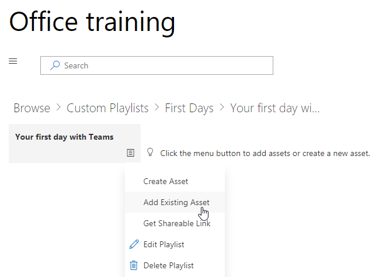

# Die Dienste und Wiedergabelisten anpassen

Standardmäßig enthalten die Erfahrung Site und das Webpart Inhalte für alle Office 365-Dienste.  Wenn aller oder einiger dieser Dienste sind nur verfügbar in Ihrem Unternehmen können Sie anpassen, welche Inhalte für die Benutzer verfügbar ist.  In diesem Artikel werden wir den Webpart-Inhalt anpassen.  

## Anpassen des Webpart-Inhalts

Das benutzerdefinierte Learning-Webpart bietet zwei wesentliche Features:
- Einblenden Sie Technologien/ausblenden
- Erstellen einer Wiedergabeliste

### Ausblenden oder anzeigen Technologiekategorien

Zum Ausblenden und Inhalt im Webpart anzeigen: 
1.  Klicken Sie auf das Dropdownmenü für das Webpart, und klicken Sie auf Technologien einblenden/ausblenden

2. Wählen Sie eine Checkox ausblenden oder anzeigen eine Technologie und wählen Sie **anwenden**aus.

### Erstellen einer Wiedergabeliste

Eine Wiedergabeliste ist eine Compliation "Anlagen". "Anlage" ist eine SharePoint-Seite oder von Microsoft Schulungsinhalte vorhandenes Element. Beim Erstellen einer Wiedergabeliste wählen Sie Objekte, die gemeinsam wechseln Sie zum Erstellen eines Learning Path für Ihre Benutzer.  

Hinzufügen von SharePoint-Seiten besteht darin, dass zum Erstellen von SharePoint-Seiten mit einem YouTube-Videos oder Videos in Ihrer Organisation gehostet. Sie können auch Seiten mit Formularen oder andere Office 365-Inhalte erstellen.  

#### Schritt 1: Erstellen einer SharePoint-Seite für die Wiedergabeliste
In diesem Beispiel erstellen wir zunächst eine SharePoint-Seite, um die Wiedergabeliste hinzuzufügen. Es wird eine Seite mit einem YouTube-video-Webpart und Text-Webpart erstellen.  Diese Anweisungen wird davon ausgegangen, dass Sie im SharePoint Online-Dienst verwenden. 

#### Erstellen einer neuen Seite
1.  Wählen Sie die Einstellungen im Menü > Websiteinhalte > Websiteseiten > neue > Websiteseite aus.
2.  Geben Sie im Titelbereich verwenden Sie das Befehlsfenster Teams
3.  Aktivieren Sie das Hinzufügen eines neuen Abschnitts, und wählen Sie zwei Spalten.

4.  Klicken Sie im linken wählen Sie neue Webpart hinzufügen aus, und wählen Sie dann einbetten. 
5.  Wechseln Sie in einem Webbrowser zu dieser URL https://youtu.be/wYrRCRphrp0 , und erhalten Sie den Einbettungscode für das Video. 
6.  In der SharePoint-Webpart hinzufügen einbetten Code und fügen Sie ihn in das einbetten. 
7.  Klicken Sie im rechten wählen Sie neue Webpart hinzufügen aus, und wählen Sie dann den Text. 
8.  Wechseln Sie in einem Webbrowser zu dieser URL: https://support.office.com/en-us/article/13c4e429-7324-4886-b377-5dbed539193b , und kopieren Sie die versuchen Sie es! Anweisungen auf der Seite, und fügen Sie sie in das Textfeld Webpart. Die Seite sollte wie folgt aussehen. 

9.  Klicken Sie auf veröffentlichen, und kopieren Sie die URL der Seite, und fügen Sie ihn in Notepad

#### Schritt 2: Erstellen der Wiedergabeliste
1.  Navigieren Sie zu, in dem Sie das Webpart benutzerdefinierte Learning installiert haben. Vollständige Website Oberfläche wird es auf die Seite der Schulung für Office 365 gehostet. 
2.  Wählen Sie im Dropdownmenü neue Wiedergabeliste erstellen. 

3.  Füllen Sie die Werte wie im folgenden Beispiel dargestellt, und wählen Sie **Erstellen**aus. 

#### Schritt 3: Hinzufügen von Ressourcen zur Wiedergabeliste
In diesem Schritt fügen Sie vorhandene Ressourcen von Microsoft und der SharePoint-Seite, die Sie erstellt haben, die Wiedergabeliste. 

1.  Klicken Sie auf die Menüschaltfläche, und klicken Sie auf vorhandenen Anlage hinzufügen.

2.  Filtern Sie nach Office 365 Apps > Microsoft-Teams-Schulung
3.  Fügen Sie Willkommen zum Microsoft-Teams hinzu, erhalten Sie Ihr Team betriebsbereit, und starten Sie Chats und tätigen.
4.  Wählen Sie das Menü Schaltfläche > Anlage erstellen aus.
5.  Typ verwenden Sie das Befehl Teams im Feld Titel Anlage. 
6.  Fügen Sie die SharePoint-Verwendung Teams Befehl Feld die URL für die Sie im Feld Asset Content kopiert haben. 
7.  Navigiert nun wieder auf der Homepage der > benutzerdefinierte Wiedergabelisten > der ersten Tage mit Teams > verwenden Sie das Befehl Teams. Die Seite sollte wie folgt aussehen. 

Ihre Wiedergabeliste mit dieser Inhalt wird nun anywhere verfügbar Sie installiert haben, / benutzerdefinierte Learning Webpart eingebettet. 

#### Zu berücksichtigende Aspekte

Benutzerdefinierte Wiedergabelisten können verwendet werden, die Endbenutzer in einer Vareity Aufgaben zu unterstützen.  Haben Sie eine Ausfallzeit Anfrageformular?  Ein Formular zum Anfordern von Hardwarekomponenten?  Alle vorhandenen Schulung Assets können in die Erfahrung programmiert werden.  
