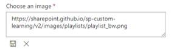

# Anpassen und Freigeben von WiedergabelistenCustomize and Share Playlists

## Erstellen einer WiedergabelisteCreate a Playlist

Eine Wiedergabeliste entspricht "Assets".A playlist is a compliation of "assets". Ein "Asset" ist eine SharePoint-Seite oder ein vorhandenes Element von Microsoft-Schulungsinhalten.An "asset" is a SharePoint page or existing item of Microsoft training content. Wenn Sie eine Wiedergabeliste erstellen, wählen Sie Objekte aus, die zusammen gehen, um einen Lernpfad für Ihren Benutzer zu erstellen.When you create a playlist you select assets that go together to create a learning path for your user.  

Der Vorteil des Hinzufügens von SharePoint-Seiten ist, dass Sie SharePoint-Seiten mit einem YouTube-Videos oder Videos in Ihrer Organisation gehostet erstellen können.The benefit of adding SharePoint pages is that you can create SharePoint pages with a YouTube videos or videos hosted in your organization. Sie können auch Seiten mit Formularen oder anderen Office 365 Inhalten erstellen.You can also create pages with Forms or other Office 365 content.  

#### Schritt 1: Erstellen einer SharePoint-Seite für Ihre WiedergabelisteStep 1: Create a SharePoint page for your playlist
In diesem Beispiel erstellen wir zunächst eine SharePoint-Seite, die der Wiedergabeliste hinzugefügt werden soll.In this example, we’ll first create a SharePoint page to add to the playlist. Wir erstellen eine Seite mit einem YouTube-Video-Webpart und einem Text-WebPart.We’ll create a page with a YouTube video web part and Text web part.  Bei diesen Anweisungen wird davon ausgegangen, dass Sie den SharePoint Online Dienst verwenden.These instructions assume you are using the SharePoint Online service. 

#### Eine neue Seite erstellenCreate a new page
1.  Wählen Sie das Menü Einstellungen > Websiteinhalte > Website Seiten > Seite neue > Site aus.Select the Settings menu > Site Contents > Site Pages > New > Site Page.
2.  Geben Sie im Bereich Titel den Befehl Teams verwenden ein.In the title area, type Use the Teams command box
3.  Wählen Sie den Abschnitt neuen Abschnitt hinzufügen aus, und wählen Sie dann zwei Spalten aus.Select the Add a new section, and then select Two Columns.

4.  Wählen Sie im linken Feld Neues Webpart hinzufügen aus, und wählen Sie dann einbetten aus.In the left-hand box, select Add a new web part, and then select Embed. 
5.  Wechseln Sie in einem Webbrowser zu dieser URL, https://youtu.be/wYrRCRphrp0 und rufen Sie den Einbettungscode für das Video ab.In a Web browser, go to this URL https://youtu.be/wYrRCRphrp0 and get the embed code for the video. 
6.  Wählen Sie im SharePoint-Webpart Einbettungscode hinzufügen aus, und fügen Sie ihn dann in das Feld embed ein.In the SharePoint Web part, select Add Embed code and then paste it into the Embed box. 
7.  Wählen Sie im rechten Feld Neues Webpart hinzufügen aus, und wählen Sie dann Text aus.In the right-hand box, select Add a new web part, and then select Text. 
8.  Wechseln Sie in einem Webbrowser zu dieser URL: https://support.office.com/article/13c4e429-7324-4886-b377-5dbed539193b und kopieren Sie den Test it!In a Web browser, go to this URL: https://support.office.com/article/13c4e429-7324-4886-b377-5dbed539193b and copy the Try it! Anweisungen auf der Seite aus, und fügen Sie Sie in das Text Webpart ein.Instructions from the page and paste them into the Text Web part. Die Seite sollte wie folgt aussehen.Your page should look like the following. 

9.  Klicken Sie auf **veröffentlichen**, und kopieren Sie dann die URL der Seite, und fügen Sie Sie in Notepad ein.Click **Publish**, and then copy the URL of the page and paste it in Notepad

#### Schritt 2: Erstellen der WiedergabelisteStep 2: Create the Playlist

1. Navigieren Sie zur Seite **benutzerdefinierte Lern Verwaltung** in ihrer Websiteumgebung.Navigate to the **Custom Learning Administration** page in your site experience.

1. Sicherstellen, dass **Kategorie** ausgewählt istMake sure **Category** is selected 
1. Klicken Sie auf die Kategorie, in der Sie Ihre neue Wiedergabeliste anzeigen möchten.Click on the category where you'd like your new playlist to appear
1. Klicken Sie neben dem Namen der Kategorie auf das Plus-Symbol Next to the category name, click on the plus symbol 

1. Geben Sie die Werte wie im folgenden Beispiel gezeigt ein, und wählen Sie **Erstellen**aus.Fill in the values as shown in the example below and select **Create**. 

- **Title** – Anzeigename der Wiedergabeliste**Title** - Display name of the playlist
- **Beschreibung** – Informationen zu den Vorgehensweise**Description** - Information about what will be learned
- **Kategorie** -preselected basierend auf Ihrer anfänglichen Auswahl**Category** - Preselected based on your initial selection
- **Unterkategorie** – vorab ausgewählt basierend auf Ihrer anfänglichen Auswahl**Sub Category** - Preselected based on your intial selection
- **Technologie** – je nach Bedarf auswählen**Technology** - Select as applicable
- **Stufe** – Anfänger, Intermidate oder erweitert**Level** - Beginner, Intermidate or Advanced
- Ziel **Gruppe** : auf diese Weise können Sie Inhalte basierend auf einer vordefinierten Liste von Rollen, die von Microsoft bereitgestellt werden, gezielt anfertigen.**Audience** - This allows you to target content based on a pre-defined list of roles provided by Microsoft.

6. Klicken Sie auf **Detail speichern**Click **Save Detail**

> [!TIP]
> Sie können das Symbolbild für Ihre Wiedergabeliste anpassen.You can customize the icon image for your playlist.  Klicken Sie auf das Bildsymbol, und fügen Sie eine URL eines zuvor hochgeladenen Bilds ein.Click the image icon and insert an URL of a previously uploaded image.  Stellen Sie sicher, dass sich das Bild in der benutzerdefinierten Lernwebsite Sammlung oder an einem anderen Speicherort befindet, auf das alle Benutzer Zugriff auf die Datei erhalten.Make sure the image is located within the Custom Learning site collection or in another location that all users will have access to the file.  

#### Schritt 3: Hinzufügen von Objekten zur WiedergabelisteStep 3: Add assets to the playlist
In diesem Schritt fügen Sie vorhandene Objekte aus Microsoft und die SharePoint-Seite, die Sie erstellt haben, zur Wiedergabeliste hinzu.In this step, you’ll add existing assets from Microsoft and the SharePoint page you created to the playlist. 

1. Nachdem Sie die Details für Ihre Wiedergabeliste gespeichert haben, können Sie die Suche nach vorhandenen Objekten verwenden.Once you have saved the details for your Playlist you can use the Search for Existing Assets.
1. **Geben Sie in einen beliebigen Suchbegriff** ein, um eine Liste der vordefinierten Objekte anzuzeigen, die in anderen Wiedergabelisten verfügbar sind.**Enter in any search term** to see a list of predefined assets that are available from other playlists. **Klicken Sie auf den Namen** eines Objekts, um es in Ihre neue Wiedergabeliste einzuschließen.**Click on the name** of an asset to include it in your new playlist.

Sie können auch die zuvor erstellte SharePoint-Seite hinzufügen oder eine von Grund auf neu in der Benutzeroberfläche erstellen.You can also add the SharePoint page you created earlier or create one from scratch in the experience.

1. Klicken Sie auf die Option " **Neues Objekt** " im Dialogfeld "Wiedergabelisten Objekte"Click on the **New Asset** option in the Playlist Assets dialog
1. Geben Sie Ihrem Objekt einen **Titel**.Give your asset a **Title**. Nach der Eingabe werden weitere Optionen angezeigt Once entered, additional options will display 
1. Sie können nun eine neue Anlage Seite in SharePoint Online erstellen oder die URL einer vorhandenen Seite eingeben, um Sie Ihrer benutzerdefinierten Wiedergabeliste hinzuzufügen.You can now create a new asset page in SharePoint Online or enter in the URL of an existing page to add it to your custom playlist. 
1. **Kategorien**-, **Unterkategorie** -und **Technologie** Felder werden basierend auf Ihrer vorherigen Auswahl für diese Wiedergabeliste vorab ausgefüllt.**Category**, **Sub Category** and **Technology** fields will be pre-populated based on your previous selections for this playlist.
1. Treffen Sie die entsprechenden Auswahlmöglichkeiten für Ebene und Zielgruppe für diese einzelne Ressource.Make the appropriate selections for Level and Audience for this individual asset.  
1. Klicken Sie auf **Objekt speichern** , um es der benutzerdefinierten Wiedergabeliste hinzuzufügen.Click **Save Asset** to add it to the custom playlist
1. Wiederholen Sie diese Schritte, entweder durchsuchen oder Hinzufügen einzelner Seiten, bis Ihre Wiedergabeliste abgeschlossen ist.Repeat these steps, either searching or adding individual pages, until your playlist is complete. 
1. Klicken Sie auf **Playlist schließen** , um zu speichernClick **Close Playlist** to save

Ihre Wiedergabeliste mit diesem Inhalt ist jetzt überall verfügbar, wo Sie das benutzerdefinierte Lern Webpart installiert/eingebettet haben.Your playlist with this content will now be available anywhere you have installed / embedded the Custom Learning webpart. 

> [!NOTE]
> Wenn Sie einen Fehler gemacht haben, nachdem Sie die Wiedergabeliste geschlossen haben, können Sie Sie aus der Kategorie löschen, indem Sie auf das X neben dem Namen der Wiedergabeliste klicken.If you make a mistake once you have closed the playlist, you can delete it from the category by clicking the X next to the playlist name.  

#### Dinge, über die Sie nachdenken solltenThings to Think About

Benutzerdefinierte Wiedergabelisten können verwendet werden, um Ihre Endbenutzer in einer Vielzahl von Aufgaben zu unterstützen.Custom playlists can be used to assist your end users in a variety of tasks.  Haben Sie ein Formular für die Auszeit von Anfragen?Do you have a time off request form?  Ein Formular zum Anfordern von Hardwaregeräten?A form to request hardware equipment?  Vorhandene Schulungsressourcen können in die Benutzeroberfläche programmiert werden.Any existing training assets can be programmed into the experience.  

## Freigeben von WiedergabelistenShare Playlists

1. Navigieren zu einer beliebigen Wiedergabeliste innerhalb des Webpart-oder Website ErlebnissesNavigate to any playlist within the webpart or site experience
1. In der linken oberen Ecke werden drei Symbole angezeigt.In the upper left hand corner you will see three icons
1. Klicken Sie auf das Symbol, das einen Link darstellt.Click on the icon representing a link
1. Kopieren der URL in die WiedergabelisteCopy the URL to the playlist

 diese URL kann nun in Ihre Websitenavigation eingefügt oder in anderer Kommunikation verwendet werden, um Ihre Mitarbeiter direkt in diese Wiedergabeliste zu übernehmen. This URL can now be inserted in your site navigation or utilized in other communications to take your employees directly to that playlist. 

### Nächste Schritte – [Einführung in die Festplatte](driveadoption.md)Next Steps - [Drive Adoption](driveadoption.md)
