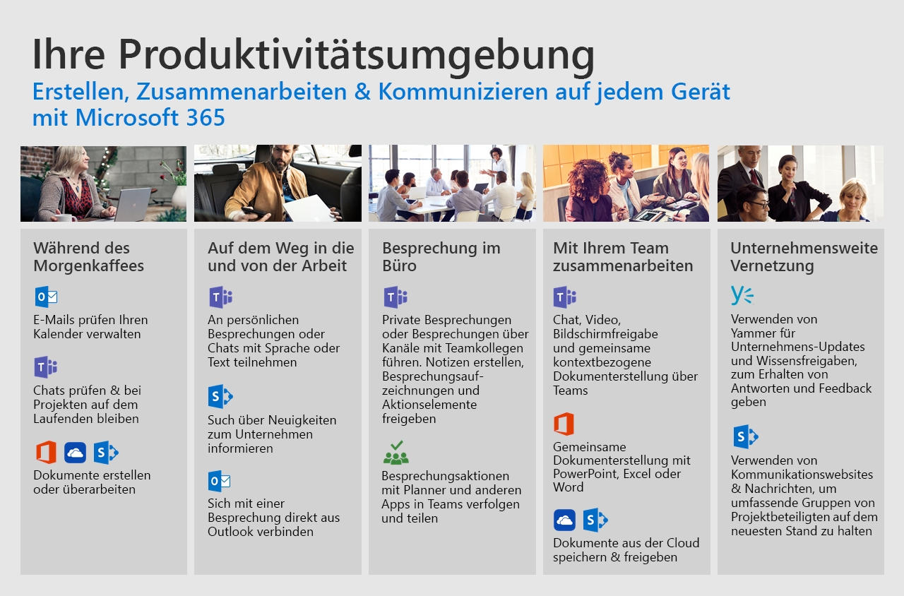

# Beispiel für Office 365

Mithilfe der Office 365-Clouddienste können Sie Ihre Teamarbeit auf jedem beliebigen Gerät verbessern.  Folgen Sie uns durch diese allgemeinen Szenarien, um zu sehen, wie Sie Ihre Zusammenarbeit, Kommunikation und Inhaltserstellung im Laufe Ihres Arbeitstags optimieren können.  

