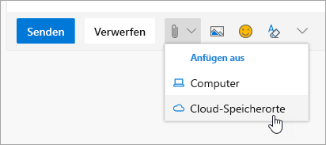

# Zusammenarbeit mit KollegenCollaborating with Colleagues

Es ist 2:00 Uhr und Zeit für die Zusammenarbeit mit Kollegen.It's 2:00 PM and time to collaborate with colleagues. Office 365 bietet erstklassige Möglichkeiten für die Zusammenarbeit, sodass Teams auf verschiedene Arten zusammenarbeiten können.Office 365 provides best-in-class opportunities for collaboration, enabling teams to work together in a number of ways. 

## ToolsTools
- Microsoft TeamsMicrosoft Teams
- Office OnlineOffice Online
- OneNoteOneNote
- SharePoint & OneDriveSharePoint & OneDrive
- 
## PrüfListe für die Zusammenarbeit mit KollegenChecklist for collaborating with colleagues
- Erstellen oder beitreten eines Microsoft-Teams für die ZusammenarbeitCreate or join a Microsoft Team to collaborate
- Erstellen und Freigeben von Dateien aus OneDriveCreate and share files from OneDrive 
- Co-Create in Office 365Co-create in Office 365 
- Verwenden von Cloud-AnlagenUse cloud attachments

## Erstellen oder beitreten eines Microsoft-Teams für die ZusammenarbeitCreate or join a Microsoft Team for collaboration

Microsoft Teams und Kanäle sind Orte, an denen Personen zusammenarbeiten können, indem Sie Dateien freigeben, Team Aktionselemente verfolgen und vieles mehr.Microsoft Teams and channels are places where people can collaborate by sharing files, tracking team action items and much more. Jedes Microsoft Teams hat eine Integration in eine SharePoint-Website, ein OneNote-Notizbuch und andere Objekte.Every Microsoft Teams has an integration into a SharePoint site, a OneNote notebook and other assets. Dieser Dienst von Office 365 wird am besten für Personen verwendet, die häufig an freigegebenen Projekten oder Ergebnissen zusammenarbeiten.This service of Office 365 is best used for people who work together frequently on shared projects or outcomes. 

## Freigeben von Dateien von Ihrem OneDriveShare Files from your OneDrive
Dateien, die in OneDrive for Business gespeichert wurden, können für jeden beliebigen Benutzer über den Browser oder Office 365-Desktopanwendungen wie Word oder Excel freigegeben werden.Files that have been saved on OneDrive for Business can be shared with anyone either from the browser or Office 365 desktop applications like Word or Excel. Es ist möglich, mit Personen, die ihren Namen, Ihren Alias oder Ihre Firmen-e-Mail-Adresse verwenden, freizugeben.It is possible to share with individuals using their name, alias, or company email address. 

## Co-Create in Office 365Co-create in Office 365
Die gemeinsame Erstellung erfolgt gleichzeitig mit Kollegen in derselben Datei.Co-creation is when we work simultaneously with colleagues on the same file. Dies ist in den webbasierten Versionen der Core Office 365-apps und in den Desktop Versionen dieser Anwendungen ab Office 2016 möglich.This is possible in the web-based versions of the core Office 365 apps and in the desktop versions of those applications from Office 2016 onward.  Sparen Sie Zeit und arbeiten Sie gemeinsam an demselben Dokument, und Office synchronisiert diese Änderungen auch dann, wenn Sie offline sind.Save time and work together on the same document and Office will synchronize those changes for you, even if one of you is offline. 

## Use Cloud Attachments-Stop Emailing that Spreadsheet!Use Cloud Attachments - Stop Emailing that Spreadsheet!
Wie oft mussten Sie nach der richtigen Version eines Dokuments suchen, wenn es an eine e-Mail angefügt wurde?How many times have you had to hunt for the right version of a document when it was attached to an email? Jetzt in Office 365 können Sie einen Link für die Datei freigeben, die als Cloud-Anlage bezeichnet wird, sodass alle Benutzer dieselbe Version bearbeiten.Now in Office 365 you can share a link to the file, called a cloud attachment, so that everyone is editing the same version.  Sie können entweder einen Link senden und entscheiden, ob die Datei von den Benutzern angezeigt oder bearbeitet werden kann.You can chose to either send a link and whether or not people can view or edit the file. 

