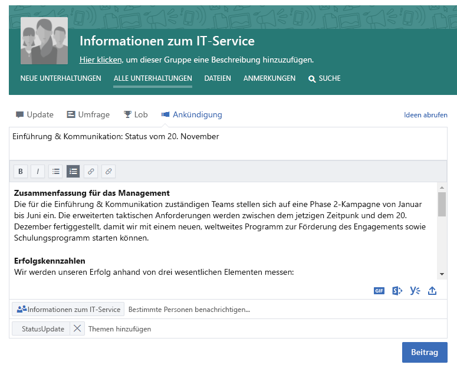
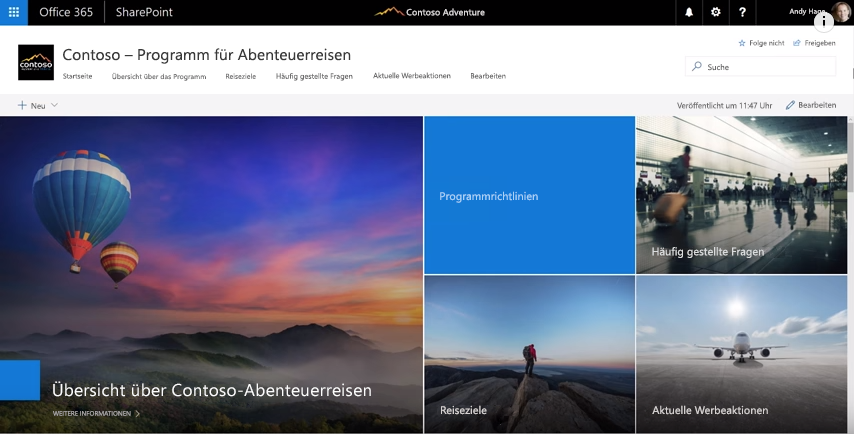
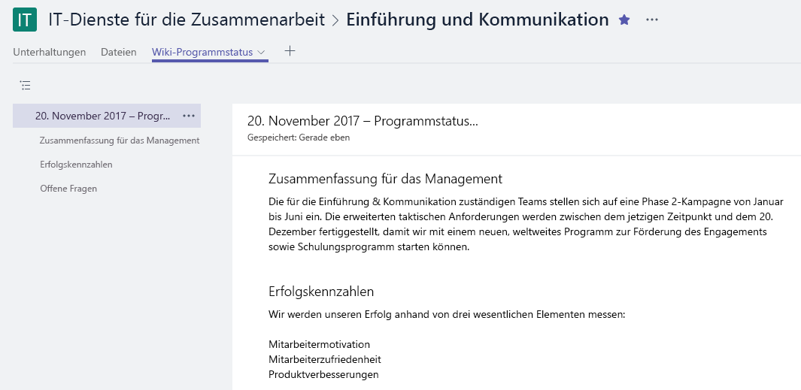

# Unternehmensweite VernetzungConnecting Across the Company

Es war ein anstrengender Tag, aber bevor Sie das Büro verlassen, sollten Sie sicherstellen, dass alle Personen, die sich für Ihre Arbeit interessieren, über den aktuellen Stand informiert sind.It's been a busy day, but before you leave the office you want to ensure that all the people interested in your work are informed about what is happening. Sicherstellen, dass alle Projektbeteiligten – innerhalb und außerhalb Ihres Teams – über Ihre Ziele, den Status und die Ergebnisse Bescheid wissen, ist ein wichtiges Element Ihrer Arbeit.Making sure that all your stakeholders -- inside and outside of your team -- understand your goals, progress, and results is an important part of what you do.  

## ToolsTools
- SharePointSharePoint
- YammerYammer
- OutlookOutlook
- Microsoft TeamsMicrosoft Teams 

## Checkliste für die unternehmensweite KommunikationChecklist for communicating across the company
- Wer sind Ihre Adressaten und welche Kommunikationsmethoden verwenden sie derzeit?Understand your audience and their existing communication methods
- Richten Sie Ihre wichtigsten Nachrichten an der Rolle der Empfänger aus, z. B. Projektbeteiligter, Teammitglied oder Mitarbeiter.Target your key messages by persona, for example, project stakeholder, team member, or employee
- Wählen Sie Kommunikationstools, die einander ergänzen; veröffentlichen Sie z. B. einen Beitrag in Ihrer Yammer-Community und versenden Sie eine Benachrichtigung per E-Mail.Select communication tools that compliment each other, for example, author a post on your Yammer community and send an alert via e-mail 
- Stellen Sie die Informationen gemeinsam mit anderen Personen in Ihrem Team zusammen.Co-author your information with others on your team
- Veröffentlichen Sie die Informationen, und senden Sie eine Benachrichtigung an alle interessierten Parteien.Publish your information and send a notification to all of your interested parties 
 
## Wählen Sie eine Kommunikationsmethode aus.Select your communication method
Verwenden Sie die nachstehenden Informationen, um zu bestimmen, auf welche Weise Sie mit Ihrem Team am besten kommunizieren können.Use the information below to decide the best way to communicate with your team. Nutzen Sie neue Technologien zusammen mit herkömmlichen E-Mail-Ankündigungen, während die Benutzer zu neuen Kommunikationsmethoden wechseln.Balance using new technology with traditional email announcements while people transition to new communications methods. Ein einheitlicher Kommunikationsansatz ist ein effektives Mittel zur Unterstützung der Aufmerksamkeit und von Änderungen in der Organisation.Having a consistent communication approach is an effective way to drive awareness and organizational change. 

**Yammer**: Sie können den Austausch in einer großen Gruppe von Personen fördern, indem Sie Ihre Updates über Yammer teilen.**Yammer**: You can drive conversation across a broad group of people by using Yammer to share your updates. Veröffentlichen Sie ein Standard-Update, oder verwenden Sie die Ankündigungsfunktion, um sicherzustellen, dass eine Kopie Ihres Updates an das Postfach jedes Mitglieds gesendet wird.Post a standard update or use the Announcement feature to ensure a copy of your update goes to each member's mailbox. 

**SharePoint**: Wenn Sie Personen außerhalb Ihrer Arbeitsgruppe erreichen möchten, können Sie einen kurzen Beitrag zu Neuigkeiten und Fortschritt schreiben, der in SharePoint Online bereitgestellt und für die gesamte Projektdauer beibehalten wird.**SharePoint**: If you want to reach people outside of your  working group, consider writing a brief news article on your charter and progress that is readily available and kept for the life of your project in SharePoint online. Verwenden Sie eine moderne Seite auf einer SharePoint-Teamwebsite, oder erstellen Sie für umfangreichere Vorhaben eventuell eine SharePoint-Kommunikationswebsite.Use a modern page in a SharePoint team site, or for a larger programs, consider creating a SharePoint communication site. 

SharePoint-Kommunikationswebsites bieten ansprechende und flexible Artikel, in die Sie Bilder, Dashboards und Text zusammen einbetten können.SharePoint communication sites provide visual and flexible news articles that allow you to embed images, dashboards, and text together. Die Informationen sind dann über einen beliebigen Browser oder über die mobile SharePoint-App verfügbar.Information is then available via any browser or through the SharePoint mobile app. Dieses Video bietet einen schnellen Überblick über die Möglichkeiten, die diese leistungsfähigen Websites bieten.This video provides a quick overview of what these powerful sites can do. Um für maximale Sichtbarkeit der Kommunikationswebsite zu sorgen, können Sie sie als Registerkarte für Ihre Arbeitsgruppe in Microsoft Teams anheften.To ensure the best visibility pin the communication site as a tab for your working group in Microsoft Teams.

**Microsoft Teams**: Wenn diese größere Gruppe von Personen bereits Teil Ihrer Arbeitsgruppe in Microsoft Teams ist, können Sie in dem Kanal "Allgemein" eine Notiz mit den wichtigsten Informationen und einem Link zu einer Wiki-Seite für ein ausführlicheres Update veröffentlichen.**Microsoft Teams**:  If this broad group of people is already a part of your working group in Microsoft Teams why not post a note in your General channel with key facts and a link to a Wiki page for your longer update.  Wiki-Seiten können von mehreren Personen gemeinsam betreut und während des Bestehens des Teams beibehalten werden.Wiki pages can be co-authored by multiple people and persist over the life of that team. 

## Tipp für einen moderneren KommunikationsansatzTip to Modernize Your Communication

**Für Ihre E-Mail-zentrierten Kollegen**: Abonnieren Sie für sie Benachrichtigungen über Ihre Yammer-Gruppe oder Ihren SharePoint-Newsfeed.**For your email centric colleagues**: Subscribe them to alerts from either your Yammer group or your SharePoint news feed.  Auf diese Weise werden sie per E-Mail darüber benachrichtigt, dass Sie neue Informationen veröffentlicht haben, und gelangen durch einen Klick zu Ihren Quellinformationen, ohne dass Sie eigens eine E-Mail erstellen müssen.This way they will get a notification in their email that you've published new information and can then click through to your source information without you having to create a separate email.  Möchten Sie es noch pfiffiger?Want to get snazzy?  Passen Sie die Benachrichtigung mit Microsoft Flow oder PowerApps an.Customize the notification with Microsoft Flow or PowerApps. Erwägen Sie die Verwendung eines Brownbag, um den Benutzern zu zeigen, wie sie Microsoft Teams, SharePoint oder Yammer auf ihren mobilen Geräten verwenden können.Consider having a brownbag to show these users how to use Microsoft Teams, SharePoint or Yammer on their mobile devices. 

**Fördern Sie den Gedankenaustausch!****Get people talking!** Aktivieren Sie die Kommentarfunktion auf Ihren SharePoint-Kommunikationswebsites für eine stärkere Einbindung.Encourage engagement by turning on comments for your SharePoint communication site pages.  Wenn Sie Yammer verwenden, stellen Sie sicher, dass Ihre Community genutzt wird, indem Sie regelmäßig überprüfen, ob es Fragen gibt, die Sie beantworten können.If you are using Yammer ensure that people participate in your community by monitoring it regularly for questions that you can answer. 

**Externe Freigabe**: Microsoft Teams, SharePoint und Yammer unterstützen die externe Freigabe, sofern Ihr Administrator dies in Ihrer Instanz von Office 365 zulässt.**Share externally**:  Microsoft Teams, SharePoint and Yammer all support external sharing if your administrator allows that in your instance of Office 365.  Durch die externe Freigabe können Sie Ihre Updates mit Personen teilen, die für Partner, Lieferanten und natürlich Ihre Kunden tätig sind.By using external sharing you can share your updates with people who work for partners, suppliers and of course, your customers.