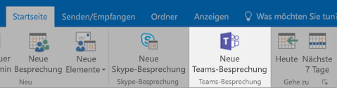
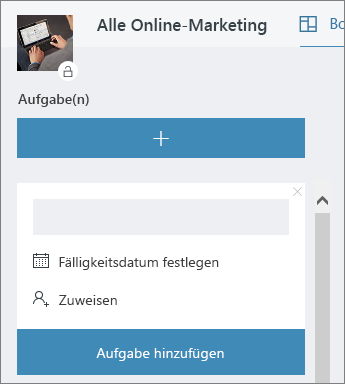

# Besprechung im Büro

Es ist 10:00 Uhr und die Uhrzeit für die Besprechung. In diesem Abschnitt zeigen wir Ihnen wie Ihre Besprechungen steigern können.  Dieser Schritt umfasst das bewährte Methoden für die Besprechung zur Vorbereitung und Office 365-Tools.  

## Tools
- Outlook
- Microsoft Teams
- Skype for Business
- OneNote

## Prüfliste für die Besprechung
- Planen und Ihrer Besprechung buchen
- Teilnehmen an einer Besprechung
- Stellen Sie Informationen in einer Besprechung
- Verwenden von OneNote in einer Besprechung für die gemeinsame Erstellung und Notizen
- Verwenden Sie zum Nachverfolgen von Aufgaben für dieses Projekt Planner in einer Besprechung
- Beenden Sie eine Besprechung
 
## Planen und Ihrer Besprechung buchen
Es gibt einige Dinge, die Sie tun können, um sicherzustellen, dass Ihre Besprechung produktiv ist wie möglich:

1. **Benötigen Sie eine Besprechung?** Berücksichtigen Sie zuerst eine Datei im Chat mit der erforderlichen genehmigende Personen nutzt.  
1. **Haben eine klare Agenda.**  Einschließen der Tagesordnung in den Notizenbereich von Ihre Einladung zur onlinebesprechung, damit Teilnehmer vorbereitet werden können.
1. **Datensatz Ihrer Besprechung**  Verwenden von besprechungsaufzeichnung-Funktionen in Microsoft-Teams, die Besprechung mit Personen gemeinsam verwenden, die nicht teilnehmen konnten oder zu einem späteren Zeitpunkt Notizen aufzuzeichnen.  

Nachdem Sie diese Besprechung buchen möchten: Buch der Besprechung mithilfe von Microsoft-Teams oder Skype für Unternehmen details in Outlook. Dadurch kann also, Teammitglieder aus unterschiedlichen Standorten enthalten, wie Video (sofern verfügbar) zur Verbesserung der Kommunikation und Aufzeichnen der Besprechung. 

## Teilnehmen an einer Besprechung
Teilnehmen an, unabhängig vom Standort. Es ist möglich, einen Microsoft-Teams oder Skype für Business Besprechung aus an einer beliebigen Stelle mit einem mobilen Gerät einwählen, die Details der Besprechung die Einwahlnummer oder mit der mobilen apps verbinden. Wenn Sie die mobilen apps verwenden, werden Sie verantwortungsbewusste für mobile Daten Einschränkungen, die für Sie oder Ihr Land gelten.

> [!TIP]
> **Verwenden eine Kopfhörer.** Wenn Sie von Ihrem Computer am Schreibtisch herstellen, verwenden Sie eine Kopfhörer statt Ihres Computers integrierten Mikrofon und Lautsprecher, um eine bessere Anrufqualität sicherzustellen.

> [!TIP]
> Aktivieren Sie das Video! Wenn Kameras verfügbar sind, lohnt verwenden können, wie persönliche Kommunikation nichtverbale Cues, die ausgelassen werden können bereitstellt, wenn Sie nur VoIP verwenden. Keine Sorge, Ihre haarstrich hervorragend aussieht. 

## Stellen Sie Informationen in einer Besprechung
Freigeben von Inhalten vom Gerät ist eine hervorragende Möglichkeit zum konzentrieren Ihrer Besprechung, und geben Sie im Rahmen dieser Diskussion Kontext. Der gesamte Bildschirmfreigabe kann im Allgemeinen eine gute Idee sein. Dies bedeutet, dass alle Elemente, die auf dem Bildschirm angezeigt wird auf den Bildschirmen der Personen, die an der Besprechung angezeigt wird. Vermeiden Sie dies können Sie, indem Sie einfach den Inhalt, den Sie in der Microsoft-Teams, freigeben möchten. 

## Verwenden von OneNote in einer Besprechung
OneNote kann zulassen für die Zusammenarbeit in Echtzeit und gemeinsame Erstellung eine idealen für Brainstorming leicht und nutzen in Besprechungen beachten. Solange jeder Zugriff auf den Pfad hat, in dem die OneNote gemeinsam genutzt wird, können Sie eine Verknüpfung mit dem Notizbuch buchen und brainstorming sofort zu starten.

Sie können einen bestimmten Abschnitt für Besprechungsnotizen im Team Notizbuch erstellen. Sie können auch die Funktionalität "Besprechungsdetails" in OneNote verwenden, zum Erstellen von Seiten mit einer Zusammenfassung die Details der Besprechung.

## Verwenden von Planner in einer Besprechung
Aktionselemente direkt in einen Plan für Ihr Projekt hinzufügen speichert von ihnen nach dem Vorfall abschreiben. Es ist eine bewährte Methode in großen Projekts Besprechungen jemanden & Notizen nachverfolgen Aktion zugewiesen. Normalerweise ist dies eine andere Person als der betroffenen mit der Besprechung. Erinnerungen für Terminelemente Aktion werden direkt an die Person gesendet, die sie Erinnerungen sind, wenn das Element des fällig am passiert zugewiesen ist. 

## Beenden Sie eine Besprechung
Wenn alles in der Agenda beschrieben wurden hat, beenden Sie die Besprechung, unabhängig von der Zeit. Weisen Sie und senden Sie Aktionselemente an alle Teilnehmer. Wenn Sie in der Microsoft-Teams zusammenarbeiten, können Sie problemlos Aktionselemente in den entsprechenden Kanal freigeben. Aufgaben können auch eingegeben und in Planner zugewiesen werden, während der Besprechung, bietet eine schnelle Möglichkeit zum Nachverfolgen für den Abschluss der auch [in Microsoft-Teams, zugegriffen](https://support.office.com/en-us/article/use-planner-in-microsoft-teams-62798a9f-e8f7-4722-a700-27dd28a06ee0)werden kann. 