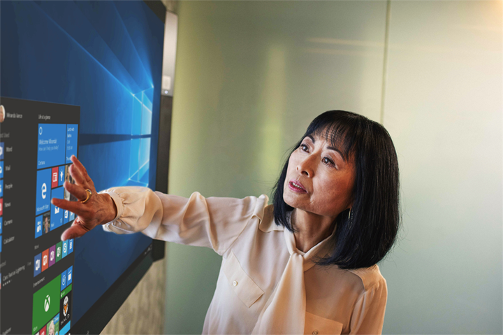

# Besprechung im BüroMeeting at the Office

Es ist 10:00 Uhr und die Uhrzeit für die Besprechung. In diesem Abschnitt zeigen wir Ihnen wie Ihre Besprechungen steigern können.  Dieser Schritt umfasst das bewährte Methoden für die Besprechung zur Vorbereitung und Office 365-Tools.It's 10:00 AM and time for your meeting. In this section, we'll show you how to make your meetings more productive.  This involves best practices for meeting preparation and Office 365 tools.  

## ToolsTools
- OutlookOutlook
- Microsoft TeamsMicrosoft Teams
- Skype for BusinessSkype for Business
- OneNoteOneNote

## Prüfliste für die BesprechungChecklist for your meeting
- Planen und Ihrer Besprechung buchenPlan and book your meeting
- Teilnehmen an einer BesprechungJoin a meeting
- Stellen Sie Informationen in einer BesprechungPresent information in a meeting
- Verwenden von OneNote in einer Besprechung für die gemeinsame Erstellung und NotizenUse OneNote in a meeting for co-creation and notes
- Verwenden Sie zum Nachverfolgen von Aufgaben für dieses Projekt Planner in einer BesprechungUse Planner in a meeting to track action items for that project
- Beenden Sie eine BesprechungEnd a meeting
 
## Planen und Ihrer Besprechung buchenPlan and book your meeting
Es gibt einige Dinge, die Sie tun können, um sicherzustellen, dass Ihre Besprechung produktiv ist wie möglich:There are a few things you can do to ensure your meeting is as productive as possible:

1. **Benötigen Sie eine Besprechung?** Berücksichtigen Sie zuerst eine Datei im Chat mit der erforderlichen genehmigende Personen nutzt.**Do you need a meeting?** Consider sharing a file in chat with the necessary approvers first.  
1. **Haben eine klare Agenda.**  Einschließen der Tagesordnung in den Notizenbereich von Ihre Einladung zur onlinebesprechung, damit Teilnehmer vorbereitet werden können.**Have a clear agenda.**  Include your meeting agenda in the notes section of your online meeting invitation so attendees can be prepared.
1. **Datensatz Ihrer Besprechung**  Verwenden von besprechungsaufzeichnung-Funktionen in Microsoft-Teams, die Besprechung mit Personen gemeinsam verwenden, die nicht teilnehmen konnten oder zu einem späteren Zeitpunkt Notizen aufzuzeichnen.**Record your meeting**  Use meeting recording functions in Microsoft Teams to share the meeting with people who could not attend or to transcribe notes later.  

Nachdem Sie diese Besprechung buchen möchten: Buch der Besprechung mithilfe von Microsoft-Teams oder Skype für Unternehmen details in Outlook. Dadurch kann also, Teammitglieder aus unterschiedlichen Standorten enthalten, wie Video (sofern verfügbar) zur Verbesserung der Kommunikation und Aufzeichnen der Besprechung.Now you're ready to book that meeting:  Book the meeting with Microsoft Teams or Skype for Business details in Outlook. Doing so enables you to include team members from different locations, record the meeting and utilize video (when available) to enhance communication. 

## Teilnehmen an einer BesprechungJoin a meeting
Teilnehmen an, unabhängig vom Standort. Es ist möglich, einen Microsoft-Teams oder Skype für Business Besprechung aus an einer beliebigen Stelle mit einem mobilen Gerät einwählen, die Details der Besprechung die Einwahlnummer oder mit der mobilen apps verbinden. Wenn Sie die mobilen apps verwenden, werden Sie verantwortungsbewusste für mobile Daten Einschränkungen, die für Sie oder Ihr Land gelten.Join from anywhere. It is possible to join a Microsoft Teams or Skype for Business meeting from anywhere using a mobile device, either by calling the dial-in number in the meeting details or using the mobile apps. When using the mobile apps, be conscious of mobile data usage limits that apply to you or your country.

> [!TIP]
> **Verwenden eine Kopfhörer.** Wenn Sie von Ihrem Computer am Schreibtisch herstellen, verwenden Sie eine Kopfhörer statt Ihres Computers integrierten Mikrofon und Lautsprecher, um eine bessere Anrufqualität sicherzustellen.**Use a headset.** If you are connecting from your computer at your desk, use a headset rather than your computer's built-in microphone and speakers to ensure a better call quality.

> [!TIP]
> Aktivieren Sie das Video! Wenn Kameras verfügbar sind, lohnt verwenden können, wie persönliche Kommunikation nichtverbale Cues, die ausgelassen werden können bereitstellt, wenn Sie nur VoIP verwenden. Keine Sorge, Ihre haarstrich hervorragend aussieht.Turn on your video! When cameras are available, it's worth using them, as face-to-face communication provides non-verbal cues that can be missed when just using voice. Don't worry, your hair looks great. 

## Stellen Sie Informationen in einer BesprechungPresent information in a meeting
Freigeben von Inhalten vom Gerät ist eine hervorragende Möglichkeit zum konzentrieren Ihrer Besprechung, und geben Sie im Rahmen dieser Diskussion Kontext. Der gesamte Bildschirmfreigabe kann im Allgemeinen eine gute Idee sein. Dies bedeutet, dass alle Elemente, die auf dem Bildschirm angezeigt wird auf den Bildschirmen der Personen, die an der Besprechung angezeigt wird. Vermeiden Sie dies können Sie, indem Sie einfach den Inhalt, den Sie in der Microsoft-Teams, freigeben möchten.Sharing content from your device is a great way to focus your meeting and provide context to the discussion. In general, sharing your entire screen can be a bad idea. It means that everything that comes up on your screen will appear on the screens of everyone attending the meeting. Avoid this by simply selecting the content you want to share in Microsoft Teams. 

## Verwenden von OneNote in einer BesprechungUse OneNote in a meeting
OneNote kann zulassen für die Zusammenarbeit in Echtzeit und gemeinsame Erstellung eine idealen für Brainstorming leicht und nutzen in Besprechungen beachten. Solange jeder Zugriff auf den Pfad hat, in dem die OneNote gemeinsam genutzt wird, können Sie eine Verknüpfung mit dem Notizbuch buchen und brainstorming sofort zu starten.OneNote can allow for real-time collaboration and co-creation, making it an ideal tool for brainstorming and note taking in meetings. As long as everyone has access to the location where the OneNote is shared, you can post a link to the notebook and start brainstorming right away.

Sie können einen bestimmten Abschnitt für Besprechungsnotizen im Team Notizbuch erstellen. Sie können auch die Funktionalität "Besprechungsdetails" in OneNote verwenden, zum Erstellen von Seiten mit einer Zusammenfassung die Details der Besprechung.You can create a specific section for meeting notes in the team notebook. You can also use the "meeting details" functionality in OneNote to create pages with a summary of the details of the meeting.

## Verwenden von Planner in einer BesprechungUse Planner in a meeting
Aktionselemente direkt in einen Plan für Ihr Projekt hinzufügen speichert von ihnen nach dem Vorfall abschreiben. Es ist eine bewährte Methode in großen Projekts Besprechungen jemanden & Notizen nachverfolgen Aktion zugewiesen. Normalerweise ist dies eine andere Person als der betroffenen mit der Besprechung. Erinnerungen für Terminelemente Aktion werden direkt an die Person gesendet, die sie Erinnerungen sind, wenn das Element des fällig am passiert zugewiesen ist.Directly adding action items into a plan for your project saves you from transcribing them after the fact. It's a best practice in large project meetings to assign someone to action tracking & note taking. This is normally a different person than the individual running the meeting. Action item reminders are sent directly to the individual to whom it is assigned as are reminders if the item passes it's due date. 

## Beenden Sie eine BesprechungEnd a meeting
Wenn alles in der Agenda beschrieben wurden hat, beenden Sie die Besprechung, unabhängig von der Zeit. Weisen Sie und senden Sie Aktionselemente an alle Teilnehmer. Wenn Sie in der Microsoft-Teams zusammenarbeiten, können Sie problemlos Aktionselemente in den entsprechenden Kanal freigeben. Aufgaben können auch eingegeben und in Planner zugewiesen werden, während der Besprechung, bietet eine schnelle Möglichkeit zum Nachverfolgen für den Abschluss der auch [in Microsoft-Teams, zugegriffen](https://support.office.com/en-us/article/use-planner-in-microsoft-teams-62798a9f-e8f7-4722-a700-27dd28a06ee0)werden kann.When everything on the agenda has been discussed, end the meeting, regardless of the time. Assign and send action items to all participants. If you are collaborating in Microsoft Teams, you can easily share action items in the appropriate channel. Action items can also be entered and assigned in Planner during the meeting, providing a fast way to track for completion which can also be [accessed in Microsoft Teams](https://support.office.com/en-us/article/use-planner-in-microsoft-teams-62798a9f-e8f7-4722-a700-27dd28a06ee0). 