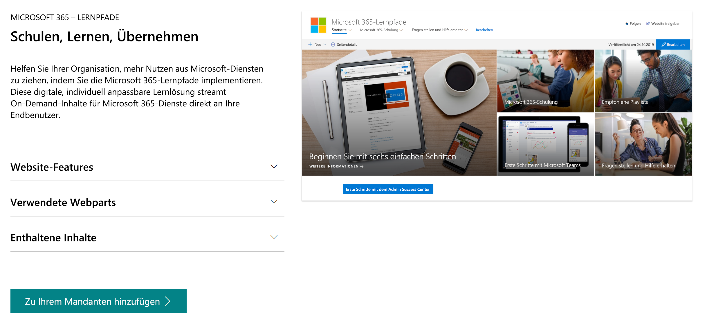

# Microsoft 365 Lern Pfade 
Microsoft 365 Learning-Pfade ist eine anpassbare, bedarfsorientierte Lernlösung, die die Nutzung und Akzeptanz von Microsoft 365-Diensten in Ihrer Organisation verbessern soll.    

## On-Demand, benutzerdefinierte Schulung von Microsoft

Microsoft 365-Lern Pfade bieten:

- **Eine vollständig anpassbare SharePoint Online Kommunikationswebsite** – das Schulungsportal für Lern Pfade kann angepasst werden, um Hilfe, Support und Community-Inhalte Ihrer Organisation hinzuzufügen.
- **Einfache** Bereitstellung – stellen Sie Lern Pfade aus dem SharePoint Online Bereitstellungsdienst mit nur wenigen einfachen Schritten zur Verfügung.
- **Die Möglichkeit, eigene Trainings Wiedergabelisten zu erstellen** – mit Lernpfaden können Sie gezielte Trainings Wiedergabelisten erstellen, um die individuellen Anforderungen Ihrer Umgebung zu erfüllen.
- Aktuelle **Inhalts** Lern Pfade bieten Inhalte über einen Microsoft Online-inhaltskatalog, sodass der Inhalt auf Ihrer Websiteregel mäßig aktualisiert wird.

> [!VIDEO https://www.microsoft.com/videoplayer/embed/RE42hMy]

## SharePoint Online-Dienst für die Zustellung 
Lernpfade können aus dem SharePoint Online-Dienst zur Verfügung gestellt werden. Wenn Microsoft 365 Lernpfade eingerichtet ist, erhalten Organisationen eine SharePoint Online Kommunikationswebsite, die als out-of-the-Box-Schulungsportal konzipiert ist, sowie ein Lern Pfade-Webpart, das mit einem Online Katalog mit Schulungsinhalten verbunden ist. 

## 3 einfache Schritte
Lassen Sie uns erste Schritte mit der Erstellung einer Lernerfahrung für Ihre Umgebung machen.
1. Wählen Sie eine [Setup Option](custom_setupoptions.md) aus, und stellen Sie Microsoft 365 Lern Pfade zur Verfügung.  
2. Anpassen von Lernpfaden für Ihre Umgebung.
3. Teilen Sie Lern Pfade mit ihren Benutzern mithilfe unserer [Adoptions Tools](driveadoption.md).

## Feedback und Support

Microsoft 365 Learning Pfads ist ein Open-Source-Projekt, das in unserer [Online-Problemliste](https://aka.ms/CustomLearningHelp) auf GitHub unterstützt wird. Die Lern Pfad Lösung und ihre Komponenten werden nicht von einem vorhandenen Microsoft-Supportvertrag abgedeckt.  

## Weitere Ressourcen
Sie können die Website "Microsoft 365 Learning Pfads" verwenden, um Links zu neuen oder vorhandenen Benutzercommunity-Foren bereitzustellen. In diesem Fall sollten Sie eine interne Benutzergruppe starten, wenn Sie bereits über keine verfügen, damit die Personen Ihren Erfolg teilen und voneinander lernen können.  Wenn Sie keine Zeit haben, eine interne Benutzergruppe zu pflegen, können Sie und Ihre Mitarbeiter der [Microsoft Office 365 Champion-Community](https://aka.ms/O365Champions) für monatliche Schulungen, Mitgliedschaft in der Online Community und frühzeitigen Zugriff auf Tools und Ressourcen für Office 365 beitreten.