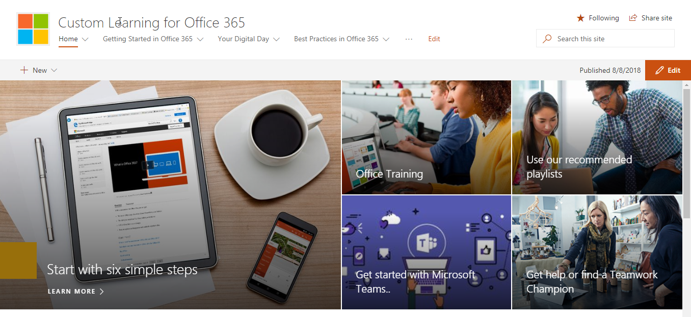
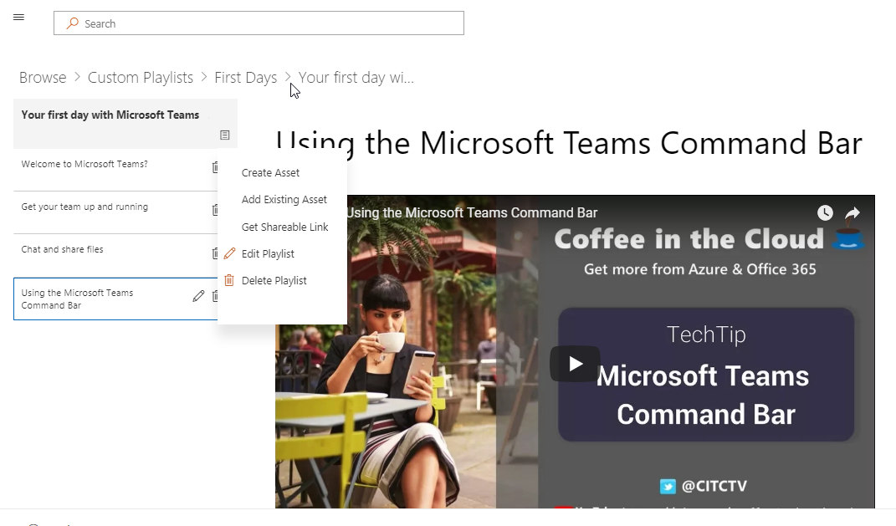

# Benutzerdefiniertes lernen für Office 365

## Self-Service, anpassbare Schulungslösungen von Microsoft

Benutzerdefiniertes lernen für Office 365 ist eine Sammlung von Open Source-Tools für Schulung und Einführung, die die Nutzung von Office 365 in Ihrer Organisation verbessern sollen. Erstellt in Partnerschaft mit Microsoft Teams und SharePoint Product Engineering Groups und dem Team für moderne Unterstützung und Erfahrung, können diese einfach zu verwendenden Lösungen in Ihrem SharePoint Online-Mandanten installiert und angepasst werden. 

Diese Lösungen bieten Ihren Endbenutzern alle Schulungsinhalte, die Microsoft anbieten muss, und hält diese Inhalte bei Bedarf auf dem neuesten Stand.  Die Website kann problemlos in Ihre Installation von Microsoft Teams oder anderen vorhandenen SharePoint Online-Websites in Ihrem Unternehmen integriert werden.

Unsere benutzerdefinierten Lerninhalte sind derzeit auf den Beginn von Inhalten für Office 365-und Windows 10-Produkte ausgelegt.  Wenn Sie mehr Inhalte sehen möchten, geben Sie uns [Anregungen und Feedback](feedback.md) in unserem Online-Forum.  

## Benutzerdefinierte Lern-Open-Source-Komponenten

Benutzerdefiniertes lernen für Office 365 bietet zwei Möglichkeiten: 

**Option 1**: [das benutzerdefinierte Learning SharePoint Online-Website Paket](installsitepackage.md)

Wählen Sie dieses SharePoint Online Communication-Website Paket aus, installieren und konfigurieren Sie es, um ein Schulungsportal für Ihr Unternehmen zu erstellen. Früher als Toolkit für Teamwork bezeichnet, kann dieses Schulungsportal angepasst werden, um Hilfe, Support und Community-Inhalte Ihrer Organisation hinzuzufügen. Sie können auch Inhalte zu Diensten entfernen, die in Ihrer Organisation nicht unterstützt werden. Das benutzerdefinierte Learning Site-Paket enthält auch das benutzerdefinierte Lern Webpart, das einen aktuellen Feed von Office 365-Schulungsinhalten für Ihre Organisation bereitstellt. 

**Option 2**: [das benutzerdefinierte learning for Office 365-Webpart](installwebpart.md) die benutzerdefinierte Lern Webpart-Option wurde für Organisationen entwickelt, die Office 365-Schulungen in eine vorhandene SharePoint Online-Kommunikationswebsite integrieren möchten. Das benutzerdefinierte Lern Webpart kann auf jeder SharePoint Online-Seite installiert werden und bietet einen aktuellen Feed der vollständigen Suite von Office 365-Schulungsinhalten der Support.Office.com-Website von Microsoft. Schulungsinhalte, die über das Webpart bereitgestellt werden, sind in einfach zu verwendende Wiedergabelisten gegliedert. Administratoren können auch das Webpart verwenden, um benutzerdefinierte Schulungs-Playlists zu erstellen, die Inhalte von YouTube, lokal gehosteten Inhalten wie. PDFs und Office 365-Schulungsinhalte für Schulungen, die auf die individuellen Anforderungen der Organisation zugeschnitten sind.

## 3 einfache Schritte

Lets [Get Started](prereqs.md) Creating a Simple Training Solutions mit aktuellen Microsoft-Inhalten.

1. Wählen Sie die richtige Lösung für Sie aus.
2. Abschließen der Installation & Anpassen von Inhalten
3. Freigeben Ihrer Website für Ihre Benutzer mithilfe unserer [Adoptions Tools](driveadoption.md)
