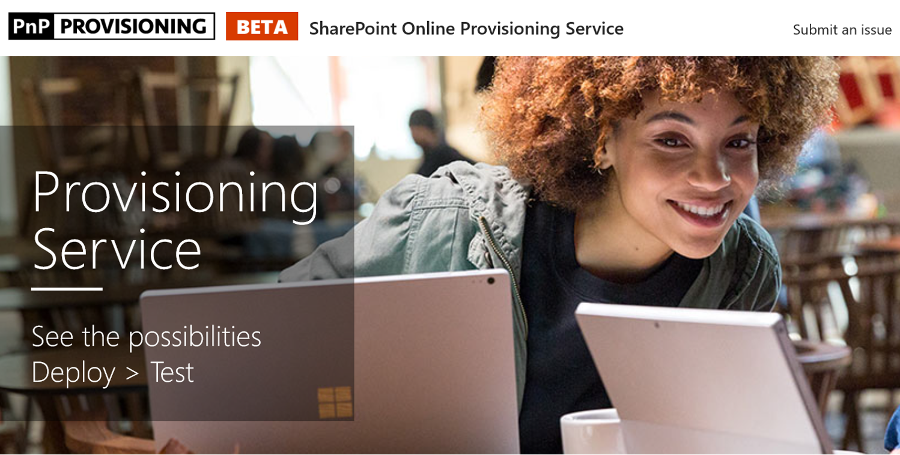

# Bereitstellen der benutzerdefiniertes Erlernen der Website

1. Wechseln Sie zu http://provisioning.sharepointpnp.com und Anmeldung mit Ihren Anmeldeinformationen für die gezielte Mandanten für die Installation verwenden möchten. 
1. Haken Sie Zustimmung im Namen Ihrer Organisation, und wählen Sie annehmen.
1. Wählen Sie benutzerdefinierte Learning für Office 365 aus dem Lösungskatalog. 
1. Wählen Sie Ihrem Mandanten hinzufügen 
1. Passen Sie die Standardauswahl auf der Seite "Bereitstellung" als erforderlich, und wählen Sie bereitstellen, wenn Sie bereit sind, zum Installieren von CLO365 in Ihrer Umgebung Mandanten.  
1. Der Bereitstellungsprozess wird bis zu 15 Minuten dauern. Sie werden benachrichtigt per e-Mail (an die Benachrichtigung e-Mail-Adresse auf der Seite Bereitstellung eingegebene) Wenn die Website für den Zugriff bereit ist. 
1. Einmal angemeldet CLO365 in Ihrem Mandanten, bevorzugten die Website und kopieren Sie die Url für die zukünftige.  

## Weitere Schritte
- Verwenden Sie das [Standardkonto](sitecontent.md) in das Webpart aus.
- [Anpassen](customization.md) der Schulung Erfahrung für Ihre Organisation.
- [Bessere Akzeptanz](driveadoption.md) der Schulung Lösung ist.

