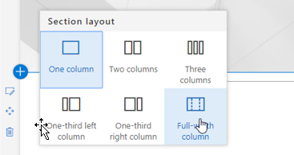
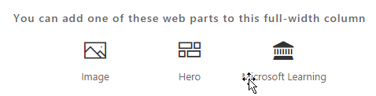

# Installieren der benutzerdefiniertes Lösung Webpart lernenInstalling the Custom Learning Solution Webpart

## Erforderliche Komponenten für eine gesamte Mandanten-installationPrerequisites for a tenant-wide installation

- Um die benutzerdefinierte Learning-Webpart für Ihre gesamte Mandanten zu installieren, müssen Sie Office 365-Administratorberechtigungen verfügen.  Wenn Sie nicht über diese Berechtigungen verfügen, die können Sie gemeinsam mit dem Office 365-Administrator oder installieren das Webpart für eine einzelne Websitesammlung.To install the Custom Learning webpart for your entire tenant you will need to have Office 365 Administrative permissions.  If you do not have these permissions you can either work with your Office 365 Administrator or install the webpart for an individual site collection.
- Sie oder Ihr Office 365-Administrator muss Setup und konfiguriert einen Mandanten geltende [App-Katalog](https://docs.microsoft.com/en-us/sharepoint/dev/spfx/set-up-your-developer-tenant) oder [Site Collection App-Katalog](https://docs.microsoft.com/en-us/sharepoint/dev/general-development/site-collection-app-catalog), um das Webpart empfangen.]You or your Office 365 Administrator must have setup and configured a tenant-wide [App Catalog](https://docs.microsoft.com/en-us/sharepoint/dev/spfx/set-up-your-developer-tenant) or a [Site Collection App Catalog](https://docs.microsoft.com/en-us/sharepoint/dev/general-development/site-collection-app-catalog)to receive the webpart.]
- Wir unterstützen nur SharePoint Online. Das Webpart wird nicht unterstützt für die Installation auf eine beliebige Version von SharePoint lokal.We support SharePoint Online only. The web part is not support for installation on any version of SharePoint on premises.

## Hinzufügen des benutzerdefinierte Learning-Webparts zu Ihrem MandantenAdd the Custom Learning webpart to your tenant 

1. Laden Sie das benutzerdefinierte Learning-Webpart, und speichern Sie sie auf Ihrem lokalen Laufwerk.  Dieser Datei lautet "ms-benutzerdefinierte-learning.sppkg".  Ändern Sie den Namen oder die Suffix der Datei nicht.Download the Custom Learning webpart and save it to your local drive.  This file is named "ms-custom-learning.sppkg".  Do not change the name or suffix of the file. 
2. Navigieren Sie zu der [Office 365-Verwaltungsportal](https://admin.microsoft.com/AdminPortal/Home#/homepage) für Ihre MandantenNavigate to the [Office 365 Admin portal](https://admin.microsoft.com/AdminPortal/Home#/homepage) for your tenant
3. Wählen Sie im linken Navigationsbereich Admin Center, SharePoint aus. Dadurch wird eine neue Registerkarte, und wählen Sie Apps In the SharePoint Admin Center, App-Katalog, Apps für SharePoint geöffnet.From the left navigation select Admin Centers, SharePoint. This will open in a new tab. , In the SharePoint Admin Center select Apps, App Catalog, Apps for SharePoint 
4. Aktivieren Sie das Webpart hochladen und wählen Sie die heruntergeladene Datei "ms-benutzerdefinierte-learning.sppkg"Select upload the webpart and choose the "ms-custom-learning.sppkg" file you downloaded
5. Für diese Mandanten geltende Installation das Kontrollkästchen Sie neben "Diese Lösung für alle befindet sich in der Organisation verfügbar machen."For this tenant-wide installation check the box next to "Make this solution available to all sits in the organization."  

## Hinzufügen des Kunden Learning-Webparts zu einer SharePoint Online-SeiteAdd the Customer Learning webpart to a SharePoint Online Page

Nach der Installation benutzerdefinierte Learning in Ihrem Mandanten können Sie das Webpart zu einer SharePoint-Seite hinzufügen. Wenn Sie dies tun, ist plötzlich Office 365-Schulung für Sie verfügbar.After Custom Learning is installed in your tenant you can add the Web part to a SharePoint page. When you do, suddenly Office 365 training is available to you. 

1. Fügen Sie die benutzerdefinierte Learning-Webpart in ein Layout mit voller Breite Spalten hinzu:Add the Custom Learning webpart in a full width column layout:

2. Wählen Sie im Abschnitt hinzufügen, und wählen Sie dann volle Breitenspalte, in der SharePoint-Seite.  Sehen Sie die folgende Meldung angezeigt:In the SharePoint page, select Add section and then select full width column.  You'll see the following prompt:

3. Wählen Sie Microsoft Learning.  Sie sollten nun Folgendes angezeigt:Select Microsoft Learning.  You should now see the following: 

 Sie können nun auf die Kacheln zum Untersuchen des Standardinhalts in der Projektmappe enthaltenen klicken.You can now click on the tiles to explore the default content included in the solution.  

## Weitere SchritteNext Steps
- Verwenden Sie das [Standardkonto](webpartcontent.md) in das Webpart aus.Explore the [default content](webpartcontent.md) included in the webpart.
- [Anpassen](customization.md) der Schulung Erfahrung für Ihre Organisation.[Customize](customization.md) the training experience for your organization.
- [Bessere Akzeptanz](driveadoption.md) der Schulung Lösung ist.[Drive adoption](driveadoption.md) of your training solution.

