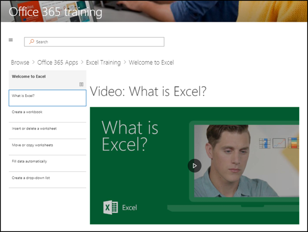

# Erkunden der Website und der Standardinhalte

### Tour durch die Website 

Navigieren Sie zur Startseite, und wählen Sie Office 365 Training aus. Jede Seite in der SharePoint Online-Website ist so konfiguriert, dass Sie das Microsoft Learning Webpart hostet. Auf diese Weise kann die Seite den gesamten im Webpart verfügbaren Inhalt anzeigen.

Wählen Sie in der Menüleiste das Navigationselement **Office 365 Training** aus, und wählen Sie dann erste **Schritte mit OneDrive**aus. In diesem Fall filtert das Webpart den Inhalt so, dass nur OneDrive Inhalte angezeigt werden.

Wiederholen Sie diese Schritte für die beiden anderen Menü Optionen, **beginnen Sie mit Teams** und beginnen **Sie mit SharePoint Online** , um Ihre Inhalte zu überprüfen und die Navigation zu testen.

Navigieren Sie zurück zur Startseite, und wählen Sie **mit sechs einfachen Schritten starten**aus. Dadurch gelangen Sie zur Wiedergabeliste mit den sechs einfachen Schritten.

> [!TIP]
> Die sechs einfachen Schritte werden von einem Microsoft-Forschungsteam abgeleitet. Dies sind die Schritte, die Microsoft-Forscher als die klebrigsten gefunden haben, was bedeutet, dass Benutzer, die diese Schritte durchlaufen, ihre Verwendung von Office 365 zunehmen und produktivere Arbeitskräfte werden. Und das ist gut für alle.

### Gehen Sie zu beginnen mit sechs einfachen Schritten
- Klicken Sie auf der Startseite mit sechs einfachen Schritten auf starten. 
- Sie sehen die Office-Schulungsseite mit dem benutzerdefinierten Lern-Webpart, das mit der Wiedergabeliste mit sechs einfachen Schritten an den Start weitergeleitet wird.  

### Anzeigen einer Liste von Wiedergabelisten für eine Kategorie

Wählen Sie auf der Office 365-Schulungsseite Excel-Schulung aus, um zu einer Liste von Excel-Schulungs Listen zu wechseln.

### Anzeigen einer Wiedergabeliste

Klicken Sie auf **Willkommen bei Excel** , um die Wiedergabeliste anzuzeigen.

Ihre Website ist jetzt so eingerichtet, dass auf jeder Seite der richtige Inhalt angezeigt wird. 

## Weitere Schritte
- [Anpassen von Websiteinhalten](customization.md)
- [Laufwerk Einführung](driveadoption.md) 
